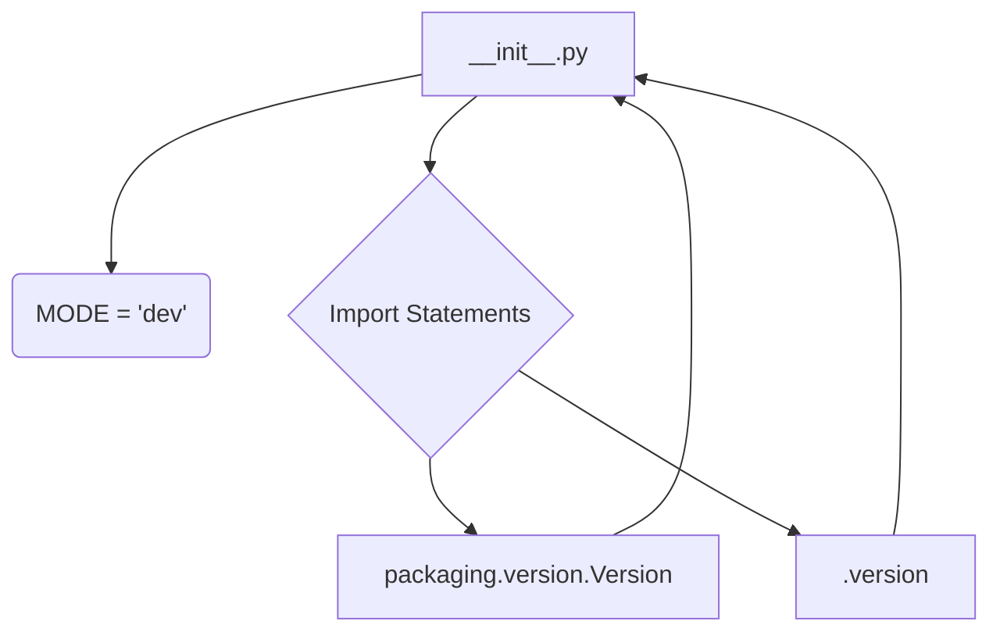

1. **<input code>**

```python
## \file hypotez/src/suppliers/aliexpress/gapi/__init__.py
# -*- coding: utf-8 -*-\
#! venv/Scripts/python.exe
#! venv/bin/python/python3.12

"""
.. module: src.suppliers.aliexpress.gapi 
	:platform: Windows, Unix
	:synopsis:

"""
MODE = 'dev'

from packaging.version import Version
from .version import __version__, __doc__, __details__
```

2. **<algorithm>**



This is a very simple Python module.  It sets a `MODE` variable and imports components from a submodule (`version.py`).  There's no significant algorithm execution, it's primarily about module setup.


3. **<explanation>**

* **Imports:**
    * `from packaging.version import Version`: Imports the `Version` class from the `packaging` library. This is likely used for version comparisons in other parts of the project. The `packaging` library is a standardized way to handle and compare Python package versions.  This is crucial for ensuring compatibility and dependencies are managed correctly.

    * `from .version import __version__, __doc__, __details__`: Imports variables (`__version__`, `__doc__`, `__details__`) defined within the `version.py` file within the same `gapi` subpackage.  This `.` notation indicates that the imported module is in the same relative directory.  This is the standard way to access submodule's data in Python, promoting clear organization.


* **Classes:** There are no classes defined in this file.


* **Functions:** There are no functions defined.


* **Variables:**
    * `MODE = 'dev'`: A string variable that likely controls various aspects of the module's behavior (e.g., developer vs. production mode). This is a common technique in software development to control settings and behaviors without modifying the core code base.  Without knowing the context of the larger project, it's difficult to say exactly how it is used.


* **Potential Errors/Improvements:**
    * **Lack of documentation:** While there's a docstring, it could be more specific about the purpose of the `MODE` variable and how it impacts the module's operation.
    * **Missing Context:** The code snippet is very limited. To properly analyze the code, we'd need to see `version.py` and how `MODE` is used.


* **Relationships with other project parts:**
    * The file is part of a supplier (aliexpress) module within a project (hypotez). `version.py` within the same `gapi` submodule is referenced. This suggests a package organization that separates different features and tools. The precise dependencies and usage will depend on what the rest of the project does with the `MODE` variable and the version info.


**Overall:** This file acts as an initialization point for the `aliexpress/gapi` module, setting up a development mode and importing necessary components.  To fully understand its role, the rest of the `gapi` module and how it interacts with the rest of the `hypotez` project need to be inspected.