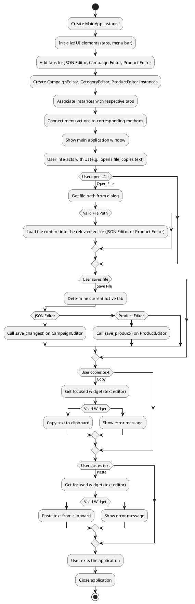

```python
## File hypotez/src/suppliers/aliexpress/gui/main.py
# -*- coding: utf-8 -*-\n#! venv/Scripts/python.exe\n#! venv/bin/python/python3.12\n\n"""
.. module: src.suppliers.aliexpress.gui 
	:platform: Windows, Unix
	:synopsis:
"""
MODE = 'dev'


"""
	:platform: Windows, Unix
	:synopsis:
"""


"""
	:platform: Windows, Unix
	:synopsis:
"""


"""
  :platform: Windows, Unix
"""
"""
  :platform: Windows, Unix
  :platform: Windows, Unix
  :synopsis:
"""MODE = 'dev'
  
""" module: src.suppliers.aliexpress.gui """


""" Main window interface for managing advertising campaigns """


import header
import asyncio
import sys
from PyQt6 import QtWidgets, QtGui, QtCore
from qasync import QEventLoop
from pathlib import Path
from src.utils import j_loads_ns, j_dumps
from product import ProductEditor
from campaign import CampaignEditor
from category import CategoryEditor
from src.suppliers.aliexpress.campaign import AliCampaignEditor
from styles import set_fixed_size


class MainApp(QtWidgets.QMainWindow):
    def __init__(self):
        """ Initialize the main application with tabs """
        super().__init__()
        self.setWindowTitle("Main Application with Tabs")
        self.setGeometry(100, 100, 1800, 800)

        self.tab_widget = QtWidgets.QTabWidget()
        self.setCentralWidget(self.tab_widget)

        # Create the JSON Editor tab and add it to the tab widget
        self.tab1 = QtWidgets.QWidget()
        self.tab_widget.addTab(self.tab1, "JSON Editor")
        self.promotion_app = CampaignEditor(self.tab1, self)

        # Create the Campaign Editor tab and add it to the tab widget
        self.tab2 = QtWidgets.QWidget()
        self.tab_widget.addTab(self.tab2, "Campaign Editor")
        self.campaign_editor_app = CategoryEditor(self.tab2, self)

        # Create the Product Editor tab and add it to the tab widget
        self.tab3 = QtWidgets.QWidget()
        self.tab_widget.addTab(self.tab3, "Product Editor")
        self.product_editor_app = ProductEditor(self.tab3, self)

        self.create_menubar()


    def create_menubar(self):
        """ Create a menu bar with options for file operations and edit commands """
        menubar = self.menuBar()

        file_menu = menubar.addMenu("File")
        open_action = QtGui.QAction("Open", self)
        open_action.triggered.connect(self.open_file)
        file_menu.addAction(open_action)
        save_action = QtGui.QAction("Save", self)
        save_action.triggered.connect(self.save_file)
        file_menu.addAction(save_action)
        exit_action = QtGui.QAction("Exit", self)
        exit_action.triggered.connect(self.exit_application)
        file_menu.addAction(exit_action)

        edit_menu = menubar.addMenu("Edit")
        copy_action = QtGui.QAction("Copy", self)
        copy_action.triggered.connect(self.copy)
        edit_menu.addAction(copy_action)
        paste_action = QtGui.QAction("Paste", self)
        paste_action.triggered.connect(self.paste)
        edit_menu.addAction(paste_action)

        open_product_action = QtGui.QAction("Open Product File", self)
        open_product_action.triggered.connect(self.product_editor_app.open_file)
        file_menu.addAction(open_product_action)


    # ... (rest of the code)
```

```
<algorithm>
```



```
<explanation>
```

**Imports:**

- `header`:  Purpose unknown without seeing the `header` file. Likely contains constants, general utility functions, or imports for other modules crucial to the application.  Its relationship to other `src` packages is dependent on the content of `header` itself.
- `asyncio`: Used for asynchronous operations, potentially important for handling background tasks or I/O.
- `sys`: Provides access to system-specific parameters and functions, including command-line arguments and exiting the application.
- `PyQt6`:  A cross-platform GUI toolkit.  Its various components (`QtWidgets`, `QtGui`, `QtCore`) are used for building the application's window, widgets (like tabs, text editors, and dialogs), graphics, and event handling.
- `qasync`: A wrapper to make asynchronous code (like `asyncio`) work with PyQt6 efficiently.
- `pathlib`: A way to work with file paths in a more object-oriented and platform-independent manner.
- `src.utils`: Contains utility functions for JSON handling. `j_loads_ns` and `j_dumps` likely parse and serialize JSON data, and possibly handle namespaces.
- `product`, `campaign`, `category`: Likely define classes for editing products, campaigns, and categories respectively. They are part of the same package, possibly a module for domain-specific objects.
- `AliCampaignEditor`:  Custom class specific to campaigns from AliExpress. This is a key module because it's tailored for the AliExpress supplier.
- `styles`: Likely contains functions to define and apply styles to various UI elements (e.g., setting fixed sizes).

**Classes:**

- `MainApp`: The main application window.
    - `__init__`: Initializes the main window, creates tabs (JSON Editor, Campaign Editor, Product Editor), and sets up the menu bar.  Crucially, it instantiates editors from other classes.
    - `create_menubar`: Creates the menu bar.
    - `open_file`, `save_file`, `exit_application`: Handle file operations.
    - `copy`, `paste`: Handle clipboard operations.
    - `load_file`: Loads a JSON file into the selected tab.
    - Methods are tightly coupled with the `CampaignEditor`, `ProductEditor` and `CategoryEditor`.

- `CampaignEditor`, `ProductEditor`, `CategoryEditor`, `AliCampaignEditor`:  These are likely editors specific for their corresponding data types.

**Functions:**

- `main`: Initializes the `QApplication`, creates the `MainApp` instance, and starts the application's event loop using `QEventLoop`.  This is the main entry point.  The critical `loop.run_forever()` handles all GUI events.

**Variables:**

- `MODE`: A string (likely 'dev' or 'prod') used for configuration settings or to switch behavior between development and production environments.


**Potential Errors and Improvements:**

- **Error Handling:** The `load_file` method has a `try...except` block, which is good. Consider similar blocks in other methods that might raise exceptions (e.g., `open_file`).
- **File Validation:** Verify that the file being loaded is actually a valid JSON file before proceeding.  This could prevent crashes and incorrect data processing.
- **Tab Management:** The code opens multiple tabs. Consider ways to manage the current tab focus, or for different tab types, to ensure the user is always aware of which editor they are in.
- **Asynchronous Operations:** The use of `asyncio` and `QEventLoop` suggests asynchronous processing is important.  Improve error handling and logging for any asynchronous actions.
- **Data Integrity:** Consider input validation (e.g., if the user tries to load an invalid data file).  Implement data sanitization to prevent exploits.
- **Separation of Concerns:** The `MainApp` class is becoming quite large. Consider breaking out more functionality into smaller, independent classes (editors and related UI) to improve organization and maintainability.

**Relationships:**

- `MainApp` relies on `CampaignEditor`, `ProductEditor`, and `CategoryEditor` for editing functionality.
- `MainApp` uses `src.utils` for JSON handling.
- `AliCampaignEditor` handles specific AliExpress campaign data.
- `src.suppliers.aliexpress` contains specific components (AliCampaignEditor) targeted towards the AliExpress supplier interface. This implies an architecture to support multiple suppliers. `product`, `campaign`, `category` are likely to be used in other supplier modules.


The code demonstrates a typical GUI application structure using PyQt6 and handles asynchronous operations.  However, there's room for improvement in terms of handling potential errors and separating concerns.