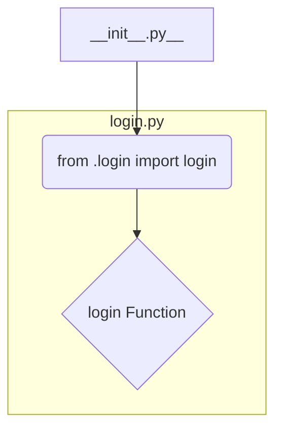

1. **<input code>**

```python
## \file hypotez/src/suppliers/aliexpress/scenarios/__init__.py
# -*- coding: utf-8 -*-
#! venv/Scripts/python.exe
#! venv/bin/python/python3.12

"""
.. module: src.suppliers.aliexpress.scenarios
	:platform: Windows, Unix
	:synopsis: Сценарии для алиэкспресс

"""
MODE = 'dev'


from .login import login
```

2. **<algorithm>**



This is a very basic module.  The `__init__.py` file is a package initializer for the `scenarios` subpackage within the `aliexpress` supplier package.  There is no substantial algorithm. The key action is importing a function from another file.


3. **<explanation>**

* **Imports:**
    * `from .login import login`: This line imports the `login` function from a module named `login.py` which is located within the same directory as `__init__.py`. The `.` is a relative import, meaning Python will search for `login.py` in the same directory as the current file. This is a standard Python practice for modular code organization.  Crucially, this import statement is _the_ most important operation in this file.

* **Classes:**
    * There are no classes defined in this file.

* **Functions:**
    * The `__init__.py` itself does not define any functions.

* **Variables:**
    * `MODE = 'dev'`: This is a global variable that likely controls behavior.  This string is a configuration string.  Its value will typically be one that controls which mode the application runs in, such as "dev" (for development) and possibly "prod" (for production) or other similar modes.

* **Potential Errors or Improvements:**
    * **Missing Documentation:** While the docstring is present, it's not in the most common Python format (using `"""Docstring goes here"""`).
    * **File Header Redundancy:** The shebang lines (`#! venv/Scripts/python.exe`, `#! venv/bin/python/python3.12`) are redundant and potentially confusing if they are not used in the same way consistently elsewhere in the codebase. The python interpreter can determine the correct python interpreter to use based on the installation process of the package and environment.

* **Relationship to Other Project Parts:**
    * This file is part of a larger project structure related to interacting with the AliExpress supplier API.  The `login` function, imported from `login.py`, likely handles the authentication process.  The `scenarios` directory will likely contain other modules for interacting with the API and managing various AliExpress functionalities.


**Chain of Relationships:**

`hypotez/src/suppliers/aliexpress/scenarios/__init__.py` -> `hypotez/src/suppliers/aliexpress/scenarios/login.py`  (the `login` function).

This `__init__.py` file establishes a foundational relationship with `login.py`, which will be responsible for handling authentication. The eventual functionality of any scenarios defined will depend on successful interaction with the AliExpress API through the `login` function and subsequent API calls.