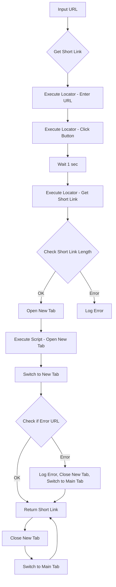

```python
## \file hypotez/src/suppliers/aliexpress/scenarios/affiliate_links_shortener_scenario.py
# -*- coding: utf-8 -*-\
#! venv/Scripts/python.exe
#! venv/bin/python/python3.12

"""
.. module: src.suppliers.aliexpress.scenarios 
	:platform: Windows, Unix
	:synopsis: Сокращатель ссылок через веббраузер

"""
MODE = 'dev'

from pathlib import Path
from typing import List, Union
from types import SimpleNamespace
import time
from src import gs
from src.utils import j_loads, j_loads_ns
from src.logger import logger
from src.webdriver import Driver

# Загрузка локаторов из JSON-файла
locator = j_loads_ns(Path(gs.path.src, 'suppliers', 'aliexpress', 'locators', 'affiliate_links_shortener.json'))

def get_short_affiliate_link(d:Driver, url: str) -> str:
    """ Script for generating a shortened affiliate link
    @param url `str`: Full URL
    @returns `str`: Shortened URL
    """
    # Выполните сценарий для получения короткой ссылки
    d.execute_locator(locator.textarea_target_url, url)  # Введите URL в поле для ввода
    d.execute_locator(locator.button_get_tracking_link)  # Нажмите кнопку для получения короткой ссылки
    d.wait(1)  # Подождите 1 секунду, чтобы страница обновилась
    short_url = d.execute_locator(locator.textarea_short_link)[0]  # Получите короткую ссылку из элемента на странице
    main_tab = d.current_window_handle  # Сохраните идентификатор основной вкладки

    if len(short_url) < 1:
        logger.error(f"Не удалось получить короткий URL от {url}")  # Логирование ошибки, если короткий URL не получен
        #raise ValueError(f"Не удалось получить короткий URL от {url}")  # Генерация исключения для остановки выполнения
    
    # Откройте новый таб с коротким URL
    d.execute_script(f"window.open('{short_url}');")
    
    # Переключитесь на новый таб
    d.switch_to.window(d.window_handles[-1])
    
    # Проверьте, что короткий URL начинается с ожидаемой части
    if d.current_url.startswith('https://error.taobao.com'):
        logger.error(f"Неправильный URL: {d.current_url}")  # Логирование ошибки, если короткий URL некорректен
        d.close()  # Закройте вкладку с неправильным URL
        d.switch_to.window(main_tab)  # Переключитесь обратно на основную вкладку
        #raise ValueError(f"Неправильный URL: {d.current_url}")  # Генерация исключения для остановки выполнения
    
    # Закройте новый таб и вернитесь к основной вкладке
    d.close()  # Закрываем новую вкладку
    d.switch_to.window(main_tab)  # Переключаемся обратно на основную вкладку
    
    return short_url  # Верните короткий URL
```

**<algorithm>**



**<explanation>**

* **Imports**:
    * `from pathlib import Path`: Used for working with file paths, especially for accessing the `locators` JSON file.  Crucially important for the proper location and access of external resource files.
    * `from typing import List, Union, ...`:  Provides type hints for function parameters and return values, improving code readability and maintainability.
    * `from types import SimpleNamespace`: A lightweight namespace for grouping attributes, likely used to create a structured container for data from `j_loads_ns`'s output.  Importantly, this likely stems from JSON being used to define attributes.
    * `import time`: Provides the `time` module for pausing execution.
    * `from src import gs`: Imports the `gs` module from the `src` package, likely for global settings or configuration. Crucial for accessing global resources needed for the affiliate link shortening scenario.
    * `from src.utils import j_loads, j_loads_ns`:  Likely imports functions for loading JSON data (with namespaces).  `j_loads_ns` is used for loading the locators, demonstrating the dependency between the affiliate link scenario and the JSON data loading utilities.
    * `from src.logger import logger`: Imports logging functionality for error reporting. This is crucial for debugging and tracking issues during execution.
    * `from src.webdriver import Driver`: Imports a `Driver` class likely providing WebDriver interaction methods (e.g., `execute_locator`, `wait`, `current_url`, `close`, `switch_to`). This shows the dependency on the WebDriver abstraction layer and how this code leverages the underlying browser automation mechanisms.  This relationship suggests the script integrates into an automated test framework or similar project structure.


* **Classes**: The code defines no classes.  It uses the `Driver` class (imported from `src.webdriver`), which is critical for interacting with the browser.

* **Functions**:
    * `get_short_affiliate_link(d:Driver, url: str) -> str`:
        * **Arguments**: `d:Driver`, an instance of the `Driver` class representing the browser automation. `url: str`, the URL to shorten.
        * **Return Value**: `str`, the shortened URL.
        * **Functionality**:  The function automates the process of shortening an affiliate link through a website. It interacts with the web browser (`d`), executes actions to get the shortened link from a specific website, handles potential errors (e.g., the website returns an incorrect format or an empty result). Crucial in managing the interactive steps of automating the process and avoiding exceptions through error handling.  The function relies on correctly loaded `locator` data from the JSON file and `Driver` methods for robust handling.


* **Variables**:
    * `MODE = 'dev'`: A string variable likely controlling the execution mode (e.g., for different settings or environments).
    * `locator`: This variable holds the parsed data from the `affiliate_links_shortener.json` file, loaded as a `SimpleNamespace` object, representing the UI element locators needed to interact with the website to generate shortened links.  This shows how UI element information is critical for the functionality.


* **Potential Errors/Improvements**:
    * **Error Handling**: While the code now logs errors, it doesn't raise exceptions in the error cases.  Consider raising exceptions to prevent silent failures.
    * **Timeout Handling**: Adding a timeout to the `d.wait()` method would prevent the script from hanging indefinitely if the web page doesn't update properly.
    * **Robust Error Detection**: Instead of just checking `len(short_url) < 1`, consider a more comprehensive check of the short URL to ensure its format matches the expected result to prevent false positives.
    * **Explicit Waiting**:  Instead of `d.wait(1)`, consider more sophisticated waiting techniques using explicit waits or web element existence checks.

**Chain of Relationships**:

The code interacts with the `gs`, `utils`, `logger`, and `webdriver` modules within the `src` package. It relies on a JSON configuration file (`affiliate_links_shortener.json`) for locators, indicating a layered architecture with data abstraction through JSON.  This structure suggests a broader project goal of automating tasks, likely within an e-commerce or affiliate marketing context.