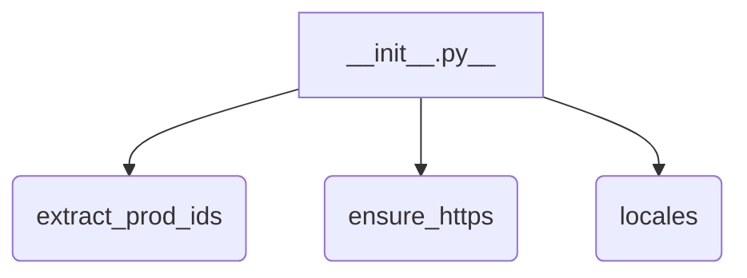

1. **<input code>**

```python
## \file hypotez/src/suppliers/aliexpress/utils/__init__.py
# -*- coding: utf-8 -*-\
#! venv/Scripts/python.exe
#! venv/bin/python/python3.12

"""
.. module: src.suppliers.aliexpress.utils 
	:platform: Windows, Unix
	:synopsis:

"""
MODE = 'dev'

from .extract_product_id import extract_prod_ids
from .ensure_https import ensure_https
from .locales import locales
```

2. **<algorithm>**



No complex algorithm is present.  This file is an initialization module. It imports functions and classes from other modules within the `aliexpress/utils` package.  There is no internal logic executed in this file itself.


3. **<explanation>**

* **Imports:**
    * `from .extract_product_id import extract_prod_ids`: Imports the `extract_prod_ids` function from the `extract_product_id.py` module within the `aliexpress/utils` subdirectory.  This suggests that `extract_prod_ids` likely parses data to extract product IDs.
    * `from .ensure_https import ensure_https`: Imports the `ensure_https` function from the `ensure_https.py` module.  This function likely handles ensuring URLs are using HTTPS.
    * `from .locales import locales`: Imports the `locales` variable (likely a dictionary or other data structure) from the `locales.py` module.  This suggests handling localization settings like language options.

* **Variables:**
    * `MODE = 'dev'`: A string variable likely used for setting the operational mode of the application (e.g., development, testing, production). This is a common practice for modular codebases.  This is a simple variable and doesn't require further explanation.

* **Classes (None):** No classes are defined in this file.

* **Functions (None):** No functions are defined in this file.  The file's sole purpose is to provide easy access to functions in other modules.

* **Potential Errors/Improvements:**
    * **Missing Docstrings:** While the module docstring exists, it would be beneficial to have more thorough docstrings for the imported functions (in `extract_product_id.py`, `ensure_https.py`, and `locales.py`)  This would significantly improve code readability and maintainability.
    * **Import Style:**  The use of `#! venv/Scripts/python.exe` and `#! venv/bin/python/python3.12` as shebang lines at the top of the file is likely an artifact from a development environment.  It's unusual to have them in a file that's not a script meant to be run directly.  Ideally, they should not be present within this module file.  These directives are typically intended for a `main` script.  If not a direct script, they might be removed.


* **Relationships with Other Parts of the Project:**
    * This `__init__.py` file acts as an entry point for other parts of the project to access the `aliexpress` supplier's utility functions. This indicates a modular design structure in the project. Other parts of the project might import functions from this `utils` package, utilizing the product ID extraction and URL validation (ensuring HTTPS) and localization support.  For example, a `main` program might call `extract_prod_ids` to retrieve data.


In summary, this `__init__.py` file acts as an organizational hub for the `aliexpress` supplier's utility functions, making them easily importable by other components of the project.  It's a standard Python practice for packages.  Improving the docstrings within the modules it imports will help understand their inner workings and usages.