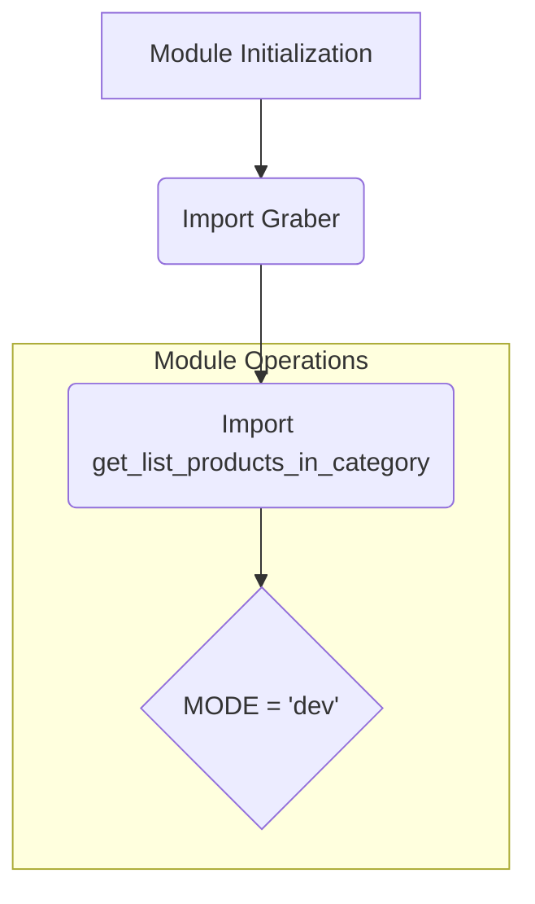

1. **<input code>**

```python
## \file hypotez/src/suppliers/amazon/__init__.py
# -*- coding: utf-8 -*-
#! venv/Scripts/python.exe
#! venv/bin/python/python3.12

"""
.. module: src.suppliers.amazon 
	:platform: Windows, Unix
	:synopsis:

"""
MODE = 'dev'

from .graber import Graber
from .scenario import get_list_products_in_category
```

2. **<algorithm>**



* **Module Initialization:** The `__init__.py` file is responsible for initializing the `amazon` sub-package.
* **Import Graber:** Imports the `Graber` class from the `graber.py` module within the `amazon` package.
* **Import get_list_products_in_category:** Imports the `get_list_products_in_category` function from the `scenario.py` module.


3. **<explanation>**

* **Imports:**
    * `from .graber import Graber`: Imports the `Graber` class from the `graber.py` module within the `amazon` package.  This likely contains methods to fetch data from Amazon.  `.` indicates a relative import, meaning it searches within the current package hierarchy.  This import is crucial for using the `Graber` class.
    * `from .scenario import get_list_products_in_category`: Imports the `get_list_products_in_category` function from the `scenario.py` module within the `amazon` package. This function likely implements the logic for retrieving product listings in a given category.

* **Variables:**
    * `MODE = 'dev'`: A string variable defining the operational mode (e.g., 'dev', 'prod').  This suggests that the module might have different behaviors or configurations depending on the `MODE`.

* **Classes (implied):**
    * `Graber`: This class is not directly used in this file, but likely handles data scraping/retrieval from Amazon. It's likely defined in `graber.py` within the same package (`amazon`).


* **Functions (implied):**
    * `get_list_products_in_category`: This function is intended to take some parameters (likely a category ID or name) and return a list of products in that category.  It's likely used to interact with `Graber` objects to collect the data.


* **Potential Errors/Improvements:**
    * **Missing Documentation:** The docstrings for the functions and class are incomplete. Detailed docstrings are beneficial for understanding the arguments, return values, and usage of these components.
    * **No Usage Examples:** The `__init__.py` file only imports functions/classes.  It doesn't utilize them.  Use cases should be shown within the file for clarity.
    * **Hardcoded values (MODE):**  Consider using a configuration file or environment variables to store the `MODE` instead of hardcoding it.


* **Chain of Relationships:**
    * `__init__.py` imports `Graber` and `get_list_products_in_category` and implicitly relies on other parts of the project for data access and processing.  It establishes a dependency on `graber.py` and `scenario.py` for functionality within the Amazon supplier package.  It further implies a larger project structure containing  the `hypotez` package that contains `src` (presumably where the project's modules are), and within `src`, there are different `suppliers`.


In summary, this `__init__.py` file acts as an entry point for the `amazon` supplier package by importing essential parts of the package (`graber.py`, `scenario.py`) enabling interaction with Amazon data, but currently lacks the implementation showing how the `Graber` or `get_list_products_in_category` are used.  The presence of `MODE = 'dev'` suggests the possibility of future configurations or alternative operational modes within the module.