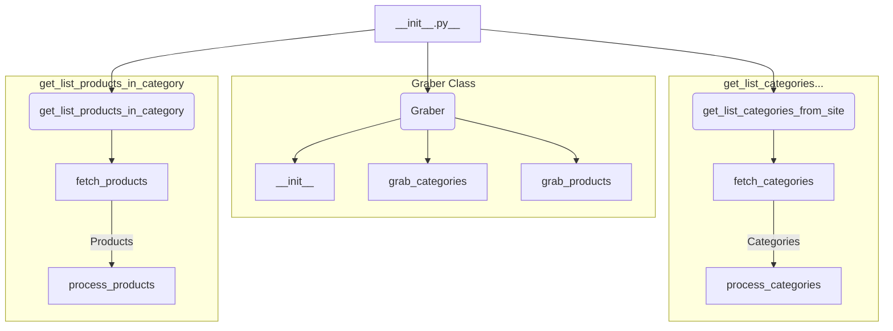

1. **<input code>**

```python
## \file hypotez/src/suppliers/bangood/__init__.py
# -*- coding: utf-8 -*-\
#! venv/Scripts/python.exe
#! venv/bin/python/python3.12

"""
.. module: src.suppliers.bangood 
	:platform: Windows, Unix
	:synopsis:

"""
MODE = 'dev'

from .graber import Graber
from .scenario import get_list_categories_from_site, get_list_products_in_category
```

2. **<algorithm>**



* **Data flow:** `__init__.py` imports classes and functions from submodules (`graber` and `scenario`).  These potentially interact with external sources (e.g., Banggood website) through methods like `fetch_categories` or `fetch_products`. The imported functions (`get_list_categories_from_site`, `get_list_products_in_category`) likely orchestrate the retrieval and processing of data from the Banggood site.  The data obtained (categories and products) are likely processed and returned.

3. **<explanation>**

* **Imports:**
    * `from .graber import Graber`: Imports the `Graber` class from the `graber.py` module within the `bangood` subdirectory. This suggests `graber.py` contains the logic for interacting with the Banggood API or website.
    * `from .scenario import get_list_categories_from_site, get_list_products_in_category`: Imports these functions from the `scenario.py` module. This implies that `scenario.py` houses the higher-level logic for retrieving data (categories and individual products). The functions may encapsulate the data gathering and any preprocessing.

* **Variables:**
    * `MODE = 'dev'`:  A string variable likely used for configuration, distinguishing between development ('dev'), testing ('test'), or production ('prod') environments.

* **Classes (if any):**
    * `Graber`: This class, defined in `graber.py`, is responsible for retrieving data from the Bangood platform.  It probably has methods like `grab_categories`, `grab_products`.  Details on its attributes and methods, along with usage examples, are unavailable because `graber.py` isn't shown.

* **Functions:**
    * `get_list_categories_from_site`, `get_list_products_in_category`: These functions are likely responsible for fetching lists of categories and products within a specified category from the Banggood website or API.  Without their implementation, the exact logic remains unknown, but it would typically involve API calls (or web scraping), data parsing, and potentially filtering/formatting.  Examples would depend on how the functions are called in the broader program structure.

* **Potential errors or improvements:**
    * **Error Handling:**  The code lacks error handling.  If the external service (Banggood website or API) is unavailable, returns an invalid response, or has unexpected data formats, the program could crash.  Robust error handling (try...except blocks) should be incorporated to ensure the script's resilience.
    * **Data Validation:**  The imported functions likely need to validate the data received to guarantee its quality and consistency.  For instance, checks for the absence of required fields or unexpected data formats would be beneficial.
    * **Rate Limiting:** If the Banggood API has rate limits (restrictions on how often a request can be made), the code should include logic to respect these limits to avoid being blocked.
    * **Documentation:** Adding docstrings to the `Graber` class, the functions, and other parts of the code would greatly improve readability and maintainability.  The existing docstrings are a good start.


**Relationship with other project parts:**

The `bangood` module is part of a larger project structure (indicated by the `hypotez/src` path). The file likely interacts with other modules (not present) within the `src` directory for tasks such as storing the fetched data or using it in further analysis. The `MODE` variable suggests an overall project structure for different environments.  To fully understand the relationship, the rest of the project's code base would need to be examined.