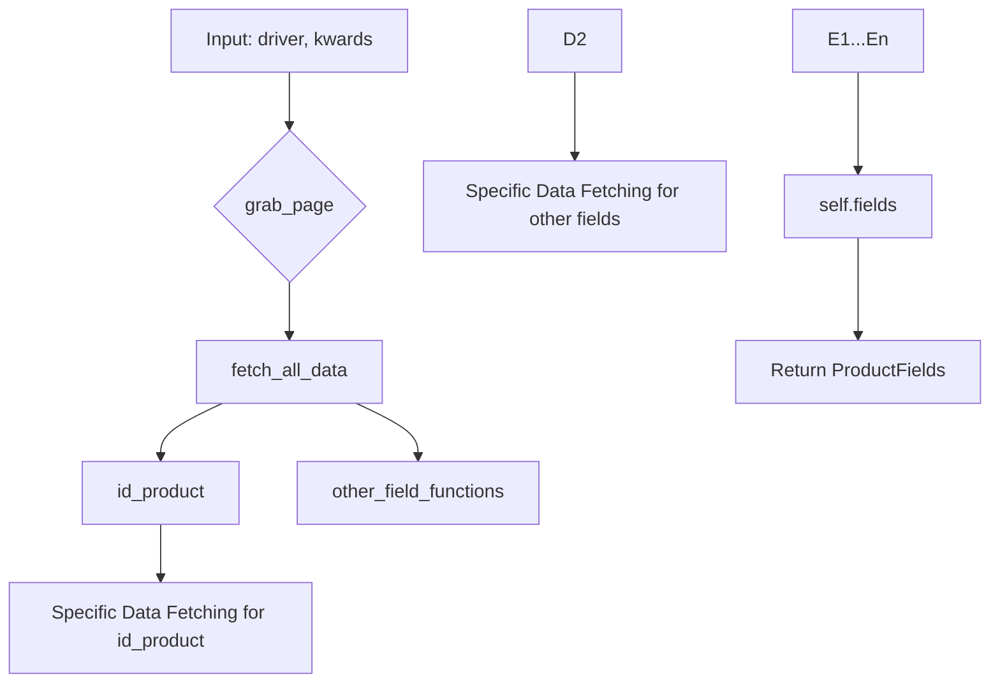

```python
## \file hypotez/src/suppliers/bangood/graber.py
# -*- coding: utf-8 -*-\
#! venv/Scripts/python.exe
#! venv/bin/python/python3.12

"""
.. module: src.suppliers.bangood 
	:platform: Windows, Unix
	:synopsis:  Класс собирает значение полей на странице  товара `bangood.com`. 
    Для каждого поля страницы товара сделана функция обработки поля в родительском классе.
    Если нужна нестандертная обработка, функция перегружается в этом классе.
    ------------------
    Перед отправкой запроса к вебдрайверу можно совершить предварительные действия через декоратор. 
    Декоратор по умолчанию находится в родительском классе. Для того, чтобы декоратор сработал надо передать значение 
    в `Context.locator`, Если надо реализовать свой декоратор - раскоментируйте строки с декоратором и переопределите его поведение

"""
MODE = 'dev'

import asyncio
from pathlib import Path
from types import SimpleNamespace
from typing import Any, Callable, Optional
from dataclasses import dataclass, field
from functools import wraps
from pydantic import BaseModel
from src import gs
from src.suppliers import Graber as Grbr, Context, close_pop_up
from src.product import ProductFields
from src.webdriver import Driver
from src.utils.jjson import j_loads_ns
from src.logger import logger
from src.logger.exceptions import ExecuteLocatorException

from dataclasses import dataclass, field
from types import SimpleNamespace
from typing import Any, Callable


# # Определение декоратора для закрытия всплывающих окон
# # В каждом отдельном поставщике (`Supplier`) декоратор может использоваться в индивидуальных целях
# # Общее название декоратора `@close_pop_up` можно изменить 


# def close_pop_up(value: Any = None) -> Callable:
#     """Создает декоратор для закрытия всплывающих окон перед выполнением основной логики функции.

#     Args:
#         value (Any): Дополнительное значение для декоратора.

#     Returns:
#         Callable: Декоратор, оборачивающий функцию.
#     """
#     def decorator(func: Callable) -> Callable:
#         @wraps(func)
#         async def wrapper(*args, **kwargs):
#             try:
#                 # await Context.driver.execute_locator(Context.locator.close_pop_up)  # Await async pop-up close  
#                 ... 
#             except ExecuteLocatorException as e:
#                 logger.debug(f'Ошибка выполнения локатора: {e}')
#             return await func(*args, **kwargs)  # Await the main function
#         return wrapper
#     return decorator


class Graber(Grbr):
    """Класс для операций захвата Morlevi."""
    supplier_prefix: str

    def __init__(self, driver: Driver):
        """Инициализация класса сбора полей товара."""
        self.supplier_prefix = 'bangood'
        super().__init__(supplier_prefix=self.supplier_prefix, driver=driver)
        # Устанавливаем глобальные настройки через Context
        Context.locator_for_decorator = None # <- если будет уастановлено значение - то оно выполнится в декораторе `@close_pop_up`


    async def grab_page(self, driver: Driver) -> ProductFields:
        """Asynchronous function to grab product fields.

        Args:
            driver (Driver): The driver instance to use for grabbing.

        Returns:
            ProductFields: The grabbed product fields.
        """
        global d
        d = self.d = driver  
        
        # ... (Implementation for getting data)
        async def fetch_all_data(**kwards):
            # Call functions to fetch specific data for different product fields
            await self.id_product(kwards.get("id_product", ''))
            # ... (rest of the field fetching functions)
            await self.local_saved_image(kwards.get("local_saved_image", ''))
            
        # Call the function to fetch all data
        await fetch_all_data()
        return self.fields
```

**<algorithm>**



**Example Data Flow:**

1.  `grab_page` receives a `driver` object and keyword arguments (`kwards`) containing product identifiers or other information.
2.  It calls `fetch_all_data` with the provided `kwards`.
3.  `fetch_all_data` calls several functions (e.g., `id_product`, `name`, `price`) which each retrieve a specific piece of data from the web page using the `driver`.
4.  Data fetched from each function is aggregated.
5.  `grab_page` then returns the assembled `ProductFields` object.

**<explanation>**

* **Imports:**
    * `asyncio`: For asynchronous operations.
    * `pathlib`, `types`, `typing`, `dataclasses`, `functools`, `pydantic`: Standard Python libraries for file paths, type hinting, data structures, function decorators, and data validation.
    * `src.*`: This is crucial and indicates a package structure for the project. `src.suppliers`, `src.product`, `src.webdriver`, `src.utils.jjson`, `src.logger` and  `src.logger.exceptions` are parts of a larger application, providing functionality like web scraping, product data handling, web driver management, JSON processing, and logging. `Graber` and `Context` are classes within `src.suppliers`. The specific relationships are not directly shown in the snippet but depend on the broader project structure.


* **Classes:**
    * `Graber`:
        * Inherits from `Grbr` (likely a base `Graber` class in `src.suppliers`).
        * `supplier_prefix`: Stores the supplier identifier ('bangood').
        * `__init__`: Initializes the `Graber` object with a `driver` and sets up the `supplier_prefix`. It also initializes a crucial field `Context.locator_for_decorator` that will trigger additional logic during web scraping if necessary.
        * `grab_page`: The main asynchronous function for retrieving product information. It calls various functions (e.g., `id_product`, `name`, `price`) to fetch data points. This function returns a `ProductFields` object (data class or Pydantic model) containing all collected information.

* **Functions:**
    * `fetch_all_data`: A helper function for managing the asynchronous calls to functions for collecting individual product field data.
    * `id_product`, `name`, `price` (and others): These are placeholders for functions (probably within the `Graber` class) that will retrieve the specific product data from the webpage. The actual implementation of each function will depend on the structure and layout of the Banggood webpage, potentially using `driver.find_element` or similar WebDriver methods to extract the desired information.


* **Variables:**
    * `MODE`: Likely a configuration constant to distinguish development or production modes.
    * `d`: A global variable that holds a driver instance. It is used inside the grab_page method. Use caution with global variables as they might cause unexpected behavior in larger applications.  
    * `Context.locator_for_decorator`: This variable is used to conditionally apply additional processing to the webpage before extracting data.


* **Potential Errors/Improvements:**
    * **Missing `fetch_specific_data` implementation:** The `fetch_all_data` function contains placeholder comments. The code needs the actual functions (`fetch_specific_data` or their implementations) to correctly retrieve product information.
    * **Global variable `d`:** While global variables can be used in simple scripts, it is generally better to pass the `driver` object directly to the helper functions and avoiding global variables in larger codebases to reduce unexpected side effects.
    * **Large number of functions for data extraction:** The code includes many placeholders for data extraction functions.  Consider a more structured way of managing these functions (e.g., using dictionaries mapping field names to extraction functions).
    * **Error Handling:** The example includes a `try...except` block. However, it could be more comprehensive by adding more specific error handling for each data extraction process, including checking if the elements are found, handling possible exceptions.

**Relationship Chain:**

The `Graber` class interacts with other parts of the project through:

1.  `Grbr` (likely a base `Graber` class): Defining a common interface.
2.  `Context` (likely a context manager): Providing access to global configuration and the web driver object (`driver`).
3.  `ProductFields`: The data model for storing the gathered product information.
4.  `Driver`: Directly interacts with the webdriver to scrape data from the web page.
5.  `logger`: For logging information and errors during the web scraping process.
6.  `gs`,  `j_loads_ns`: Other utility classes and functions are likely part of a package responsible for further processing, storing, or manipulating product information.