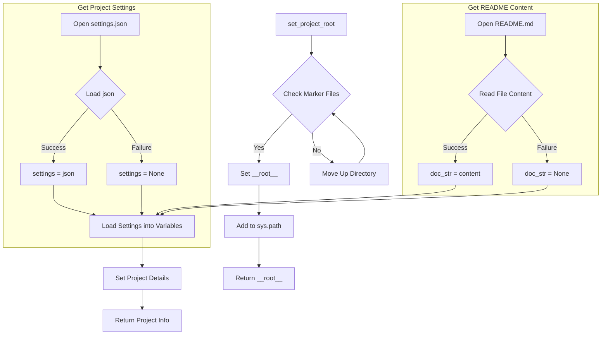

```python
## \file hypotez/src/suppliers/bangood/header.py
# -*- coding: utf-8 -*-\n#! venv/Scripts/python.exe
#! venv/bin/python/python3.12
"""
.. module: src.suppliers.bangood 
	:platform: Windows, Unix
	:synopsis:

"""
MODE = 'dev'


import sys
import json
from packaging.version import Version
from pathlib import Path
def set_project_root(marker_files=('pyproject.toml', 'requirements.txt', '.git')) -> Path:
    """
    Finds the root directory of the project starting from the current file's directory,
    searching upwards and stopping at the first directory containing any of the marker files.

    Args:
        marker_files (tuple): Filenames or directory names to identify the project root.
    
    Returns:
        Path: Path to the root directory if found, otherwise the directory where the script is located.
    """
    __root__:Path
    current_path:Path = Path(__file__).resolve().parent
    __root__ = current_path
    for parent in [current_path] + list(current_path.parents):
        if any((parent / marker).exists() for marker in marker_files):
            __root__ = parent
            break
    if __root__ not in sys.path:
        sys.path.insert(0, str(__root__))
    return __root__


# Get the root directory of the project
__root__ = set_project_root()
"""__root__ (Path): Path to the root directory of the project"""

from src import gs

settings:dict = None
try:
    with open(gs.path.root / 'src' / 'settings.json', 'r') as settings_file:
        settings = json.load(settings_file)
except (FileNotFoundError, json.JSONDecodeError):
    ...

doc_str:str = None
try:
    with open(gs.path.root / 'src' / 'README.MD', 'r') as settings_file:
        doc_str = settings_file.read()
except (FileNotFoundError, json.JSONDecodeError):
    ...


__project_name__ = settings.get("project_name", 'hypotez') if settings  else 'hypotez'
__version__: str = settings.get("version", '')  if settings  else ''
__doc__: str = doc_str if doc_str else ''
__details__: str = ''
__author__: str = settings.get("author", '')  if settings else ''
__copyright__: str = settings.get("copyrihgnt", '')  if settings else ''
__cofee__: str = settings.get("cofee", "Treat the developer to a cup of coffee for boosting enthusiasm in development: https://boosty.to/hypo69")  if settings else "Treat the developer to a cup of coffee for boosting enthusiasm in development: https://boosty.to/hypo69"
```

**<algorithm>**



**Examples:**

* **`set_project_root`:** If `__file__` is in `/path/to/project/suppliers/bangood/header.py`, and `pyproject.toml` exists in `/path/to/project`, then `__root__` will be set to `/path/to/project`.
* **`settings` loading:** If `settings.json` exists and is valid JSON, `settings` will contain the loaded data. Otherwise, `settings` will be `None`.


**<explanation>**

**Imports:**

* `sys`: Provides access to system-specific parameters and functions, such as `sys.path`, which is used to modify the Python module search path.
* `json`: Used for encoding and decoding JSON data, necessary for handling `settings.json`.
* `packaging.version`:  Used for version handling (though not directly used in this file)
* `pathlib`: Provides object-oriented way of working with files and pathnames
* `src.gs`:  This import likely defines a module (`gs`) within the `src` package, providing utility functions (possibly including `path` object). The exact contents of `gs` are not shown in this snippet, but it is clear this file relies on it to access the project's root directory.

**Classes:**

* No classes are defined directly within the file.

**Functions:**

* **`set_project_root(marker_files)`:** This function aims to locate the root directory of a project. It takes a tuple of file or directory names as input (e.g., `pyproject.toml`, `requirements.txt`) to identify the project root.  It starts from the current file's directory and walks up the directory tree until it finds a directory that contains at least one of the specified marker files. The crucial part is its modification to `sys.path`: it ensures that the project's root is added to the search path, allowing the code to import modules from other parts of the project.  
    * **Example:** If the current file is in `.../suppliers/bangood/header.py`, and `pyproject.toml` is in `.../`, `set_project_root()` will return the path to `.../`, effectively making all parts of the project available to this script.

**Variables:**

* **`__root__`:** A `Path` object representing the root directory of the project, crucial for relative pathing throughout the project.
* **`settings`:** A `dict` containing settings loaded from `settings.json`.  `None` if loading fails.
* **`doc_str`:** String containing the content of `README.MD` (or `None` if not found).
* **`__project_name__`**, `__version__`, `__doc__`, etc.: These variables store project-related data, like name, version, and documentation.  They are populated from the `settings` dictionary, using sensible defaults if the settings are missing.


**Potential Errors/Improvements:**

* **Error Handling:** The use of `try...except` blocks for loading `settings.json` and `README.MD` is good practice, preventing the script from crashing if these files are missing or invalid.  However, the `...` means any kind of error are ignored. Better practice would be more specific exception handling (e.g., `FileNotFoundError`, `json.JSONDecodeError`) and a more meaningful error message to the user.
* **`sys.path` modification:**  The modification of `sys.path` is essential; otherwise, you will encounter errors when importing modules.
* **Type Hinting:** Excellent use of type hinting, providing more readable code.


**Relationships with Other Parts:**

* The file depends on `gs` (likely from the `src` package) for path manipulation.
* It relies on `settings.json` for project configuration and `README.MD` for documentation, both located in the `src` directory.

This analysis covers the essential aspects of the file and its place within the project structure.  The understanding of how `src.gs` is defined and interacts with paths is key to fully comprehending the context.