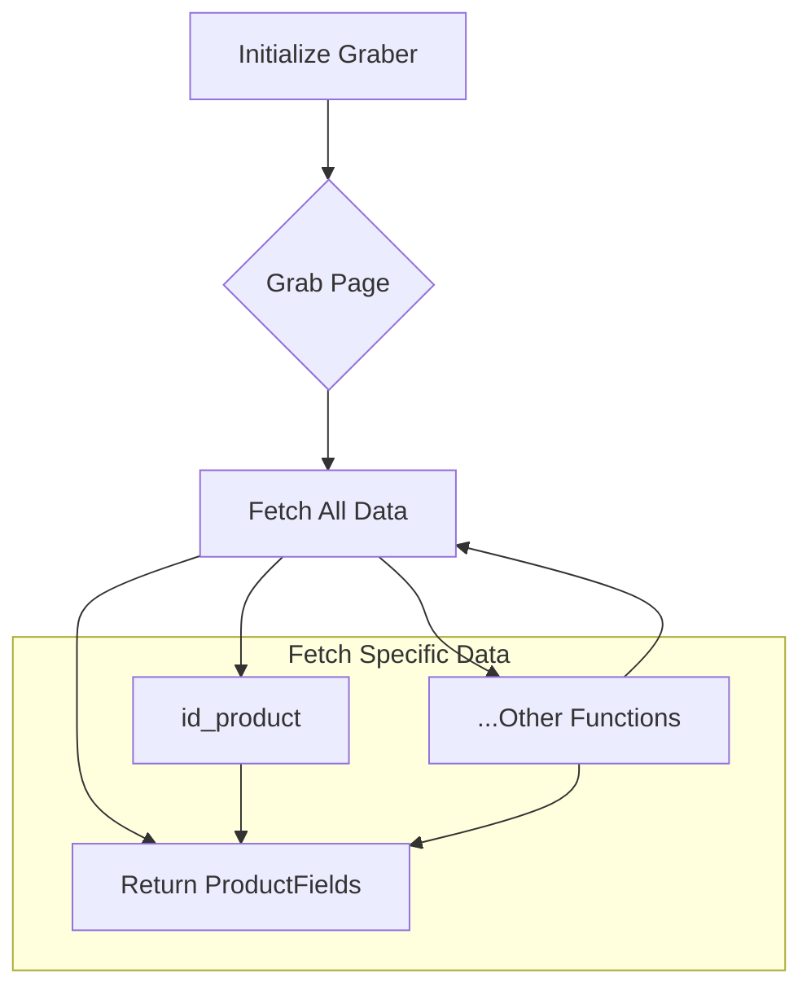

```
## File hypotez/src/suppliers/cdata/graber.py
# -*- coding: utf-8 -*-\n#! venv/Scripts/python.exe\n#! venv/bin/python/python3.12\n\n"""\n.. module: src.suppliers.cdata \n\t:platform: Windows, Unix\n\t:synopsis:  Класс собирает значение полей на странице  товара `cdata.co.il`. \n    Для каждого поля страницы товара сделана функция обработки поля в родительском классе.\n    Если нужна нестандертная обработка, функция перегружается в этом классе.\n    ------------------\n    Перед отправкой запроса к вебдрайверу можно совершить предварительные действия через декоратор. \n    Декоратор по умолчанию находится в родительском классе. Для того, чтобы декоратор сработал надо передать значение \n    в `Context.locator`, Если надо реализовать свой декоратор - раскоментируйте строки с декоратором и переопределите его поведение\n\n"""\nMODE = 'dev'\n\nimport asyncio\nfrom pathlib import Path\nfrom types import SimpleNamespace\nfrom typing import Any, Callable, Optional\nfrom dataclasses import dataclass, field\nfrom functools import wraps\nfrom pydantic import BaseModel\nfrom src import gs\nfrom src.suppliers import Graber as Grbr, Context, close_pop_up\nfrom src.product import ProductFields\nfrom src.webdriver import Driver\nfrom src.utils.jjson import j_loads_ns\nfrom src.logger import logger\nfrom src.logger.exceptions import ExecuteLocatorException\n\nfrom dataclasses import dataclass, field\nfrom types import SimpleNamespace\nfrom typing import Any, Callable\n\n\n# # Определение декоратора для закрытия всплывающих окон\n# # В каждом отдельном поставщике (`Supplier`) декоратор может использоваться в индивидуальных целях\n# # Общее название декоратора `@close_pop_up` можно изменить \n\n\n# def close_pop_up(value: Any = None) -> Callable:\n#     """Создает декоратор для закрытия всплывающих окон перед выполнением основной логики функции.\n\n#     Args:\n#         value (Any): Дополнительное значение для декоратора.\n\n#     Returns:\n#         Callable: Декоратор, оборачивающий функцию.\n#     """\n#     def decorator(func: Callable) -> Callable:\n#         @wraps(func)\n#         async def wrapper(*args, **kwargs):\n#             try:\n#                 # await Context.driver.execute_locator(Context.locator.close_pop_up)  # Await async pop-up close  \n#                 ... \n#             except ExecuteLocatorException as e:\n#                 logger.debug(f'Ошибка выполнения локатора: {e}')\n#             return await func(*args, **kwargs)  # Await the main function\n#         return wrapper\n#     return decorator\n\nclass Graber(Grbr):\n    """Класс для операций захвата Morlevi."""\n    supplier_prefix: str\n\n    def __init__(self, driver: Driver):\n        """Инициализация класса сбора полей товара."""\n        self.supplier_prefix = 'cdata'\n        super().__init__(supplier_prefix=self.supplier_prefix, driver=driver)\n        # Устанавливаем глобальные настройки через Context\n        \n        Context.locator_for_decorator = None # <- если будет уастановлено значение - то оно выполнится в декораторе `@close_pop_up`\n\n        \n\n    async def grab_page(self, driver: Driver) -> ProductFields:\n        """Asynchronous function to grab product fields.\n\n        Args:\n            driver (Driver): The driver instance to use for grabbing.\n\n        Returns:\n            ProductFields: The grabbed product fields.\n        """\n        global d\n        d = self.d = driver  \n        \n        ...\n        # Логика извлечения данных\n        async def fetch_all_data(**kwards):\n        \n            # Call function to fetch specific data\n            # await fetch_specific_data(**kwards)  \n\n            # Uncomment the following lines to fetch specific data\n            await self.id_product(kwards.get(\"id_product\", ''))\n            # ... (rest of the calls)\n\n        # Call the function to fetch all data\n        await fetch_all_data()\n        return self.fields\n\n```

**<algorithm>**



**Example Data Flow:**

1. **Initialize Graber:**  `Graber` class is initialized with a `Driver` object (`driver`). This sets up the connection to the web browser for scraping.  (Example: `driver` is an instance of a Selenium WebDriver)
2. **Grab Page:** The `grab_page` function is called.  This function contains the core logic for gathering data.
3. **Fetch All Data:** A helper function `fetch_all_data` is used to organize the process.
4. **Fetch Specific Data:**  The helper function calls various other methods (e.g., `id_product`, `name`, etc.) to fetch specific data points from the web page. Each method (`id_product`, `name`, ...) retrieves a specific data field, according to the parameter passed to `fetch_all_data()`.
5. **Return ProductFields:**  Finally, the `ProductFields` object containing all the extracted data is returned.


**<explanation>**

* **Imports:**
    * `asyncio`: For asynchronous operations.
    * `pathlib`, `types`, `typing`, `dataclasses`, `functools`, `pydantic`: Standard Python libraries for file paths, data types, dataclasses, decorators, data validation.
    * `src.gs`, `src.suppliers.Graber`, `src.suppliers.Context`, `src.suppliers.close_pop_up`, `src.product.ProductFields`, `src.webdriver.Driver`, `src.utils.jjson`, `src.logger`, `src.logger.exceptions`:  Imports from the project's `src` directory.  This implies a modular structure, where `src.suppliers` contains classes related to web scraping suppliers, `src.product` deals with product data structures, and `src.logger` manages logging.  Importantly, `close_pop_up` and  `Context` likely represent shared functionality or configuration across various supplier modules.

* **Classes:**
    * `Graber(Grbr)`: Inherits from `Grbr` (likely a base `Graber` class).  `Graber` is specialized for scraping data from `cdata.co.il`.
        * `supplier_prefix`:  Stores the name of the supplier ("cdata").
        * `__init__`: Initializes the `Graber` object, passing the `driver` and setting the `supplier_prefix`. It also handles initializing `Context.locator_for_decorator` to potentially enable a pop-up closing decorator from a parent class.
        * `grab_page`: The main asynchronous function for gathering product fields. It calls other functions to fetch data.  Crucially, this function returns `ProductFields`, a dataclass likely defined in `src.product`.

* **Functions:**
    * `fetch_all_data`: A helper function that calls specific data extraction functions.


* **Variables:**
    * `d`: A global variable (very bad practice!).  It stores the `driver` object. Avoid using global variables where possible; they decrease code clarity and maintainability.  This code might use `d` within `fetch_all_data` or specific data extraction methods.
    * `kwards`: The dictionary of keyword arguments passed to `fetch_all_data`.

* **Potential Errors and Improvements:**

    * **Global variable `d`:** Using a global `d` variable for the driver is a potential source of errors and a significant violation of good coding practices.  Use the `self.driver` attribute of the `Graber` class to access the driver object.
    * **Uncommenting:**  The code contains many commented-out calls to various functions. These likely represent data fields to be collected; ensure that these are correctly implemented and uncommented.
    * **Error Handling:** While there's a `try...except` block for `ExecuteLocatorException`, it lacks a more comprehensive approach to handling exceptions that might occur during web scraping, like network problems, timeouts, or element not found.
    * **Missing Data Validation:** The code doesn't validate the extracted data; it could contain unexpected or invalid data types, which might cause issues later. Implement type checking (e.g., using `typing`) or validation logic (e.g., with `pydantic`) for the `ProductFields` structure.
    * **Data Structure (`ProductFields`):** The structure of `ProductFields` in `src.product` needs to match the expected structure of the data being extracted from `cdata.co.il`.

**Relationship Chain:**

This code interacts with various other parts of the project through imports.  A relationship chain would be like this:

1. `Graber` depends on `src.suppliers.Graber` (likely a base class) and `src.webdriver.Driver` for web interaction.
2. `Graber` needs `ProductFields` and potentially other data structures (e.g., for product specifications) in `src.product`.
3. `Graber` uses `src.logger` for logging errors and messages.


In summary, the code is a web scraper for product data from `cdata.co.il`. It's designed to be modular, utilizing asynchronous methods for efficiency. However, significant improvements regarding global variables, error handling, data validation, and implementation of the missing logic are needed for robust operation.