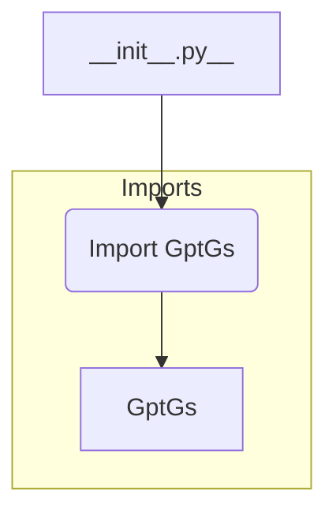

**<input code>**

```python
## \file hypotez/src/suppliers/chat_gpt/__init__.py
# -*- coding: utf-8 -*-\
#! venv/Scripts/python.exe
#! venv/bin/python/python3.12

"""
.. module: src.suppliers.chat_gpt 
	:platform: Windows, Unix
	:synopsis:

"""
MODE = 'dev'

from .gsheet import GptGs
```

**<algorithm>**



**Example Data Flow:**

No explicit data flow is shown in this small file.  The `__init__.py` file simply imports the `GptGs` class from the `gsheet.py` file, which resides in the same directory.

**<explanation>**

* **Imports:**
    - `from .gsheet import GptGs`: This line imports the `GptGs` class from the `gsheet.py` file within the same directory (`./gsheet.py`). This is a relative import. It's a crucial part of Python's package structure, allowing the `chat_gpt` module to use functionality from its internal sub-modules without explicitly specifying the full path. This file is part of the `suppliers` package within the `hypotez` project.  The `.` indicates that the imported module is located in the same directory.

* **Classes:**
    - `GptGs`: This is a class, defined in the `gsheet.py` file, but not directly defined or used in this `__init__.py`.   The `__init__.py` file simply imports this class making it usable in other files that import `chat_gpt`.  The precise functionality of this class (`GptGs`) is not visible within this snippet and would be defined within `gsheet.py`.

* **Functions:**
    - There are no functions defined in this file.

* **Variables:**
    - `MODE = 'dev'`: This is a constant string variable. It's likely used for configuration purposes (e.g., to distinguish between development and production modes).  It likely influences behavior in other parts of the project that import `chat_gpt`.

* **Potential Errors/Improvements:**
    - **Missing Docstrings:** While the module (`src.suppliers.chat_gpt`) has docstrings, the `MODE = 'dev'` variable, and the import statement lack internal docstrings, which can help in understanding their purpose.
    - **No direct use of the GptGs class:** This file imports `GptGs` but doesn't create or use instances of the class itself. This would be done in other parts of the project that import this file.
    - **Ambiguity:** `gsheet` doesn't provide enough context.  The file name suggests it interacts with Google Sheets; this aspect is crucial to understanding its purpose and relationship with the larger system.


**Relationship with other parts of the project:**

The `chat_gpt` module, through the `GptGs` class in `gsheet.py`, likely interacts with Google Sheets APIs.  The `MODE = 'dev'` variable in `__init__.py` suggests the `chat_gpt` package is part of a larger framework for managing settings and configurations, potentially used by other components within the `hypotez` project, and likely a key part of a data pipelines setup.  More context from other files within the `hypotez` project would help refine the understanding of how this module integrates into the entire system.