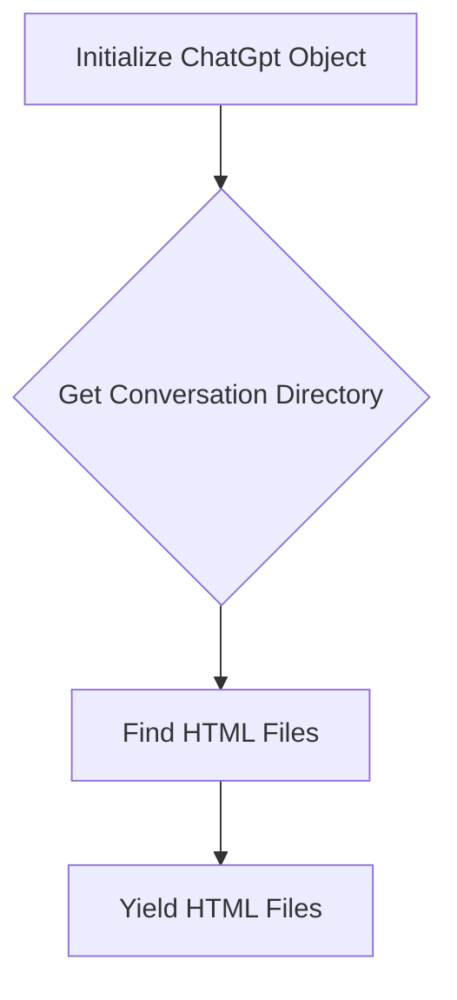

1. <input code>
```python
## \file hypotez/src/suppliers/chat_gpt/chat_gpt.py
# -*- coding: utf-8 -*-
#! venv/Scripts/python.exe
#! venv/bin/python/python3.12

"""
.. module: src.suppliers.chat_gpt 
	:platform: Windows, Unix
	:synopsis:

"""
MODE = 'dev'

"""
	:platform: Windows, Unix
	:synopsis:

"""

"""
	:platform: Windows, Unix
	:synopsis:

"""


"""
  :platform: Windows, Unix

"""
"""
  :platform: Windows, Unix
  :platform: Windows, Unix
  :synopsis:
"""MODE = 'dev'
  
import header
from pathlib import Path
from src import gs
from src.utils.file import recursively_read_text_files
class ChatGpt:

    def yeld_conversations_htmls(self) -> str:
        """"""
        ...
        conversation_directory = Path(gs.path.data / 'chat_gpt' / 'conversations')
        html_files = conversation_directory.glob("*.html")

```

2. <algorithm>



**Example:**

- **A:** A `ChatGpt` object is created.
- **B:** The code accesses the `gs.path.data` object (likely a global variable or class attribute containing a path), appends 'chat_gpt/conversations' to construct the path to the conversations directory.
- **C:** The `glob` method is used to find all files ending with `.html` in the specified directory, resulting in a list of file paths (`html_files`).  E.g., if the directory contains `conversation1.html`, `conversation2.html`, `otherfile.txt`, `html_files` will contain `conversation1.html`, `conversation2.html`.
- **D:** The code yields the identified HTML files (presumably for processing or further use).

3. <explanation>

- **Imports:**
    - `header`: This import is unclear without seeing the `header.py` file.  It's likely a custom header file containing import statements or global variables for the project, essential for initialization.  The relationship is unclear without context.
    - `pathlib`: Used for object-oriented file system paths (`Path`), making path handling more manageable and robust than string manipulation.
    - `gs`: This import likely references the `gs` module (possibly `global_settings` or similar). This module probably contains crucial configurations (e.g., paths to data directories). The relationship is with global configuration management.
    - `recursively_read_text_files`:  This import suggests the existence of a `file` module within the `utils` package.  Its purpose is to read text files recursively. The relation is with file handling functionality.

- **Classes:**
    - `ChatGpt`: This class likely represents the Chat GPT interaction logic for a hypothetical application.
    - `yeld_conversations_htmls(self) -> str`: This method (incomplete) is likely responsible for fetching HTML files related to conversation data. It will retrieve files from the `conversation_directory`, determined by `gs`. It should handle edge cases and raise exceptions when files are missing or have incorrect formats.


- **Functions:**
    - No complete functions exist. The method `yeld_conversations_htmls` is incomplete (the `...` indicates missing code), but its intent is clear: to find and return a list of conversation files in HTML format, given a directory path.


- **Variables:**
    - `MODE`: A string variable likely controls application modes (e.g., development, production). The current value is 'dev'.
    - `conversation_directory`: A `Path` object representing the directory containing the conversation HTML files.
    - `html_files`: An iterator/generator object containing the found HTML file paths.

- **Potential Errors and Improvements:**
    - **Incomplete method:**  The `yeld_conversations_htmls` method is unfinished and lacks the code to actually *yield* the HTML files.  This should be expanded to read and return the contents of the HTML files.
    - **Error handling:** The code lacks error handling for cases where the conversation directory doesn't exist, or no HTML files are found.  Adding `try...except` blocks to catch `FileNotFoundError` and other relevant exceptions would improve robustness.  Consider `conversation_directory.exists()` for existence checking before proceeding.
    - **File format validation:** Assuming the function is meant to return the *content* of the files, you need validation.  What if the files are corrupt or have an invalid format? Validate the file content to prevent unexpected behavior.
    - **Yield vs. Return:** The function is designed to *yield* results (efficient for potentially large datasets).  Consider what the expected usage is before modifying from yielding to returning a list.


- **Relationships with other parts of the project:**
    - The code heavily relies on the `gs` module (likely containing settings).  The `gs.path.data` path to the data directory is essential for locating the files.