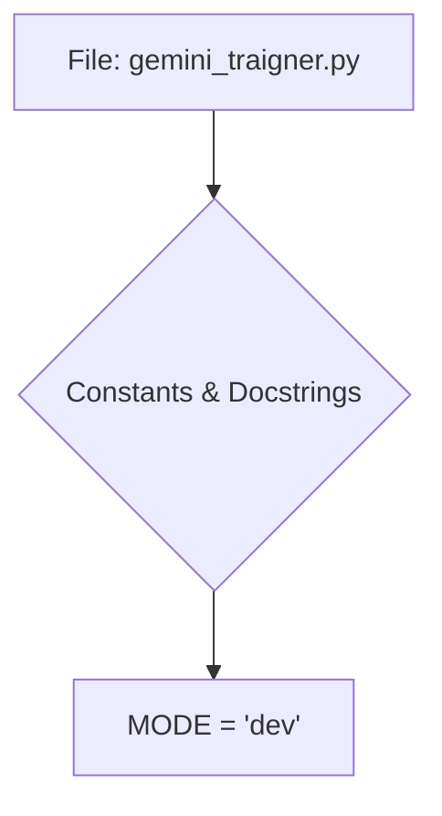

```
1. <input code>
```python
## \file hypotez/src/suppliers/chat_gpt/gemini_traigner.py
# -*- coding: utf-8 -*-
#! venv/Scripts/python.exe
#! venv/bin/python/python3.12

"""
.. module: src.suppliers.chat_gpt 
	:platform: Windows, Unix
	:synopsis:

"""
MODE = 'dev'

"""
	:platform: Windows, Unix
	:synopsis:

"""


"""
	:platform: Windows, Unix
	:synopsis:

"""


"""
  :platform: Windows, Unix

"""
"""
  :platform: Windows, Unix
  :platform: Windows, Unix
  :synopsis:
"""MODE = 'dev'
```

2. <algorithm>



There's no significant algorithm or workflow to describe as the provided code snippet only contains docstrings and a constant declaration.  It defines a variable `MODE` and some empty docstrings.  Data flow is minimal, if any.


3. <explanation>

* **Imports**: There are no imports in this code snippet.

* **Classes**: No classes are defined.

* **Functions**: No functions are defined.

* **Variables**:
    * `MODE`: A string variable initialized to 'dev'.  It appears to be a global configuration variable, likely controlling the mode of operation (e.g., development, production).

* **Potential Errors or Areas for Improvement**:
    * **Redundancy:** The multiple empty docstrings and the repeated definition of `MODE` are redundant and should be removed for clarity and maintainability.
    * **Docstrings:** The docstrings themselves are not very informative and are not used by any tools (like Sphinx).  They should be descriptive and use proper Sphinx docstring conventions.  Additionally, the docstring for `MODE` should explain what that variable actually means and does, and the context of what 'dev' represents, rather than just saying 'development'.
    * **File/Module Structure**: The Python shebangs (`#! venv/Scripts/python.exe` and `#! venv/bin/python/python3.12`) are unnecessary and potentially problematic.  Use a single correct shebang line, or even better use a virtual environment and virtual environment specific configuration to use Python.


* **Relationships with other parts of the project**: The `src.suppliers.chat_gpt` module (presumably) is part of a larger project.  The `MODE` variable would likely be used by other modules within the `src` package to conditionally enable or disable certain functionalities or configuration settings.  The `gemini_traigner` file is likely a part of a larger program that interacts with or trains a Gemini (likely an AI) model.


**Summary:**

This file appears to be a part of a project for using or training a Gemini AI model.  The current content only defines a mode, likely intended for use by other modules that make up the actual training and utilization processes. The redundancy of docstrings and variable definitions make for an unoptimized module, and the `#!` style python shebang lines should be avoided.  A better practice would be to move the `MODE` configuration variable into a configuration file for better maintenance and organization.