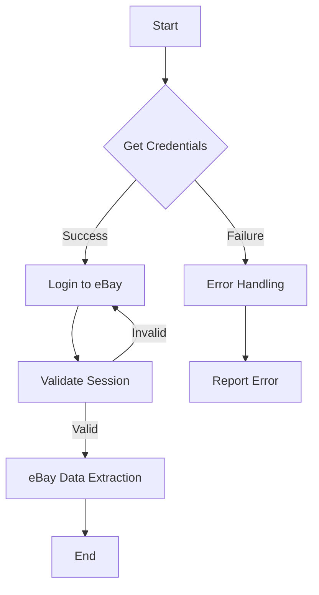

```
1. <input code>

```python
## \file hypotez/src/suppliers/ebay/login.py
# -*- coding: utf-8 -*-\
#! venv/Scripts/python.exe
#! venv/bin/python/python3.12

"""
.. module: src.suppliers.ebay 
	:platform: Windows, Unix
	:synopsis:

"""
MODE = 'dev'

"""
	:platform: Windows, Unix
	:synopsis:

"""


"""
	:platform: Windows, Unix
	:synopsis:

"""


"""
  :platform: Windows, Unix

"""
"""
  :platform: Windows, Unix
  :platform: Windows, Unix
  :synopsis:
"""MODE = 'dev'
  
""" module: src.suppliers.ebay """


"""   Интерфейс авторизации. Реализация для вебдрайвера

@image html login.png
"""
```

2. <algorithm>



* **Start**: Initialization of the login process.
* **Get Credentials**: Fetching necessary credentials (username, password, etc.) for eBay login. Example: Reading from a configuration file or database.
* **Login to eBay**: Attempting to log in to the eBay website using the retrieved credentials. Example: Using a web driver (e.g., Selenium) to interact with the eBay login page.
* **Error Handling**: Implementing error handling in case of login failure.  Example: Checking for specific error codes returned by the web driver.
* **Validate Session**: Verifying if the login was successful by checking if a valid session cookie exists. Example: Checking for a specific session ID stored in the driver.
* **eBay Data Extraction**: If the session is valid, extracting data from eBay (e.g., product listings). Example: Using XPath or CSS selectors to locate and extract information from the eBay page.
* **Report Error**: If validation fails, reporting the specific error.  Example: Log the error message, provide it to the calling function, or raise an exception to be handled higher up the stack.
* **End**: Completion of the login and data retrieval process.


3. <explanation>

* **Imports**: There are no imports in this code snippet. It appears to be a stub or documentation file.  Crucially, without imports, there can't be dependencies/relationships with other packages.

* **Classes**: No classes are defined.

* **Functions**: No functions are defined.

* **Variables**: Only one variable is present, `MODE = 'dev'`. It's a string variable and is likely used for configuration purposes (e.g., to distinguish between development and production modes).

* **Potential Errors/Improvements**:
    * **Missing Implementation**: The code is a placeholder, and lacks any actual implementation of login or data extraction logic. This file clearly needs to import libraries, use functions, and create classes to achieve the intended login functionality.
    * **Incomplete Documentation**: The docstrings are incomplete; they lack details about the function's arguments, return values, exceptions raised, and relationships to other parts of the project.
    * **Missing Error Handling**: The workflow diagram suggests error handling, but the code snippet has none. Implementing appropriate error handling is critical to robust code.
    * **Dependency on External Libraries**: The comments suggest reliance on a web driver (e.g., Selenium). This dependency should be handled with proper import statements and installation of the necessary libraries.
    * **Hardcoded Credentials**: Any sensitive credentials (e.g., username and passwords) should absolutely *not* be hardcoded in the source code.  Instead, they must be stored securely in environment variables or configuration files.

* **Relationships with other parts of the project**: The `hypotez/src/suppliers/ebay/login.py` file likely interacts with other modules or classes within the `hypotez` project to perform eBay related tasks. It would use appropriate imports and method calls, but without actual implementation, the details are unknown.


**Overall:**  The file is a starting point for a login script. It needs significant implementation to perform the actions described in the documentation and algorithm.  Important improvements include handling authentication securely, robust error handling, and connecting with external libraries.