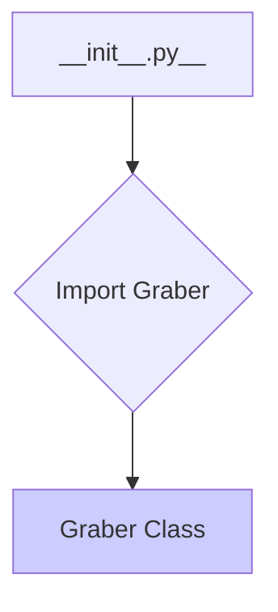

1. **<input code>**

```python
## \file hypotez/src/suppliers/etzmaleh/__init__.py
# -*- coding: utf-8 -*-\
#! venv/Scripts/python.exe
#! venv/bin/python/python3.12

"""
.. module: src.suppliers.etzmaleh 
	:platform: Windows, Unix
	:synopsis:

"""
MODE = 'dev'


from .graber import Graber
```

2. **<algorithm>**



No complex algorithm is present. This file is a module initializer for the `etzmaleh` supplier. Its primary function is to import the `Graber` class from the `graber.py` module within the same directory.


3. **<explanation>**

* **Imports:**
    * `from .graber import Graber`: This line imports the `Graber` class from the `graber.py` file.  The `.` indicates that `graber.py` is located in the same directory as the current file (`__init__.py`). This is a standard Python import for modules within a package.  This import is crucial for using the `Graber` class in other parts of the `hypotez` project that import this module.  The `hypotez` project appears to have a modular structure, likely for organizing different suppliers (e.g., `etzmaleh`) and their components.


* **Variables:**
    * `MODE = 'dev'`: This variable likely sets a mode for the `etzmaleh` supplier.  The value `'dev'` suggests a development or testing mode. This variable is likely used for conditional logic within the `etzmaleh` modules, allowing for different behaviors in development versus production (e.g., different logging levels, data sources, or APIs).


* **Classes (Implicit):**
    * `Graber`: While the code snippet only imports the `Graber` class from the `graber.py` module, `Graber` is a class that is defined elsewhere (in `graber.py`). The `__init__.py` acts as an entry point for accessing this class within the `etzmaleh` supplier.   Further analysis of `graber.py` is needed to understand its full functionality, attributes, and methods.


* **Functions (Implicit):**
    * No functions are directly defined in this `__init__.py` file. All functions related to the `etzmaleh` supplier are contained within the `graber.py` file.


* **Potential Errors or Areas for Improvement:**
    * **Missing Documentation:**  While a docstring exists at the top, `Graber` class is not documented directly within the `__init__.py`. A thorough documentation within `graber.py` is highly recommended.
    * **Detailed Purpose:** A more descriptive docstring for this `__init__.py` file would be helpful to fully understand its intent, clarifying how it supports the `etzmaleh` supplier within the broader `hypotez` project structure.

* **Relationship with Other Parts of the Project:**
    * The `hypotez` project likely uses a package structure, with separate modules/packages for different parts of the application. The `suppliers` package seems to contain modules for various data suppliers (e.g., `etzmaleh`).
    * `graber.py` (presumably containing the `Graber` class) contains the core logic for interacting with the `etzmaleh` data source.

**In Summary:** This `__init__.py` file acts as an import statement to allow the use of the `Graber` class from `graber.py`. The code has a clear modular structure.  Further analysis of `graber.py` is necessary to fully grasp the `etzmaleh` supplier's logic.