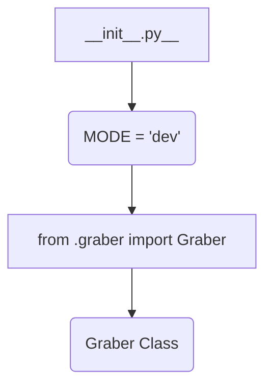

1. **<input code>**

```python
## \file hypotez/src/suppliers/grandadvance/__init__.py
# -*- coding: utf-8 -*-
#! venv/Scripts/python.exe
#! venv/bin/python/python3.12

"""
.. module: src.suppliers.grandadvance 
	:platform: Windows, Unix
	:synopsis:

"""
MODE = 'dev'

from .graber import Graber
```

2. **<algorithm>**



This is a very basic module.  The primary action is importing the `Graber` class from the `graber.py` file within the same directory.  No significant logic or operations are performed within this `__init__.py` file.

**Example data flow:**

The `__init__.py` file does not directly manipulate data. The crucial logic, likely, resides within the `graber.py` file's `Graber` class.

3. **<explanation>**

* **Imports:**
    * `from .graber import Graber`: This line imports the `Graber` class from the `graber.py` file located in the same directory (`./graber.py`).  The `.` is crucial; it signifies importing from a module within the same package. This is standard Python package import practice.

* **Variables:**
    * `MODE = 'dev'`: This defines a constant string variable.  Its purpose is likely to indicate the current operational mode (development, production, etc.).  This variable is not used internally in this small file and its use is not apparent.

* **Classes:**
    * `Graber`: The `Graber` class is imported but not defined or used directly in this file.  This class (likely located in `graber.py`) is presumed to handle fetching, processing, or storing data.


* **Functions:**
    * None. There are no functions defined within this file.

* **Potential Errors/Improvements:**

    * **Missing Documentation:** While the docstring is present, it's rudimentary.  Detailed documentation explaining the purpose of the `Graber` class and the `MODE` variable would be extremely helpful.

    * **Missing Data Validation:** This initial file does not perform any data validation on the `Graber` object; such validation would likely take place within `graber.py`.

    * **Lack of Interaction Details:** The relationship between this file and other parts of the project is unclear; without the `graber.py` file, its potential interaction cannot be assessed.

* **Relationships with other parts of the project:**

    The `suppliers/grandadvance/__init__.py` file acts as an entry point to access the `Graber` class.  This class, defined elsewhere, likely interacts with external data sources or handles data manipulation related to the 'grandadvance' supplier.  Without further context of the project's architecture and `graber.py`, a more precise description is impossible.


**Overall:** This file is a simple package initialization file, acting primarily as an import statement to access the core functionality of the grandadvance data processing.  The most crucial elements of data acquisition and manipulation are located within the `graber.py` file.  The `MODE` variable, without further context, is not readily apparent in terms of utility.