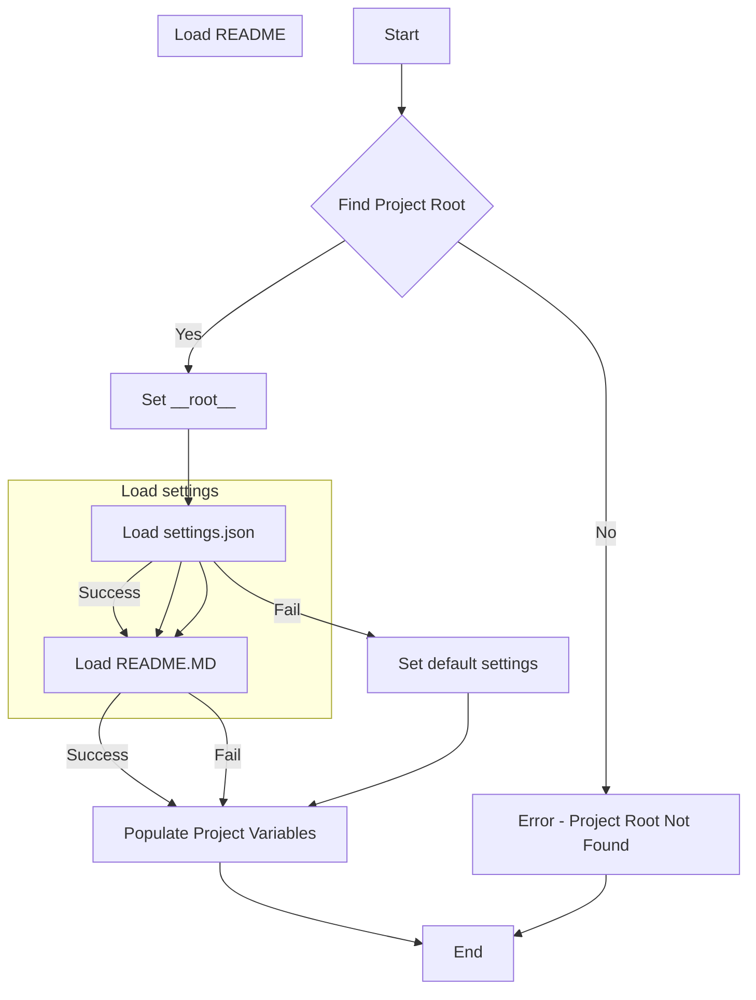

## File hypotez/src/suppliers/grandadvance/header.py
# -*- coding: utf-8 -*-
#! venv/Scripts/python.exe
#! venv/bin/python/python3.12

"""
.. module: src.suppliers.grandadvance 
	:platform: Windows, Unix
	:synopsis:

"""
MODE = 'dev'


import sys
import json
from packaging.version import Version

from pathlib import Path
def set_project_root(marker_files=('pyproject.toml', 'requirements.txt', '.git')) -> Path:
    """
    Finds the root directory of the project starting from the current file's directory,
    searching upwards and stopping at the first directory containing any of the marker files.

    Args:
        marker_files (tuple): Filenames or directory names to identify the project root.
    
    Returns:
        Path: Path to the root directory if found, otherwise the directory where the script is located.
    """
    __root__:Path
    current_path:Path = Path(__file__).resolve().parent
    __root__ = current_path
    for parent in [current_path] + list(current_path.parents):
        if any((parent / marker).exists() for marker in marker_files):
            __root__ = parent
            break
    if __root__ not in sys.path:
        sys.path.insert(0, str(__root__))
    return __root__


# Get the root directory of the project
__root__ = set_project_root()
"""__root__ (Path): Path to the root directory of the project"""

from src import gs

settings:dict = None
try:
    with open(gs.path.root / 'src' /  'settings.json', 'r') as settings_file:
        settings = json.load(settings_file)
except (FileNotFoundError, json.JSONDecodeError):
    ...

doc_str:str = None
try:
    with open(gs.path.root / 'src' /  'README.MD', 'r') as settings_file:
        doc_str = settings_file.read()
except (FileNotFoundError, json.JSONDecodeError):
    ...


__project_name__ = settings.get("project_name", 'hypotez') if settings  else 'hypotez'
__version__: str = settings.get("version", '')  if settings  else ''
__doc__: str = doc_str if doc_str else ''
__details__: str = ''
__author__: str = settings.get("author", '')  if settings else ''
__copyright__: str = settings.get("copyrihgnt", '')  if settings else ''
__cofee__: str = settings.get("cofee", "Treat the developer to a cup of coffee for boosting enthusiasm in development: https://boosty.to/hypo69")  if settings else "Treat the developer to a cup of coffee for boosting enthusiasm in development: https://boosty.to/hypo69"
```

```
<algorithm>
```

**Example Data Flow:**

1. **Find Project Root (B):** The script starts from `__file__`, traverses up the directory tree, and checks for files like `pyproject.toml`, `requirements.txt`, and `.git` within each parent folder. For example, if the file is in `hypotez/src/suppliers/grandadvance`, the script would check `hypotez/src/suppliers`, then `hypotez/src`, and finally `hypotez`.


2. **Load settings.json (E):** The script attempts to open `settings.json` located in the `src` directory within the project root, loading its content into the `settings` dictionary.  Example: `{"project_name": "MyProject", "version": "1.0.0"}`


3. **Load README.MD (F):** If successful, the script loads the content of `README.MD` into the `doc_str` variable.  Example: reads the entire contents of the file.


4. **Populate Project Variables (H):** The script assigns values from the `settings` dictionary (if loaded successfully) to the project variables `__project_name__`, `__version__`, `__author__`, and so on. If any key is missing, a default value is provided.  For example, if 'version' isn't present, `__version__` defaults to "".

```
<explanation>

**Imports:**

- `sys`: Provides access to system-specific parameters and functions, such as `sys.path` which is used to append the project root to Python's search path.
- `json`: Used for working with JSON data. Used to load and read `settings.json` and `README.MD`.
- `packaging.version`: Used for handling project version information more robustly.
- `pathlib`:  Used for working with file paths in a more object-oriented and platform-independent manner.

**Classes:**

- No custom classes are defined in the file.

**Functions:**

- `set_project_root(marker_files)`:
    - Takes a tuple of filenames/directories (`marker_files`) as input.
    - Iteratively checks parent directories until one containing at least one of the `marker_files` is found.
    - Appends the project root to `sys.path` to make modules importable from the current directory.
    - Returns the Path object representing the project root directory.

**Variables:**

- `MODE`: A string constant, likely used for configuration flags.
- `__root__`: Path variable to store the project root.
- `settings`: Dictionary containing project settings read from `settings.json`.
- `doc_str`: String containing the content of `README.MD` (if found).
- `__project_name__`, `__version__`, `__doc__`, `__details__`, `__author__`, `__copyright__`, `__cofee__`: Variables to store data extracted from `settings.json` with appropriate defaults if the data is not found.

**Potential Errors/Improvements:**

- The `try...except` blocks for loading `settings.json` and `README.MD` are good practice for handling potential `FileNotFoundError` and `json.JSONDecodeError`.
- Consider more robust error handling: For example, instead of `...`, raise a custom exception or log a specific message if a critical file is missing.
- Consider using a configuration management library (e.g., `configparser`, `toml`) instead of hardcoding JSON. This would add more flexibility and potentially reduce the exception handling.
- The use of default values for missing keys in `settings.json` is good, but consider using a more informative error message or a clear log if a file is missing or invalid.

**Relationships:**

- This file heavily relies on the `gs` module (imported from `src.gs`).  The `gs.path.root` suggests this module contains utility functions or classes for locating the project root, which allows the current file to operate independently of the location of the files.
```