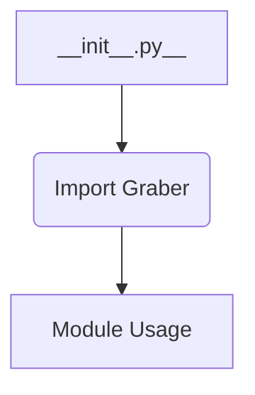

1. **<input code>**

```python
## \file hypotez/src/suppliers/hb/__init__.py
# -*- coding: utf-8 -*-\n#! venv/Scripts/python.exe
#! venv/bin/python/python3.12

"""
.. module: src.suppliers.hb 
	:platform: Windows, Unix
	:synopsis:

"""
MODE = 'dev'


from .graber import Graber
```

2. **<algorithm>**



* **Import Graber:** The file imports the `Graber` class from the `graber.py` module within the same directory (`./graber`).
* **Module Usage:** The imported `Graber` class is ready to be used in other modules of the `hb` package (assuming usage follows).

3. **<explanation>**

* **Imports:**
    * `from .graber import Graber`: This line imports the `Graber` class from the `graber.py` file located within the same directory (indicated by the `.`).  This is a standard Python import for modules within the same package. This implies that `graber.py` defines the `Graber` class.  The `graber.py` file would likely contain the implementation details for data acquisition or processing relevant to the `hb` supplier.

* **Classes:**
    * `Graber`: This class is defined in `graber.py` (not shown).  Its role is to grab data, likely from some external source (e.g., a website, database, file).   Without seeing `graber.py`, we can't detail its attributes or methods.

* **Functions:**
    * There are no functions defined directly within `__init__.py`.  Any functions would be part of the `Graber` class within `graber.py`.

* **Variables:**
    * `MODE = 'dev'`: This is a global variable that likely controls the operation mode of the supplier.  'dev' suggests it's a development mode and could influence behavior of the system, such as logging levels, configurations, or data sources used.

* **Potential Errors/Improvements:**
    * The docstrings are incomplete.  The `""".. module: src.suppliers.hb ..."""` docstrings are useful, but a more detailed description of the module's purpose, expected inputs/outputs, and possible exceptions should be added for better readability and maintainability.
    * Lack of import of other potential helpers. It's possible this file is importing classes or functions from other files within `hb` that are not included in this snapshot.
    * No indication of use of the `Graber` class.  Without seeing how this module is used in other files, it's unclear how the `Graber` class interacts with the rest of the application.


**Relationships with other parts of the project:**

* The `hb` package likely forms part of a larger project that manages different suppliers (e.g., `sb`, `fb`, etc.). The package structure implies a modular design with a separate package for each supplier, potentially to handle different data sources or strategies.  The `Graber` class within `graber.py` likely interacts with a data processing pipeline or other classes in the project.


**In summary:** This `__init__.py` file acts as an entry point for the `hb` supplier package, primarily importing the `Graber` class for data acquisition. Further analysis requires inspecting the `graber.py` file to understand the implementation details of the `Graber` class and how it integrates into the larger project.