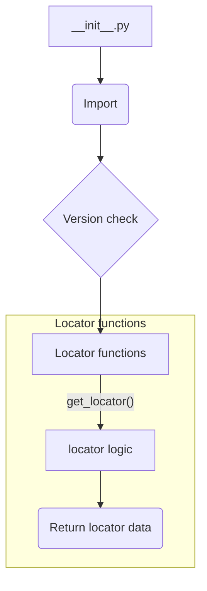

```
## <input code>
```python
## \file hypotez/src/suppliers/hb/locators/__init__.py
# -*- coding: utf-8 -*-\
#! venv/Scripts/python.exe
#! venv/bin/python/python3.12

"""
.. module: src.suppliers.hb.locators 
	:platform: Windows, Unix
	:synopsis:

"""
MODE = 'dev'

"""
	:platform: Windows, Unix
	:synopsis:

"""


"""
	:platform: Windows, Unix
	:synopsis:

"""


"""
  :platform: Windows, Unix

"""
"""
  :platform: Windows, Unix
  :platform: Windows, Unix
  :synopsis:
"""MODE = 'dev'
  
""" module: src.suppliers.hb.locators """


""" Изменения в локаторах. Применять с осторожносастью  """
...

from packaging.version import Version
from .version import __version__, __doc__, __details__  

from .locator import 
```

## <algorithm>



* **Import:** Imports necessary modules, including `Version` from `packaging.version` for potentially handling versioning logic, and modules from `src.suppliers.hb.locators.version` (e.g., `__version__`, `__doc__`, `__details__`) and `src.suppliers.hb.locators.locator`.


* **Version Check (if applicable):** This step might be implicitly contained within the `locator` module and used for version compatibility checks.


* **Locator functions:** This block describes the function calls that utilize the `locator` module. For example, `get_locator()` in a hypothetical `locator.py` file could handle specific logic related to finding or retrieving information about a locator.


* **Return locator data:** The process returns the locator data, which could be a specific object or set of data values.


**Example Data Flow:**

1. `__init__.py` imports necessary modules.
2. A function call to `get_locator()` (from `locator.py`) within `__init__.py` retrieves location information. 
3.  The `get_locator` function performs logic specific to the `locator` implementation, potentially involving database queries, file parsing, or other operations.
4.  The results of these operations are returned.


## <explanation>

**Imports:**

- `from packaging.version import Version`: Imports the `Version` class from the `packaging` library, which is commonly used for handling software version numbers. This is important for version compatibility checks or other scenarios where version numbers need to be interpreted or compared.  The relationship with other `src` packages depends on how `packaging` is managed in the project. This may be a standard Python library or part of a package used elsewhere in `src`.

- `from .version import __version__, __doc__, __details__`: Imports specific variables (`__version__`, `__doc__`, `__details__`) defined within the `version.py` module within the `src.suppliers.hb.locators` package. This suggests a module structure for managing version-related information for the locators. The `.` prefix indicates an import from a module within the current directory (the `locators` package).

- `from .locator import`: Imports the `locator` module. This is the core module for handling locator-related operations.  The relationship is that `__init__.py` serves as an entry point for accessing functions and classes contained within `locator.py`, which presumably contains methods for managing locators and potentially the `get_locator` function.


**Classes (if any):**

- The code snippet only shows imports and some comments, no class definitions are visible.  If classes exist in `locator.py`, they would handle specific aspects of locator management.


**Functions (if any):**

- The code snippet only hints at the existence of functions within the `.locator` module.  A function like `get_locator()` is implicitly implied based on the structure. Actual function definitions are missing.   


**Variables:**

- `MODE = 'dev'`: A global variable likely used for configuration. A common use-case is selecting different behaviour (e.g., debug mode) for development vs. production.


**Potential Errors/Improvements:**

- The use of `...` indicates that the file contains more code than what is shown. The `...` is a crucial missing part, preventing a complete analysis of its functionality and potential errors. If there's a `get_locator` function, it's essential to understand its arguments and return type to have a complete picture.


**Chain of Relationships:**

The `src.suppliers.hb.locators` package is likely part of a larger project where this module interacts with other parts of the supplier or locator logic. `locator` module is responsible for handling logic directly related to locators, potentially interacting with data sources (databases, configuration files, etc) via methods, which could be within the `locator` module. More context is needed to describe the complete chain of relationships.