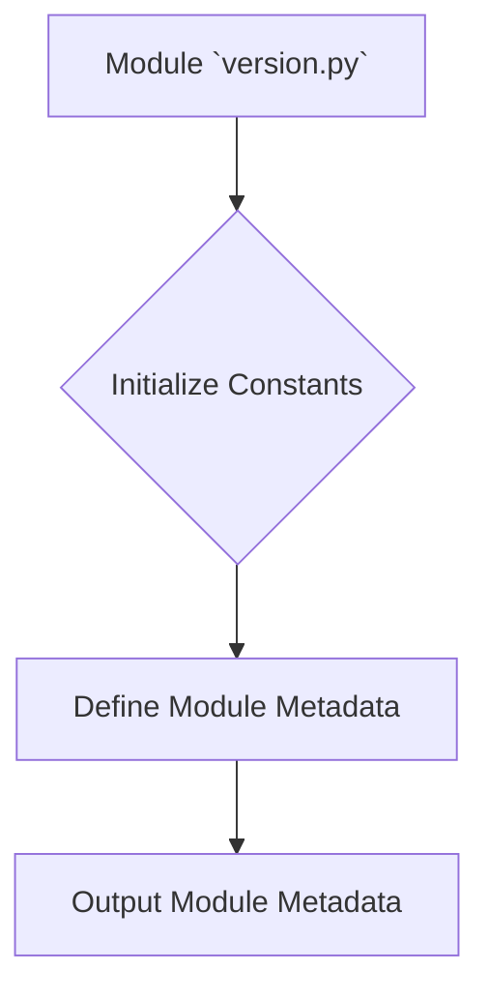

```
1. <input code>
```python
## \file hypotez/src/suppliers/hb/locators/version.py
# -*- coding: utf-8 -*-\n#! venv/Scripts/python.exe
#! venv/bin/python/python3.12
"""
.. module: src.suppliers.hb.locators 
	:platform: Windows, Unix
	:synopsis:

"""
MODE = 'dev'

"""
	:platform: Windows, Unix
	:synopsis:

"""


"""
	:platform: Windows, Unix
	:synopsis:

"""


"""
  :platform: Windows, Unix

"""
"""
  :platform: Windows, Unix
  :platform: Windows, Unix
  :synopsis:
"""MODE = 'dev'
  
""" module: src.suppliers.hb.locators """


"""
- `__version__`: This variable holds the version of the module or package.
- `__name__`: Contains the name of the module. If the script is being run directly, the value will be `"__main__"`.
- `__doc__`: The module's documentation string.
- `__details__`: This variable likely contains additional details about the module, but the exact purpose depends on the specific module or package.
- `__annotations__`: Contains type annotations for variables and functions in the module.
- `__author__`: The name(s) of the author(s) of the module.
"""
__name__:str
__version__="3.12.0.0.0.4"
__doc__:str
__details__:str="Details about version for module or class"
__annotations__

__author__='hypotez '
```

2. <algorithm>



**Explanation of Blocks:**

* **Initialize Constants:**  The code initializes a constant `MODE` to the string 'dev'.  This likely controls some aspect of the module's behavior or configuration, though without context, it's difficult to determine the exact nature.

* **Define Module Metadata:** The code defines several metadata variables: `__version__`, `__name__`, `__doc__`, `__details__`, `__annotations__`, and `__author__`. These variables describe the module itself and are crucial for use in build systems, documentation generators, and metadata discovery.

* **Output Module Metadata:** The module metadata is defined but not actively used in this particular file.  It's likely that the module metadata will be used elsewhere in the project to determine its version, author, or other information, e.g., by a package management tool or by other parts of the application.


3. <explanation>

* **Imports**: There are no imports in this file.  The script initializes constants and defines metadata variables for the module.

* **Classes**: There are no classes defined.  This file is a Python module, not a class definition.

* **Functions**: There are no functions defined.

* **Variables**:
    * `MODE`: A string variable that likely represents a development or operational mode (e.g., 'dev', 'prod').
    * `__version__`: A string literal defining the version of the module.
    * `__name__`:  A string representing the name of the module.  Its value will be `"__main__"` if the file is run directly.
    * `__doc__`: A string containing the module docstring.
    * `__details__`, `__annotations__`, `__author__`: Variables containing additional metadata information about the module.

* **Potential Errors or Areas for Improvement:**
    * **Missing context:** Without knowing how the `MODE` variable is used elsewhere, it's hard to determine its purpose or if its current implementation is optimal.
    * **Missing type hints:** There are `str` type hints for `__name__` and the other variables, but more specific and comprehensive type annotations are generally beneficial to help maintain clarity and allow static analysis tools to better validate the code.

* **Relationship with Other Parts of the Project**:
    * This `version.py` file likely lives in a larger package structure (`hypotez/src/suppliers/hb/locators`). The metadata variables defined here will be used by other files or modules within this package (or the containing packages) to get information about the version or authors of this module.  It's a standard practice to put versioning information into a dedicated file within a package structure like this.


**Overall:** This Python file defines the metadata of a module (`version.py`) within a larger software project, containing crucial information about the version, author, and potential configuration settings that might be needed by other parts of the system.