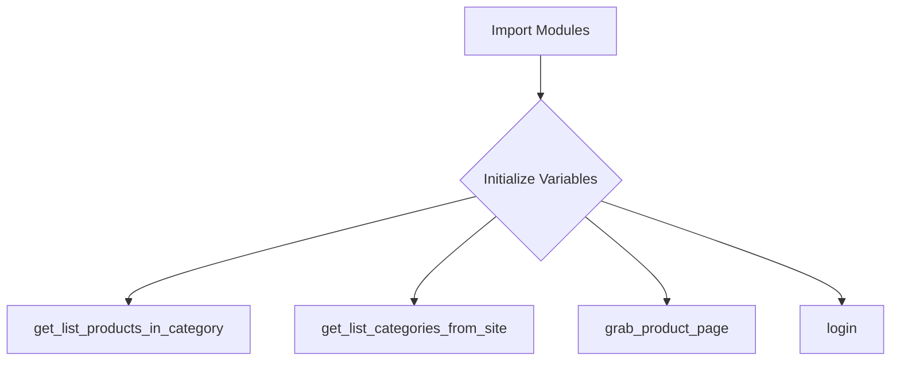

```
## <input code>
```python
## \file hypotez/src/suppliers/hb/scenarios/__init__.py
# -*- coding: utf-8 -*-
#! venv/Scripts/python.exe
#! venv/bin/python/python3.12

"""
.. module: src.suppliers.hb.scenarios 
	:platform: Windows, Unix
	:synopsis:

"""
MODE = 'dev'

"""
	:platform: Windows, Unix
	:synopsis:

"""

"""
	:platform: Windows, Unix
	:synopsis:

"""


"""
  :platform: Windows, Unix

"""
"""
  :platform: Windows, Unix
  :platform: Windows, Unix
  :synopsis:
"""MODE = 'dev'
  
""" module: src.suppliers.hb.scenarios """


"""  Поставщик <I>hb.co.il</I> """
...

from packaging.version import Version
from .version import __version__, __doc__, __details__  

from .categories import get_list_products_in_category, get_list_categories_from_site
from .grabber import grab_product_page
from .login import login
```

## <algorithm>



**Explanation:**

The algorithm is largely focused on importing necessary modules and then exposing functions for interacting with the HB.co.il supplier.  It doesn't show any specific logic for controlling how these functions are used, which is typically handled in another part of the project.

* **Import Modules:** The script imports various modules needed for different tasks related to interacting with the supplier.
* **Initialize Variables:**  The script initializes a variable `MODE` with a string value.  Its use is unclear from the snippet, but it probably influences configuration, possibly for development vs. production.


* **`get_list_products_in_category`:** A function that likely retrieves a list of products from a specific category of the supplier's website.
* **`get_list_categories_from_site`:** A function responsible for obtaining a list of available categories from the supplier site.
* **`grab_product_page`:** Likely fetches the HTML source code for a product page.
* **`login`:** Likely contains the functionality to log in to the supplier's website if authentication is required.


## <explanation>

**Imports:**

* `from packaging.version import Version`: Imports the `Version` class from the `packaging` library, which is used for handling and comparing software versions. This is common in Python projects dealing with version control and compatibility checks.
* `.version`: Likely a module within the same directory containing version information (`__version__`, `__doc__`, `__details__`), likely used for project metadata.
* `.categories`: Contains functions related to product categories, like `get_list_products_in_category` and `get_list_categories_from_site`.  These functions presumably interact with an API or web scraping tools to retrieve this data.
* `.grabber`: Contains `grab_product_page` which likely handles retrieving product page content (HTML, JSON, etc.).
* `.login`: Contains `login` function, responsible for authenticating with the supplier's website.

**Classes (if any):**

* There are no classes defined in the provided code snippet.

**Functions:**

* There are no function definitions with detailed code, only function calls are present.  The `get_list_products_in_category`, `get_list_categories_from_site`, `grab_product_page`, and `login` functions would have their own definitions and implementations in their respective modules.

**Variables:**

* `MODE`: A string variable that's likely used for configuration and selection of different operation modes.  Its impact can vary greatly depending on the rest of the project.

**Potential Errors/Improvements:**

* **Missing Implementation:** The code only shows imports and variables.  The actual implementation of `get_list_products_in_category`, `get_list_categories_from_site`, `grab_product_page`, and `login` is crucial and missing from this snippet.
* **Error Handling:** The functions (especially those related to web scraping or API calls) are missing error handling (e.g., `try...except` blocks). This is critical for robustness and preventing unexpected crashes.
* **Dependency Management:** Although not directly visible here, the use of `#! venv/Scripts/python.exe` and `#! venv/bin/python/python3.12` suggests a virtual environment. Proper dependency management using a tool like `pip` would be essential to ensure all the external libraries like `packaging` are available and correctly installed.


**Relationships with other parts of the project:**

The `__init__.py` file in the `hypotez/src/suppliers/hb/scenarios` directory acts as an entry point for the HB (hb.co.il) supplier's functionalities.  It bundles together core functionalities for accessing data.  Other parts of the `hypotez` project would likely use these functions to build more complex features or processes.  The calling code would exist elsewhere in the project.