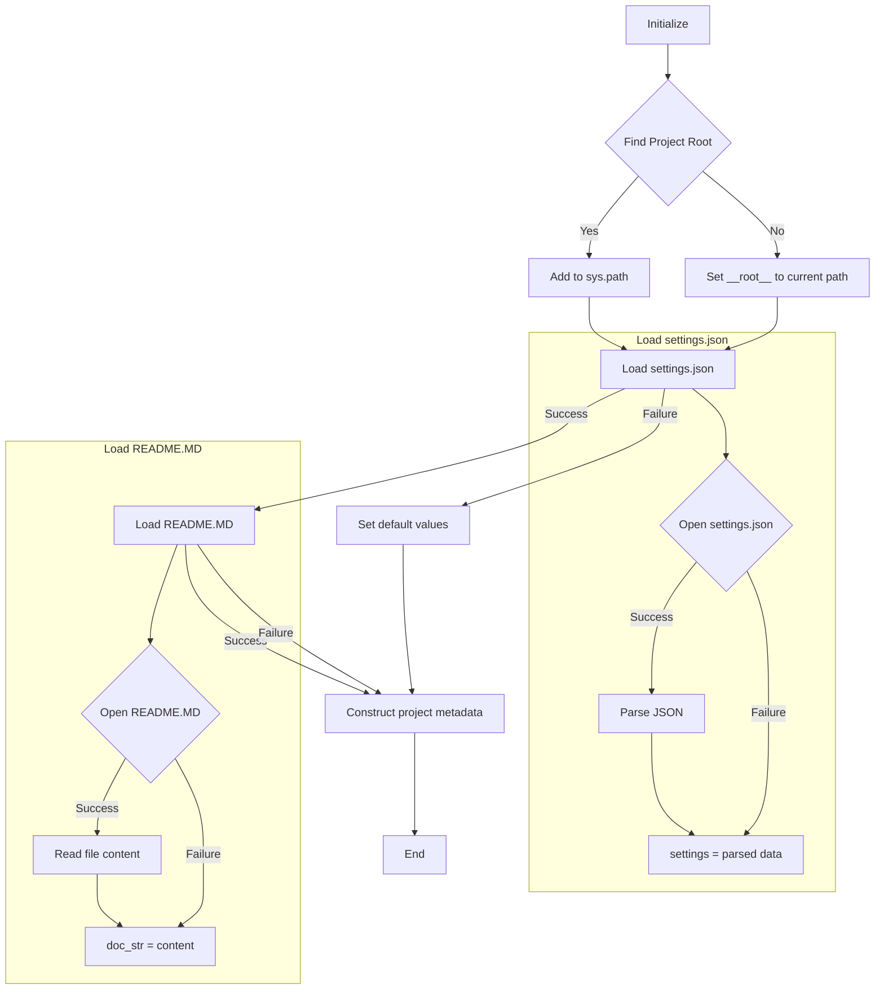

```## hypotez/src/suppliers/header.py
# -*- coding: utf-8 -*-\n#! venv/Scripts/python.exe\n#! venv/bin/python/python3.12\n\n"""\n.. module: src.suppliers \n\t:platform: Windows, Unix\n\t:synopsis:\n\n"""\nMODE = \'dev\'\n\nimport sys\nimport json\nfrom packaging.version import Version\n\nfrom pathlib import Path\ndef set_project_root(marker_files=(\'pyproject.toml\', \'requirements.txt\', \'.git\')) -> Path:\n    """\n    Finds the root directory of the project starting from the current file\'s directory,\n    searching upwards and stopping at the first directory containing any of the marker files.\n\n    Args:\n        marker_files (tuple): Filenames or directory names to identify the project root.\n    \n    Returns:\n        Path: Path to the root directory if found, otherwise the directory where the script is located.\n    """\n    __root__:Path\n    current_path:Path = Path(__file__).resolve().parent\n    __root__ = current_path\n    for parent in [current_path] + list(current_path.parents):\n        if any((parent / marker).exists() for marker in marker_files):\n            __root__ = parent\n            break\n    if __root__ not in sys.path:\n        sys.path.insert(0, str(__root__))\n    return __root__\n\n\n# Get the root directory of the project\n__root__ = set_project_root()\n"""__root__ (Path): Path to the root directory of the project"""\n\nfrom src import gs\n\nsettings:dict = None\ntry:\n    with open(gs.path.root / \'src\' /  \'settings.json\', \'r\') as settings_file:\n        settings = json.load(settings_file)\nexcept (FileNotFoundError, json.JSONDecodeError):\n    ...\n\n\ndoc_str:str = None\ntry:\n    with open(gs.path.root / \'src\' /  \'README.MD\', \'r\') as settings_file:\n        doc_str = settings_file.read()\nexcept (FileNotFoundError, json.JSONDecodeError):\n    ...\n\n \n\n__project_name__ = settings.get("project_name", \'hypotez\') if settings  else \'hypotez\'\n__version__: str = settings.get("version", \'\')  if settings  else \'\'\n__doc__: str = doc_str if doc_str else \'\'\n__details__: str = \'\'\n__author__: str = settings.get("author", \'\')  if settings  else \'\'\n__copyright__: str = settings.get("copyrihgnt", \'\')  if settings  else \'\'\n__cofee__: str = settings.get("cofee", "Treat the developer to a cup of coffee for boosting enthusiasm in development: https://boosty.to/hypo69")  if settings  else "Treat the developer to a cup of coffee for boosting enthusiasm in development: https://boosty.to/hypo69"
```

2. **<algorithm>**



**Example:**

If `__file__` points to `hypotez/src/suppliers/header.py`, the algorithm will search up the directory tree for `pyproject.toml`, `requirements.txt`, and `.git`.  If `pyproject.toml` is found in `hypotez`, `__root__` will be set to `hypotez`. If not found, the script will set `__root__` to the current path.

3. **<explanation>**

* **Imports:**
    * `sys`: Provides access to system-specific parameters and functions,  crucially used here to modify the Python path.  Crucial for the module to find `src` packages.
    * `json`: Used for handling JSON data, specifically loading settings from `settings.json`.
    * `packaging.version`: Used for handling software version numbers if necessary.
    * `pathlib`: Crucial for working with file paths in a platform-independent way.
* **Classes:** There are no classes defined in this code.
* **Functions:**
    * `set_project_root(marker_files=...)`: This function is vital for locating the project root directory. It iterates through parent directories starting from the current file's location and checks if any of the specified marker files exist within. If one of the files is found, it sets `__root__` to that directory and adds it to the Python path.  This is essential for ensuring that imported modules, especially those within the `src` directory, can be located properly.
        * **Example usage:** `set_project_root()` would find the project root, handling cases where the project is structured differently.
* **Variables:**
    * `MODE`: A string variable likely for development mode/production mode, but not used extensively in the snippet.
    * `__root__`: Path object representing the project root directory.
    * `settings`: Dictionary containing project settings loaded from `settings.json`.  It's dynamically loaded.
    * `doc_str`: String containing the content of the `README.md` file.
    * `__project_name__`, `__version__`, `__doc__`, `__details__`, `__author__`, `__copyright__`, `__cofee__`: Strings holding project metadata, defaults are set if corresponding values are missing in `settings.json`.
* **Potential Errors/Improvements:**
    * **Error Handling:** The code uses `try...except` blocks for file loading, which is good practice. However, consider logging the errors rather than using `...` for better debugging and user feedback, especially in production environments.
    * **Missing `settings.json`:**  If `settings.json` doesn't exist, the code will use default values.  Consider adding a meaningful default for settings rather than using empty strings.
    * **`gs.path.root`:** The `gs.path.root` variable seems to reference an external library or module (`src.gs`).   Its purpose needs context to explain the meaning and possible issues (if the import doesn't work due to a missing or misconfigured module).
    * **`__cofee__`:** This variable name seems unusual and could be improved to be more standard, for example, `__support_email__`.


**Relationships to other parts of the project:**

The code heavily relies on the `src.gs` module (indicated by `gs.path.root`). This `gs` module appears to provide functions or attributes for interacting with file paths within the project, so `gs` is crucial for this module. The `settings.json` and `README.MD` files should be located inside the project root (`src` directory) and must contain the respective data to work as expected.  The imports/usages within this module show clear connections to other parts of the project, as external files and settings are used for creating a basic, descriptive metadata structure.