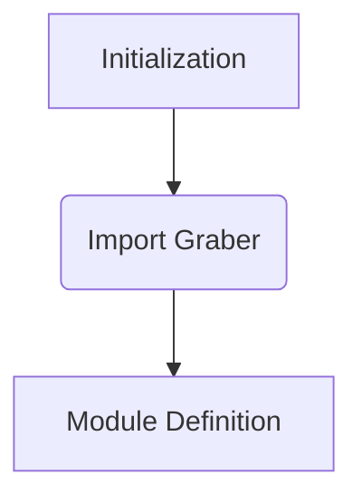

1. **<input code>**:

```python
## \file hypotez/src/suppliers/ivory/__init__.py
# -*- coding: utf-8 -*-
#! venv/Scripts/python.exe
#! venv/bin/python/python3.12

"""
.. module: src.suppliers.ivory 
	:platform: Windows, Unix
	:synopsis:

"""
MODE = 'dev'

from .graber import Graber
```

2. **<algorithm>**:



* **Initialization (A):** Sets the `MODE` variable to 'dev'. This is likely a configuration flag for development mode. No data is directly involved here.

* **Import Graber (B):** Imports the `Graber` class from the `graber.py` module within the `ivory` subpackage. This imports the necessary class for interacting with the data source/logic of the `ivory` supplier. No data is flowing at this step.

* **Module Definition (C):** Defines the `ivory` module itself. This creates a namespace within `src.suppliers` for the `ivory` supplier, preparing it to contain other relevant parts like classes and functions. The data and logic for working with the `ivory` supplier will be handled by code within the `graber` class.


3. **<explanation>**:

* **Imports:**
    * `from .graber import Graber`: Imports the `Graber` class from the `graber.py` file located in the same directory as this `__init__.py` file. This is standard Python module import syntax using relative paths, indicating that the `graber` module is part of the `ivory` supplier package.  The `.graber` indicates to look for the `graber` module in the current directory (the `ivory` directory).  This import is necessary to use the `Graber` class within the `ivory` module.  This is a crucial link to the actual data source or logic implementation.

* **Classes:**
    * `Graber`: This class is defined in `graber.py`. Its functionality is not described here.  This class likely interacts with the `ivory` supplier's data source.  Without the `graber.py` code, the precise methods and attributes of the `Graber` class are unknown.  

* **Functions:**
    * No functions are defined in this file.

* **Variables:**
    * `MODE`: A string variable initialized to 'dev'. This variable is likely used for configuration purposes, enabling different behaviors in development or production environments.

* **Potential Errors/Improvements:**
    * **Missing `graber.py`:** The code assumes the existence of `graber.py` file containing the `Graber` class definition. Without this file, there will be an import error when running the code.
    * **No Documentation for Graber:** The lack of documentation within the `graber.py` file will hinder the understanding and maintainability of the code in the long run.  Documentation should be added to explain the purpose of the `Graber` class, its methods, and how to use it.

* **Chain of Relationships:**
    * The `ivory` module is part of the `suppliers` package in the `hypotez` project.  To use this module, other parts of the project will need to import it, for example, a `main` module or a pipeline/processing module that uses `ivory` data.

**Overall:**

This `__init__.py` file acts as a front-facing module for the `ivory` supplier in the `hypotez` project.  Crucially, it imports the `Graber` class, which is expected to handle the core logic for retrieving or processing data from the `ivory` source.  The `MODE` variable implies more complex setups where different modes of operation exist.  Future analysis will require the `graber.py` file to understand the full functionality of the `ivory` supplier.