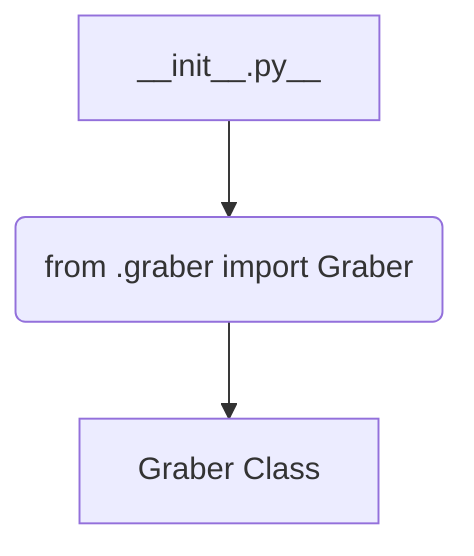

1. **<input code>**

```python
## \file hypotez/src/suppliers/ksp/__init__.py
# -*- coding: utf-8 -*-
#! venv/Scripts/python.exe
#! venv/bin/python/python3.12

"""
.. module: src.suppliers.ksp 
	:platform: Windows, Unix
	:synopsis:

"""
MODE = 'dev'

from .graber import Graber
```

2. **<algorithm>**



There's no complex algorithm; this file primarily acts as an import module for the `Graber` class. The `__init__.py` file is executed when the package `ksp` is imported. It sets a constant named `MODE` to `'dev'` and imports the `Graber` class from a module (likely `graber.py`) within the same package (`suppliers.ksp`). The `graber.py` likely contains the implementation of the `Graber` class, which is then made available through this import for use in other parts of the project.


3. **<explanation>**

* **Imports**:
    * `from .graber import Graber`: This line imports the `Graber` class from the `graber.py` module located within the same directory as the current `__init__.py` file.  The `.` before `graber` indicates a relative import, making it clear that `graber.py` is a part of the `ksp` package within the `suppliers` package.  This is standard Python practice for keeping modules organized within a package structure. This is the crucial part of the file; it exposes the `Graber` class for use in other parts of the project.


* **Classes**:
    * `Graber`: This is a class defined in `graber.py`. The import statement simply makes the class accessible for use within the `ksp` package.  We cannot see the contents of this class from the snippet provided and cannot comment on its role, attributes, or methods.


* **Functions**:
    * No functions are defined directly in this `__init__.py` file.


* **Variables**:
    * `MODE = 'dev'`: This is a global variable that likely controls different behavior depending on the development environment.  'dev' likely indicates a development mode.  This mode variable isn't used in the provided snippet, so its specific effect is uncertain.


* **Relationships to other parts of the project**: This module, `ksp` likely forms part of a larger project that uses a supplier package (`suppliers`) to fetch data from a particular source (KSP, possibly). The import ensures the `Graber` class is part of the process.  Other modules within `suppliers` (or elsewhere in the project) might utilize the `Graber` class to interact with the KSP data source, perform necessary processing, or build additional entities using that data.


* **Potential Errors or Improvements**:
    * **Documentation:** While the docstring exists, it is very basic. Adding more detailed information about the purpose of the `Graber` class and `MODE` variable would significantly enhance the readability and maintainability of the code.
    * **Context:** The meaning of `MODE` is currently unclear without additional context.  It would be helpful to know how this variable influences the behavior of `Graber` (or other dependent classes).

In summary, this `__init__.py` file acts as a simple module that provides access to a class (`Graber`) likely responsible for interacting with a KSP data source.  More context is needed to fully understand the purpose of the `MODE` variable and the broader functionality of the `Graber` class.