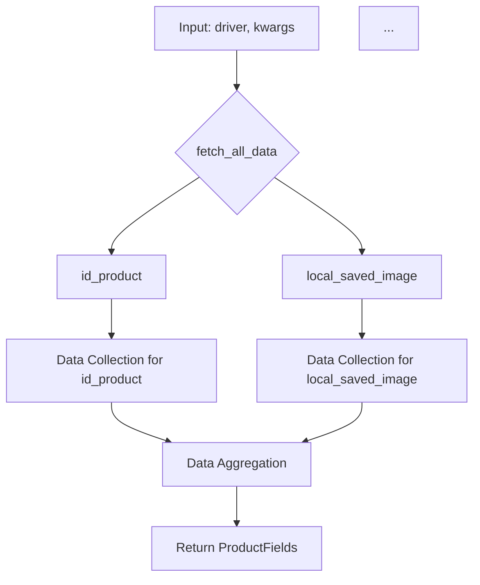

```python
## \file hypotez/src/suppliers/ksp/graber.py
# -*- coding: utf-8 -*-
#! venv/Scripts/python.exe
#! venv/bin/python/python3.12

"""
.. module: src.suppliers.ksp 
	:platform: Windows, Unix
	:synopsis: Класс собирает значение полей на странице  товара `ksp.co.il`. 
    Для каждого поля страницы товара сделана функция обработки поля в родительском классе.
    Если нужна нестандертная обработка, функция перегружается в этом классе.
    ------------------
    Перед отправкой запроса к вебдрайверу можно совершить предварительные действия через декоратор. 
    Декоратор по умолчанию находится в родительском классе. Для того, чтобы декоратор сработал надо передать значение 
    в `Context.locator`, Если надо реализовать свой декоратор - раскоментируйте строки с декоратором и переопределите его поведение


"""
MODE = 'dev'

import asyncio
from pathlib import Path
from types import SimpleNamespace
from typing import Any, Callable, Optional
from dataclasses import dataclass, field
from functools import wraps
from pydantic import BaseModel
from src import gs
from src.suppliers import Graber as Grbr, Context, close_pop_up
from src.product import ProductFields
from src.webdriver import Driver
from src.utils.jjson import j_loads_ns
from src.logger import logger
from src.logger.exceptions import ExecuteLocatorException

from dataclasses import dataclass, field
from types import SimpleNamespace
from typing import Any, Callable


# # Глобальные настройки через отдельный объект
# class Context:
#     """Класс для хранения глобальных настроек."""
#     driver: Driver = None
#     locator: SimpleNamespace = None

# # Определение декоратора для закрытия всплывающих окон
# # В каждом отдельном поставщике (`Supplier`) декоратор может использоваться в индивидуальных целях
# # Общее название декоратора `@close_pop_up` можно изменить 


# def close_pop_up(value: Any = None) -> Callable:
#     """Создает декоратор для закрытия всплывающих окон перед выполнением основной логики функции.

#     Args:
#         value (Any): Дополнительное значение для декоратора.

#     Returns:
#         Callable: Декоратор, оборачивающий функцию.
#     """
#     def decorator(func: Callable) -> Callable:
#         @wraps(func)
#         async def wrapper(*args, **kwargs):
#             try:
#                 # await Context.driver.execute_locator(Context.locator.close_pop_up)  # Await async pop-up close  
#                 ... 
#             except ExecuteLocatorException as e:
#                 logger.debug(f'Ошибка выполнения локатора: {e}')
#             return await func(*args, **kwargs)  # Await the main function
#         return wrapper
#     return decorator


class Graber(Grbr):
    """Класс для операций захвата Morlevi."""
    supplier_prefix: str

    def __init__(self, driver: Driver):
        """Инициализация класса сбора полей товара."""
        self.supplier_prefix = 'ksp'
        super().__init__(supplier_prefix=self.supplier_prefix, driver=driver)
        # Устанавливаем глобальные настройки через Context
        Context.locator_for_decorator = None # <- если будет уастановлено значение - то оно выполнится в декораторе `@close_pop_up`


    async def grab_page(self, driver: Driver) -> ProductFields:
        """Asynchronous function to grab product fields.

        Args:
            driver (Driver): The driver instance to use for grabbing.

        Returns:
            ProductFields: The grabbed product fields.
        """
        global d
        d = self.d = driver  
        
        ...
        # Логика извлечения данных
        async def fetch_all_data(**kwards):
            # Call function to fetch specific data
            # await fetch_specific_data(**kwards)  
            # Uncomment to call specific functions.
            await self.id_product(kwards.get("id_product", ''))
            # ... (many more await calls to functions) ...
            await self.local_saved_image(kwards.get("local_saved_image", ''))

        await fetch_all_data()
        return self.fields


```

### <algorithm>



**Example:**

If `id_product = '123'` and `local_saved_image = 'path/to/image'` are passed as keyword arguments in `fetch_all_data`, then functions `id_product(123)` and `local_saved_image('path/to/image')` are called to fetch relevant data. The collected data from those functions is then aggregated, and the `ProductFields` object containing the merged data is returned.

### <explanation>

**Imports:**

- `asyncio`: Used for asynchronous operations.
- `pathlib`: Provides path objects.
- `types`: Used for `SimpleNamespace`.
- `typing`: Provides type hints.
- `dataclasses`:  Used for creating dataclasses.
- `functools`: Used for `wraps` decorator.
- `pydantic`:  Used for data validation (likely through BaseModel).
- `src.*`: Imports from internal packages, likely for database interactions, web drivers, product data structures, logger, and utility functions (e.g., JSON loading).  The relationships indicate dependencies on a larger project structure. `src.suppliers` contains classes for interacting with specific e-commerce platforms like KSP.  `src.product` defines the structure of product data being collected. `src.webdriver` handles browser interactions.

**Classes:**

- `Graber(Grbr)`: Inherits from `Grbr` (likely a base Graber class). This class is specific for KSP. `Graber` manages the data acquisition process from KSP.
    - `supplier_prefix`: Defines the supplier identifier.
    - `__init__(driver: Driver)`: Initializes `Graber` with a `Driver` object for browser interaction. Also sets a global `Context` variable.
    - `grab_page(driver: Driver) -> ProductFields`:  Fetches product data.  It contains an inner `fetch_all_data` function that likely calls various functions (e.g., `id_product`, etc.) to collect the data in an async way, building the `ProductFields` object.

**Functions:**

- `fetch_all_data(**kwards)`: Calls multiple asynchronous functions to collect product data from the page, with input from `kwards`, like `id_product`.  Crucially, these functions are likely defined in the parent or within the `Graber` class.
- `id_product(id_product_value)`:  Example data collection function from the code. This function likely retrieves product ID data from the web page and stores it.
- `local_saved_image(image_url)`:  Example. This likely downloads the image and saves it locally.


**Variables:**

- `d`:  Global variable, likely used for storing the `driver` instance within the class scope.
- `MODE`: String constant, potentially for setting different operating modes (development, production).


**Potential Errors/Improvements:**

- **Error Handling:** The code lacks comprehensive error handling.  If any of the asynchronous functions (`id_product`, etc.) encounter exceptions, those should be properly caught, logged, and handled.
- **Missing Functions:**  The code currently has many `await self.xxx()` calls without showing the implementations for `xxx` functions.  These need to be defined.
- **Data Validation:** While `pydantic` is imported, there's no clear indication of using `BaseModel` for data validation. This should be considered to enforce expected data types and formats.
- **Duplicate Imports:** `from dataclasses import dataclass, field` is imported twice.
- **Global Variable `d`:** The use of `global d` within `grab_page` is a bit unusual; it might be better to encapsulate this variable inside the class or pass it as a parameter.


**Chain of Relationships:**

The code strongly depends on:

1. `src.suppliers`: Defines the base Graber class for handling data acquisition from different suppliers.
2. `src.product`: Contains the `ProductFields` definition; this is the data structure that `grab_page` returns.
3. `src.webdriver`:  Provides the `Driver` class for browser interaction.
4. `src.logger`: Provides logging capabilities.
5. `src.utils.jjson`: Used for JSON handling.
6. `src` (likely a package or module): Core module of the project, possibly containing configuration, database connections, and other fundamental functionalities.

The code gathers data from a web page, and this data likely needs to be processed and stored in a database or used for further computations.  The chain of dependencies shows how this code connects to larger project components.