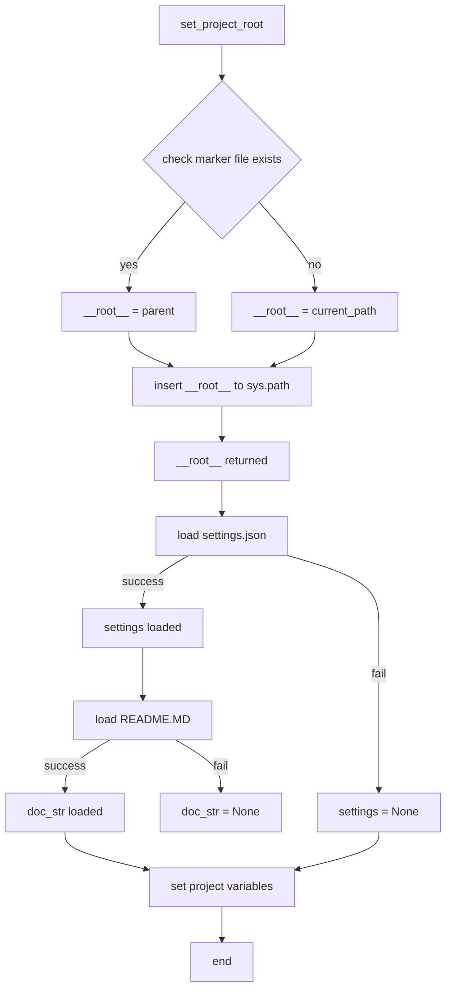

## File hypotez/src/suppliers/ksp/header.py
# -*- coding: utf-8 -*-\n#! venv/Scripts/python.exe\n#! venv/bin/python/python3.12\n\n"""\n.. module: src.suppliers.ksp \n\t:platform: Windows, Unix\n\t:synopsis:\n\n"""\nMODE = \'dev\'\n\n\n\nimport sys\nimport json\nfrom packaging.version import Version\n\nfrom pathlib import Path\ndef set_project_root(marker_files=(\'pyproject.toml\', \'requirements.txt\', \'.git\')) -> Path:\n    """\n    Finds the root directory of the project starting from the current file\'s directory,\n    searching upwards and stopping at the first directory containing any of the marker files.\n\n    Args:\n        marker_files (tuple): Filenames or directory names to identify the project root.\n    \n    Returns:\n        Path: Path to the root directory if found, otherwise the directory where the script is located.\n    """\n    __root__:Path\n    current_path:Path = Path(__file__).resolve().parent\n    __root__ = current_path\n    for parent in [current_path] + list(current_path.parents):\n        if any((parent / marker).exists() for marker in marker_files):\n            __root__ = parent\n            break\n    if __root__ not in sys.path:\n        sys.path.insert(0, str(__root__))\n    return __root__\n\n\n# Get the root directory of the project\n__root__ = set_project_root()\n"""__root__ (Path): Path to the root directory of the project"""\n\nfrom src import gs\n\nsettings:dict = None\ntry:\n    with open(gs.path.root / \'src\' /  \'settings.json\', \'r\') as settings_file:\n        settings = json.load(settings_file)\nexcept (FileNotFoundError, json.JSONDecodeError):\n    ...\n\n\ndoc_str:str = None\ntry:\n    with open(gs.path.root / \'src\' /  \'README.MD\', \'r\') as settings_file:\n        doc_str = settings_file.read()\nexcept (FileNotFoundError, json.JSONDecodeError):\n    ...\n\n \n\n__project_name__ = settings.get("project_name", \'hypotez\') if settings  else \'hypotez\'\n__version__: str = settings.get("version", \'\')  if settings  else \'\'\n__doc__: str = doc_str if doc_str else \'\'\n__details__: str = \'\'\n__author__: str = settings.get("author", \'\')  if settings  else \'\'\n__copyright__: str = settings.get("copyrihgnt", \'\')  if settings  else \'\'\n__cofee__: str = settings.get("cofee", "Treat the developer to a cup of coffee for boosting enthusiasm in development: https://boosty.to/hypo69")  if settings  else "Treat the developer to a cup of coffee for boosting enthusiasm in development: https://boosty.to/hypo69"\n```

```
<algorithm>
**Diagram:**



**Example Data Flow:**

1. `set_project_root()` is called with `marker_files = ('pyproject.toml', 'requirements.txt', '.git')`.
2. It starts from the current file's directory (`/hypotez/src/suppliers/ksp`).
3. It iterates up the directory tree: `/hypotez/src/suppliers`, `/hypotez/src`, `/hypotez`.
4. If `pyproject.toml` exists in `/hypotez`, `__root__` is updated to `/hypotez`.
5. `/hypotez` is added to `sys.path`.
6. `__root__` is returned.
7. The script loads `settings.json` from `/hypotez/src/settings.json`.
8. If successful, `settings` is populated with data.
9. It attempts to load `README.MD` and stores the content in `doc_str`.
10. Project variables (`__project_name__`, `__version__`, etc.) are set based on the loaded data.


```
<explanation>

**Imports:**

- `sys`: Used for manipulating the Python path (`sys.path`). Important for finding modules in non-standard locations.
- `json`: Used for loading the project settings from `settings.json`.
- `packaging.version`:  Used to handle versions consistently (although not used directly here).
- `pathlib`: Provides `Path` objects for working with file paths in a more object-oriented way, improving code readability and robustness. This is preferred over string manipulation for file paths.


**Classes:**

- No classes are defined.


**Functions:**

- `set_project_root(marker_files=...) -> Path`:
    - **Arguments:** `marker_files`: A tuple of filenames or directory names used to locate the project root directory.
    - **Return Value:** A `Path` object representing the root directory of the project. If the root directory is not found, it returns the directory where the script is located.
    - **Functionality:** Recursively searches up the directory tree from the current file location until a directory containing any of the specified marker files is found.  It adds the project root to `sys.path` which allows imports from the project root to work.


**Variables:**

- `MODE`: A string variable, likely used to control different project modes (e.g., 'dev', 'prod').
- `__root__`: A `Path` object representing the project's root directory.
- `settings`: A `dict` variable that holds the project settings loaded from `settings.json`.
- `doc_str`: A string variable that holds the content of the `README.MD` file.
- `__project_name__`, `__version__`, `__doc__`, `__details__`, `__author__`, `__copyright__`, `__cofee__`: Variables that store project metadata extracted from the `settings` dictionary.


**Potential Errors and Improvements:**

- **Error Handling:** The `try...except` blocks are good for handling `FileNotFoundError` and `json.JSONDecodeError`.  These errors are common when dealing with external files.  Consider adding more specific exception types for better error handling and logging.
- **`gs` Module:** The code uses a `gs` module, suggesting that `gs.path.root` is a function or attribute from another part of the project. The code would be more readable if this module was clearly documented.
- **`sys.path` insertion:** While adding the root to `sys.path` is common, consider a mechanism to prevent conflicts if the same path is present multiple times in the `sys.path`.


**Relationships:**

- This file heavily relies on the `gs` module (specifically `gs.path.root`). This implies a dependency on another part of the project responsible for handling file paths and project locations.
- The `settings.json` file and `README.MD` file (and potentially other configuration files) reside in a related directory in the project hierarchy, implying a project structure design where project settings are managed consistently.