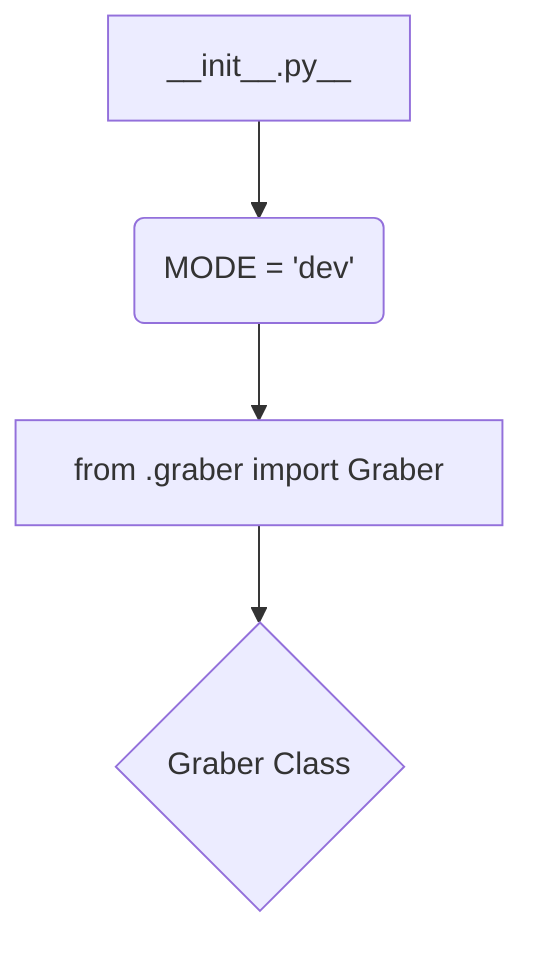

1. **<input code>**

```python
## \file hypotez/src/suppliers/kualastyle/__init__.py
# -*- coding: utf-8 -*-\
#! venv/Scripts/python.exe
#! venv/bin/python/python3.12

"""
.. module: src.suppliers.kualastyle 
	:platform: Windows, Unix
	:synopsis:

"""
MODE = 'dev'

from .graber import Graber
```

2. **<algorithm>**



**Example Data Flow (Conceptual):**

No explicit data flow is shown in the code snippet.  `__init__.py` imports a class `Graber` from the `graber.py` file, but the functionality of `Graber` and any data it might process is not defined here.

3. **<explanation>**

* **Imports:**
    * `from .graber import Graber`: This line imports the `Graber` class from a module named `graber.py` located within the same directory (`kualastyle`) as `__init__.py`.  The `.graber` part indicates a relative import, a common Python practice for internal module organization.  This import makes the `Graber` class accessible within `kualastyle` files without needing the full path. The lack of further functionality in `__init__` suggests this package serves as a container to expose the `Graber` class.
    
* **Variables:**
    * `MODE = 'dev'`: This global variable likely sets a mode for the `kualastyle` module (e.g., development, testing, production).  This variable can later be checked and used for conditional logic.

* **Classes (Implicit):**
    * `Graber`:  The `Graber` class is imported.   Its definition (methods, attributes, purpose) is not shown in this file.  This means analysis of its implementation is deferred to `graber.py`.   Its use in data acquisition or processing is not specified.

* **Functions (Absent):** There are no functions in this file.

* **Potential Errors/Improvements:**

    * **Missing Documentation:** While the `__init__.py` file includes docstrings, the documentation for `Graber` (its purpose, inputs, and output) is missing. Adding comprehensive docstrings for the `Graber` class would improve maintainability.
    * **Missing Context:**  Understanding the `Graber` class's role and how it fits within the broader application `hypotez` is crucial for a complete understanding.  Does `Graber` fetch data from a specific source (a web API, a database, etc.)?  It's not entirely clear without seeing `graber.py`.
    * **Unclear Purpose:** The `MODE` variable would benefit from comments clarifying the context of modes (e.g., debugging mode, production mode).

* **Relationship to Other Parts of the Project:**

   The `kualastyle` module appears to be part of a larger project (`hypotez`) that has a `suppliers` directory. This suggests that the `kualastyle` module is responsible for a specific data sourcing or processing task within the application. It interacts with other modules in `hypotez` through the `Graber` class, but the specific details of this interaction are not visible in `__init__.py`.   Further exploration of the `graber.py` file and potential usage of `Graber` in other `hypotez` files is needed to understand this interaction.


**Overall:**  This `__init__.py` file serves as an entry point for the `kualastyle` module, primarily by exposing the `Graber` class for use in other parts of `hypotez`. The code is well-structured in terms of relative imports.  More context from `graber.py` and potentially other modules in `hypotez` is essential for a complete understanding of its purpose within the larger system.