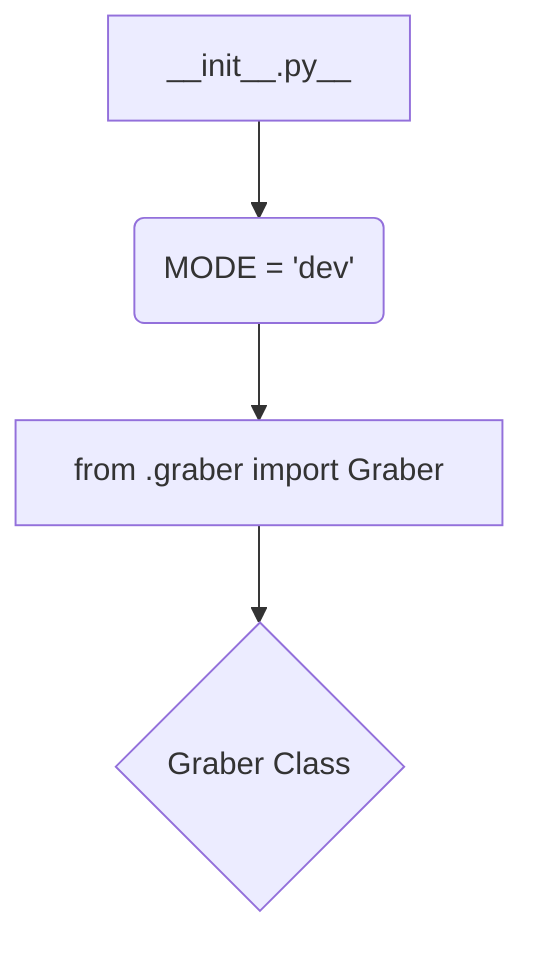

1. **<input code>**

```python
## \file hypotez/src/suppliers/morlevi/__init__.py
# -*- coding: utf-8 -*-
#! venv/Scripts/python.exe
#! venv/bin/python/python3.12

"""
.. module: src.suppliers.morlevi 
	:platform: Windows, Unix
	:synopsis:

"""
MODE = 'dev'

from .graber import Graber
```

2. **<algorithm>**



No specific algorithm is present, as the file is an initialization file.  The workflow is simple: define a constant and import a class from a submodule.


3. **<explanation>**

* **Imports:**
    * `from .graber import Graber`: This line imports the `Graber` class from the `graber.py` file located in the same directory (`./graber.py`).  The `.` prefix indicates a relative import within the `morlevi` package. This import is crucial for using the `Graber` class in any module within the `morlevi` package. This relationship implies a dependency: code in `__init__.py` relies on the `Graber` class defined elsewhere within the project.  The `morlevi` package likely contains several files related to data acquisition from a source called 'morlevi'.


* **Classes:**
    * `Graber`: The code only imports the `Graber` class; no definition is given here. The actual definition of this class (attributes, methods) is located in `hypotez/src/suppliers/morlevi/graber.py`.  Its purpose is unknown without examining the definition. This will likely handle the core logic for interacting with the 'morlevi' data source (e.g., making requests, parsing responses, etc.).


* **Functions:**
    * No functions are defined directly in this file.  All functionality is delegated to imported components, specifically the `Graber` class.


* **Variables:**
    * `MODE = 'dev'`: This is a constant variable, likely defining the operational mode (e.g., 'dev' for development, 'prod' for production). This variable might influence the behavior of other modules that import `morlevi`.


* **Potential Errors/Improvements:**
    * **Missing `graber.py`**: The code assumes a `graber.py` file exists in the same directory (`hypotez/src/suppliers/morlevi/`).  If it doesn't, a `ModuleNotFoundError` will occur during runtime.

    * **Type Hinting**: Adding type hints to `MODE` (e.g., `MODE: str = 'dev'`) would improve code readability and maintainability, especially as the project grows.

    * **Documentation**: While the docstring is present, consider adding more detail regarding the `Graber` class in the docstrings within `graber.py` explaining what the class does, its methods, and their parameters.

* **Chain of Relationships:**
    * `__init__.py` depends on `graber.py`.
    * The `morlevi` package likely sits within a larger `suppliers` package, and will probably be used in the `hypotez` application logic.  Understanding where `morlevi` is imported will show how it's used within the application.


**In summary:** This file is a simple initializer for the `morlevi` module, defining a mode and importing the `Graber` class.  The core functionality resides in the `Graber` class, which likely handles the data acquisition and processing for the 'morlevi' source.  Additional modules will use the methods provided by `Graber` within this module to interact with the data.