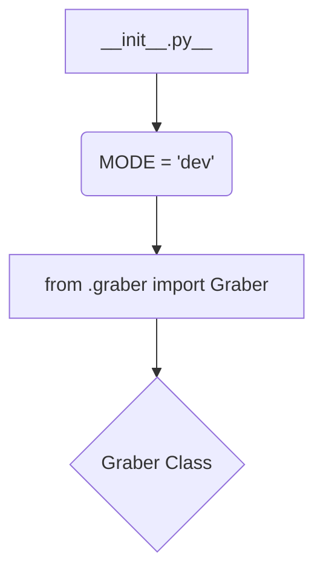

1. **<input code>**

```python
## \file hypotez/src/suppliers/visualdg/__init__.py
# -*- coding: utf-8 -*-\
#! venv/Scripts/python.exe
#! venv/bin/python/python3.12

"""
.. module: src.suppliers.visualdg 
	:platform: Windows, Unix
	:synopsis:

"""
MODE = 'dev'

from .graber import Graber
```

2. **<algorithm>**



* **Block A (\_\_init__.py):** This file initializes the `visualdg` module.
    * **Example:**  `MODE = 'dev'` sets a configuration variable (likely for different execution modes).
* **Block B (MODE = 'dev'):**  This declares a constant.
    * **Example:** `MODE = 'dev'`
* **Block C (from .graber import Graber):** Imports the `Graber` class from the `graber.py` module within the `visualdg` subpackage.
    * **Example:** This imports the `Graber` class, making it available for use in other modules of this package.
* **Block D (Graber Class):** This class (defined in `graber.py`) represents a data-grabbing component.
    * **Example:** The implementation details of `Graber` are not shown here, but it presumably manages acquisition of data.

3. **<explanation>**

* **Imports:**
    * `from .graber import Graber`: This imports the `Graber` class from the `graber.py` file located within the same directory (`visualdg`) as the current `__init__.py` file. The `.` before `graber` indicates a relative import, crucial for module organization. This import makes the `Graber` class usable within the `visualdg` package.  This suggests a modular design where data acquisition logic is separated and reusable.

* **Classes:**
    * `Graber`: The code snippet itself doesn't show the `Graber` class's definition, but it implies a data-grabbing/processing class likely handling input from a source (e.g., a database, API, file).  This class would likely have methods for initializing connections, retrieving data, processing it, and so on.  Further details about this class's functionality can only be found in `graber.py`.


* **Functions:**
    * None directly defined.

* **Variables:**
    * `MODE = 'dev'`: A string variable, likely a configuration parameter.  It's initialized to 'dev', indicating that this module is running in a development mode.  The presence of such a variable suggests that other values, like a 'production' mode, could be defined if there was more code.   The mode would be used to control how data is acquired or treated.

* **Potential Errors or Improvements:**
    * **Missing Documentation:** The docstrings are present, but more details about the usage and expected inputs/outputs of the `Graber` class would significantly enhance the code's maintainability.
    * **Error Handling:** No error handling mechanisms are shown.  A production-ready version of the `Graber` class should include appropriate checks and error handling to manage potential issues, like network problems, database errors, file access issues, and format exceptions, to prevent unexpected crashes.


* **Relationships with Other Parts of the Project:**
    * The import `from .graber import Graber` indicates that the `visualdg` module depends on the `graber` module's implementation.  The `graber` module is likely responsible for the actual data acquisition logic and potentially interacts with other `src` packages for data processing or storage. Without more context, determining exact dependencies is difficult.  For instance, `graber` might interact with a database or an API implemented in other packages.


In summary, this `__init__.py` file sets up the `visualdg` module by importing necessary components.   The core functionality (data acquisition) is delegated to the `Graber` class, which will need to be analyzed in its implementation in `graber.py`. Further code analysis depends on the content of `graber.py`.