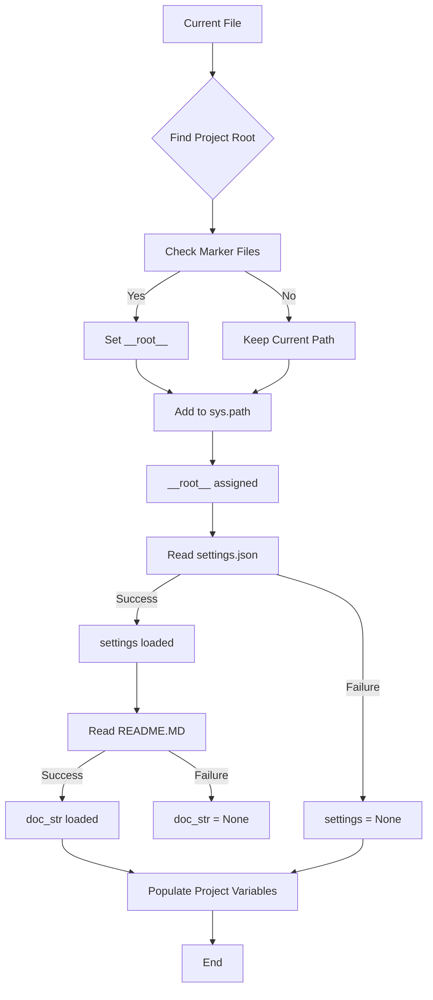

```python
## \file hypotez/src/suppliers/wallmart/header.py
# -*- coding: utf-8 -*-\n#! venv/Scripts/python.exe
#! venv/bin/python/python3.12

"""
.. module: src.suppliers.wallmart 
	:platform: Windows, Unix
	:synopsis:

"""
MODE = 'dev'


import sys
import json
from packaging.version import Version

from pathlib import Path
def set_project_root(marker_files=('pyproject.toml', 'requirements.txt', '.git')) -> Path:
    """
    Finds the root directory of the project starting from the current file's directory,
    searching upwards and stopping at the first directory containing any of the marker files.

    Args:
        marker_files (tuple): Filenames or directory names to identify the project root.
    
    Returns:
        Path: Path to the root directory if found, otherwise the directory where the script is located.
    """
    __root__:Path
    current_path:Path = Path(__file__).resolve().parent
    __root__ = current_path
    for parent in [current_path] + list(current_path.parents):
        if any((parent / marker).exists() for marker in marker_files):
            __root__ = parent
            break
    if __root__ not in sys.path:
        sys.path.insert(0, str(__root__))
    return __root__


# Get the root directory of the project
__root__ = set_project_root()
"""__root__ (Path): Path to the root directory of the project"""

from src import gs

settings:dict = None
try:
    with open(gs.path.root / 'src' /  'settings.json', 'r') as settings_file:
        settings = json.load(settings_file)
except (FileNotFoundError, json.JSONDecodeError):
    ...

doc_str:str = None
try:
    with open(gs.path.root / 'src' /  'README.MD', 'r') as settings_file:
        doc_str = settings_file.read()
except (FileNotFoundError, json.JSONDecodeError):
    ...


__project_name__ = settings.get("project_name", 'hypotez') if settings  else 'hypotez'
__version__: str = settings.get("version", '')  if settings  else ''
__doc__: str = doc_str if doc_str else ''
__details__: str = ''
__author__: str = settings.get("author", '')  if settings else ''
__copyright__: str = settings.get("copyrihgnt", '')  if settings else ''
__cofee__: str = settings.get("cofee", "Treat the developer to a cup of coffee for boosting enthusiasm in development: https://boosty.to/hypo69")  if settings else "Treat the developer to a cup of coffee for boosting enthusiasm in development: https://boosty.to/hypo69"
```

```
2. <algorithm>



**Example Data Flow:**

If `__file__` is located at `/path/to/hypotez/src/suppliers/wallmart/header.py`, the algorithm will traverse up the directory tree (`/path/to/hypotez/src/suppliers/wallmart/`, `/path/to/hypotez/src/suppliers/`, `/path/to/hypotez/src/`, `/path/to/hypotez`).  If `pyproject.toml` is found in `/path/to/hypotez/src`, `__root__` will be set to `/path/to/hypotez/src`.


```
3. <explanation>

**Imports:**

* `sys`: Provides access to system-specific parameters and functions, crucial for manipulating the Python path.
* `json`: For handling JSON data, used to load configuration settings (`settings.json`).
* `packaging.version`: Used for handling version strings consistently and accurately across different Python versions.
* `pathlib`: For handling file paths in an object-oriented way, replacing older `os.path` methods. This provides a more robust and readable way to work with files.  `Path` objects are more suitable for representing file system paths and operations.

**Classes:**

There are no classes in this code.  The use of `Path` objects from the `pathlib` module are objects, but they're not class definitions.

**Functions:**

* `set_project_root(marker_files)`:
    * **Purpose:** Locates the project root directory by checking for specific marker files (e.g., `pyproject.toml`).
    * **Arguments:** A tuple `marker_files` containing filenames or directory names to search for. Defaults to common project files.
    * **Return Value:** A `pathlib.Path` object representing the project root directory.
    * **Example:** If the current file is in `/path/to/myproject/src/suppliers/wallmart/header.py`, and `pyproject.toml` exists in `/path/to/myproject/src`, this function will return a `Path` object pointing to `/path/to/myproject/src`.

**Variables:**

* `MODE`: A string variable that likely controls the execution mode (e.g., 'dev', 'prod').
* `__root__`: A `pathlib.Path` object storing the project root directory.
* `settings`: A dictionary storing project settings loaded from `settings.json`.  Note the `try...except` blocks to handle file not found or JSON parsing errors gracefully.
* `doc_str`: A string containing the content of the `README.MD` file.
* `__project_name__`, `__version__`, `__doc__`, `__details__`, `__author__`, `__copyright__`, `__cofee__`:  Variables holding project metadata. They are populated from the `settings` dictionary if found.

**Potential Errors/Improvements:**

* **Error Handling:** The `try...except` blocks for loading `settings.json` and `README.MD` are good practice. Consider adding more specific exception types for better error analysis (e.g., `FileNotFoundError` and `json.JSONDecodeError`).
* **`__root__` Assignment:** The way `__root__` is updated is somewhat convoluted.  Consider using a `reduce` or similar operation to eliminate redundant comparisons and checks.
* **Robustness:**  Consider error handling in `set_project_root`: What happens if no marker file is found anywhere?  It's crucial to have a fail-safe condition in `set_project_root`.
* **`gs.path.root`:**  This relies on a module named `gs` and a `path` attribute within it. The code assumes that `gs` has been imported and has the correct structure, potentially creating hidden dependencies.

**Relationships:**

This module relies on the `gs` module (likely from the `src` package) to get the project root path.  This indicates a dependency on a package in the same project. It assumes a directory structure where a `settings.json` and a `README.MD` file exist within a `src` directory that is either in the project root or under `__root__`.
```