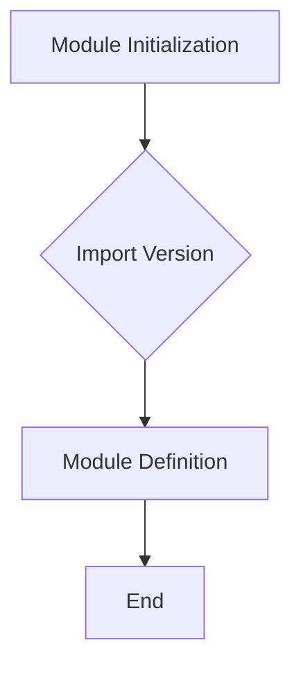

1. **<input code>**:

```python
## \file hypotez/src/templates/_examples/__init__.py
# -*- coding: utf-8 -*-
#! venv/Scripts/python.exe
#! venv/bin/python/python3.12

"""
.. module: src.templates._examples 
	:platform: Windows, Unix
	:synopsis:

"""
MODE = 'dev'

"""
	:platform: Windows, Unix
	:synopsis:

"""


"""
	:platform: Windows, Unix
	:synopsis:

"""


"""
  :platform: Windows, Unix

"""
"""
  :platform: Windows, Unix
  :platform: Windows, Unix
  :synopsis:
"""MODE = 'dev'
  
""" module: src.templates._examples """


from packaging.version import Version
from .version import __version__, __doc__, __details__
```

2. **<algorithm>**:



This is a simplified algorithm as the code primarily focuses on initialization and imports.  There is no significant flow of data within a loop or complex decision-making structure.


3. **<explanation>**:

* **Imports**:
    * `from packaging.version import Version`: Imports the `Version` class from the `packaging` library.  This is likely used for version handling (comparison, etc.).  `packaging` is a standard library for managing and working with Python package versions.  This import is crucial for comparing versions or handling project versions.  This import is part of a larger project structure for version control.

    * `from .version import __version__, __doc__, __details__`: Imports variables (`__version__`, `__doc__`, `__details__`) from a file named `version.py` within the same directory (`_examples`).  This is standard practice for managing metadata about a package or module within a larger project. This suggests that the `version.py` file contains information about the module's version and documentation. The `.` before `version` indicates a relative import from the current module's directory.

* **Classes**:  There are no classes defined in this file.

* **Functions**: There are no functions defined in this file.

* **Variables**:
    * `MODE = 'dev'`: This variable is likely used for configuration (e.g., development vs. production mode).  It's a string and has a constant value of 'dev'.

* **Potential Errors or Improvements**:

    * **Redundant Documentation**: The multiple `"""Docstrings"""` are redundant and could be consolidated for better clarity.

    * **Missing Use**: The use of `MODE` and the imported version information is not clear.  Without more context, it's difficult to definitively state how these are used in the larger project.

    * **Unclear Purpose**: The file seems to primarily serve as an initialization module for the `_examples` directory.  While it's technically valid Python code, it would be more meaningful if there was code that used the imported `Version` data or the `MODE` to perform specific actions.


* **Relationships with Other Parts**:

    * This file likely belongs to a larger project structure involving Python packages.  The imports (`packaging` and the relative import to `version.py`) hint at a package-based organization. `version.py` would likely contain the actual version information. Other Python files within `hypotez/src/templates/_examples` might import and use the variables defined in this file.  The broader project context is needed to determine the full purpose and interaction with other parts of the `hypotez` project.

**In Summary**: This file acts as an initialisation module for the `_examples` section within `hypotez`.  It primarily imports metadata (likely versioning information) and defines a configuration variable (`MODE`).  Without further context, it's hard to determine its complete functionality within the bigger project.