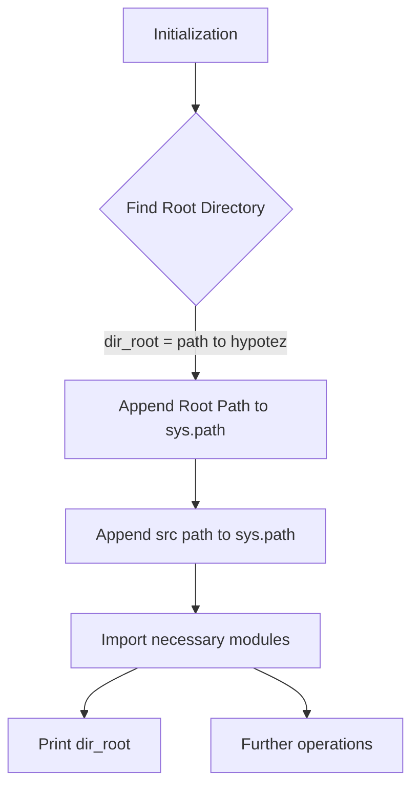

1. **<input code>**

```python
## \file hypotez/src/templates/_examples/header.py
# -*- coding: utf-8 -*-\n#! venv/Scripts/python.exe\n#! venv/bin/python/python3.12\n\n"""
.. module: src.templates._examples 
	:platform: Windows, Unix
	:synopsis:

"""
MODE = 'dev'

"""
	:platform: Windows, Unix
	:synopsis:

"""


"""
	:platform: Windows, Unix
	:synopsis:

"""


"""
  :platform: Windows, Unix

"""
"""
  :platform: Windows, Unix
  :platform: Windows, Unix
  :synopsis:
"""MODE = 'dev'
  
""" module: src.templates._examples """


import sys
import os
from pathlib import Path

dir_root : Path = Path (os.getcwd()[:os.getcwd().rfind('hypotez')+11])
sys.path.append (str (dir_root) )  # Добавляю корневую папку в sys.path
dir_src = Path (dir_root, 'src')
sys.path.append (str (dir_root) ) 
...

print(dir_root)
# ----------------
from pathlib import Path
import json
import re
# ----------------

from src import gs
from src.suppliers import Supplier
from src.product import Product, ProductFields, ProductFieldsLocators
from src.category import Category
from src.utils import j_dumps, j_loads,   pprint, save_text_file
from src.logger import logger
from src.utils.string import StringFormatter, StringNormalizer, ProductFieldsValidator
...
```

2. **<algorithm>**



**Example:**
If `os.getcwd()` returns `/home/user/project/hypotez`, `dir_root` will be `/home/user/project/`.

3. **<explanation>**

* **Imports:**
    * `sys`, `os`, `pathlib`: Standard Python libraries for system interaction, file path manipulation, and paths.
    * `json`, `re`: Standard Python libraries for JSON data handling and regular expressions.  These are general-purpose utilities.
    * `gs`: Imports a module from the `src` package.  Contextual information about `gs` is missing; this would be essential for a complete analysis.
    * `Supplier`, `Product`, `ProductFields`, `ProductFieldsLocators`, `Category`: These imports suggest modules likely defining classes for managing suppliers, products, and categories within an application (e.g., e-commerce, inventory management).  These classes reside within submodules of the `src` package.
    * `j_dumps`, `j_loads`, `pprint`, `save_text_file`, `StringFormatter`, `StringNormalizer`, `ProductFieldsValidator`:  These functions are likely from the `src.utils` module, providing utility methods (JSON serialization/deserialization, formatting, normalization) possibly with specialized functions for product fields.
    * `logger`: A logger module from the `src.logger` package; likely to handle logs for debugging and informational purposes.
* **Classes:** (Missing details of class contents)
    * `Supplier`, `Product`, `Category`:  These are classes likely defining attributes and methods for their respective entities.
    * `ProductFields`, `ProductFieldsLocators`, `StringFormatter`, `StringNormalizer`, `ProductFieldsValidator`: These suggest classes with attributes and methods pertaining to managing product fields, formatting strings, normalizing strings, and validating product fields.   The specific purpose of these classes will depend on their implementations.
* **Functions:** (Missing details of function contents)
    * The presence of `j_dumps`, `j_loads`, `pprint`, `save_text_file`, `StringFormatter`, `StringNormalizer`, `ProductFieldsValidator` suggests functions for data serialization, manipulation, output, and validation.
* **Variables:**
    * `MODE`: A string variable likely configuring the application's operating mode (`'dev'` in this case).
    * `dir_root`: A `Path` object representing the root directory of the project.
    * `dir_src`: A `Path` object representing the `src` directory within the project.
    * `sys.path.append(...)`: Dynamically adds the paths to the module search path. This is crucial to import modules from subdirectories of the project.
* **Potential Errors/Improvements:**
    * **Hardcoded Paths:** The code hardcodes `'hypotez'` in the root directory calculation.  This is fragile.  A better solution is to use constants defined elsewhere, or use the `Path` object for a clearer, more flexible representation.
    * **Missing `...`:** The `...` indicates incomplete code. This hinders a complete understanding. Adding missing import or method definitions would provide critical context.
    * **Redundant Append:** `sys.path.append(str(dir_root))` is called twice. This is unnecessary and may have unintended consequences.
    * **Verbose Documentation:** While the docstrings are present, they are incomplete and could be more helpful in describing the purpose and functionality of the module.
    * **Error Handling:**  No error handling. If `os.getcwd()[:os.getcwd().rfind('hypotez')+11]` fails to find `hypotez`, it will throw an exception.
    * **Unclear `...`:** It's unclear what operations follow the `print(dir_root)` line. This impedes a holistic understanding.

* **Relationships:**
The code establishes a relationship between the current script and the `src` package, which houses essential classes and functions for the project's core logic. The `src` package likely encapsulates the application's core functionality, with various modules like `suppliers`, `products`, `utils`, and `logger` interacting to accomplish specific tasks.  The missing parts (the `...`) would reveal more specific dependencies and integration points.