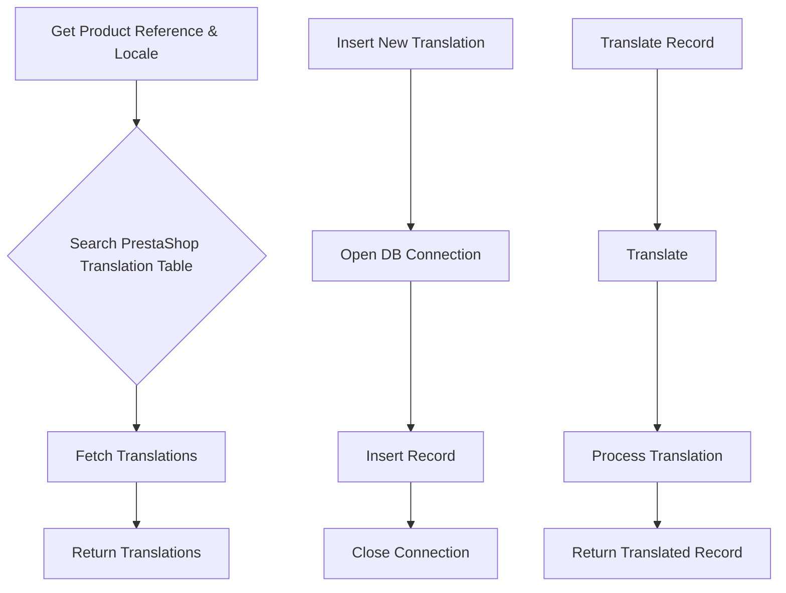

```
## File hypotez/src/translators/product_translator.py
# -*- coding: utf-8 -*-\n#! venv/Scripts/python.exe\n#! venv/bin/python/python3.12\n\n"""\n.. module: src.translators \n\t:platform: Windows, Unix\n\t:synopsis:\n\n"""\nMODE = \'dev\'\n\n"""\n\t:platform: Windows, Unix\n\t:synopsis:\n\n"""\n\n"""\n\t:platform: Windows, Unix\n\t:synopsis:\n\n"""\n\n"""\n  :platform: Windows, Unix\n\n"""\n"""\n  :platform: Windows, Unix\n  :platform: Windows, Unix\n  :synopsis:\n"""MODE = \'dev\'\n  \n""" module: src.translators """\n\n\n\n""" Модуль управления переводами.\nСлой связи между словарем полей товара, таблицей переводов и переводчиками\n\n`get_translations_from_presta_translations_table(product_reference, credentials, i18n)`\n    1. получает референс товара, параметры подключения к базе переводов престашоп и язык перевода в формате en_EN, he_HE, ru-RU \n    2. созадет условуе запроса\n    3. возвращает результат\n    \n\n@todo\n    1. Продумать какой нибудж парсер для en_EN, he_HE, ru-RU\n"""\n\n...\n\nfrom pathlib import Path\nfrom typing import List, Dict\n...\nfrom src import gs\nfrom src.logger import logger\nfrom src.utils import j_loads, j_dumps,  pprint\nfrom src.db import ProductTranslationsManager\nfrom src.ai.openai import translate\nfrom src.endpoints.PrestaShop import PrestaShop\n\n# def record(presta_fields:Dict, i18n:str = None, i:int = 0) -> Dict:\n#     """ Вытаскивает из словаря полей престашоп \n#     `dict_product_fields` значения мультиязычных полей \n#     @param dict_product_fields престашоп словарь полей товара\n#     @param i18n Локаль: en-US, ru-RU, he-IL\n#     @param i индекс языка в мультиязычных полях\n#     """\n#     ...\n#     i18n = i18n if i18n else presta_fields.get(\'locale\')\n#     if not i18n:\n#         text = presta_fields.language[0][\'value\']\n#         i18n = detect(text)\n#         ...\n#     i = 0 # <- Вытаскивает первый из списка языков в мультиязычных полях\n    \n#     # словарь record со всеми ключами\n#     record = {\n#     # ... (many fields)\n#     }\n#     return  record\n\n\ndef get_translations_from_presta_translations_table(product_reference: str, i18n: str = None) -> list:\n    """Функция возвращает словарь переводов полей товара."""\n    with ProductTranslationsManager() as translations_manager:\n        search_filter = {\'product_reference\': product_reference}\n        product_translations = translations_manager.select_record(**search_filter)\n    return product_translations\n\ndef insert_new_translation_to_presta_translations_table(record):\n    with ProductTranslationsManager() as translations_manager:\n        translations_manager.insert_record(record)\n\ndef translate_record(record: dict, from_locale: str, to_locale: str) -> dict:\n    """Функция для перевода полей товара."""\n    translated_record = translate(record, from_locale, to_locale)\n    ... # Добавить обработку переведенной записи\n    return translated_record\n\n```

2. **<algorithm>**



**Example Data Flow:**

* **A (Get Product Reference & Locale):** `product_reference = "XYZ123"; i18n = "en_EN"`
* **B (Search PrestaShop Translation Table):**  Constructs a query to find translations for `product_reference = "XYZ123"`.
* **C (Fetch Translations):**  `ProductTranslationsManager` retrieves the corresponding translations from the database.  Example: `[{'field1': 'translated_value1', 'field2': 'translated_value2'}]`
* **D (Return Translations):** The function returns the translations.

* **E (Insert New Translation):** `record = {'product_reference': 'ABC456', 'field1': 'Value1', 'field2': 'Value2'}`.
* **F (Open DB Connection):** Establishes a connection to the database.
* **G (Insert Record):**  `ProductTranslationsManager` inserts the record into the database.
* **H (Close Connection):** Closes the database connection.


* **I (Translate Record):** `record = {'field1': 'original_value1', 'field2': 'original_value2'}, from_locale = 'fr_FR', to_locale = 'en_EN'`.
* **J (Translate):** `translate` function (likely from `src.ai.openai`) performs the translation using the OpenAI API.
* **K (Process Translation):** Processes the result (e.g., formatting, error handling).  Example: checks if a translation was successful.
* **L (Return Translated Record):** The function returns the translated record.


3. **<explanation>**

* **Imports:**
    * `from pathlib import Path`: Used for file path operations (though not directly used in this file).
    * `from typing import List, Dict`: Provides type hints for better code readability and maintainability.
    * `from src import gs`: Imports from the `src` package, likely a general-purpose or utility module in the same project.
    * `from src.logger import logger`: Imports a logging facility for error reporting and debugging.
    * `from src.utils import j_loads, j_dumps, pprint`: Imports utility functions for JSON handling and pretty printing.
    * `from src.db import ProductTranslationsManager`: Imports a class or module for interacting with the database, specifically for managing product translations.
    * `from src.ai.openai import translate`: Imports the translation function from the OpenAI integration module. This likely uses the OpenAI API for translation.
    * `from src.endpoints.PrestaShop import PrestaShop`: Imports a module or class related to interacting with the PrestaShop API.

* **Classes:**
    * `ProductTranslationsManager`: Likely a class responsible for managing database interactions related to product translations.  It contains methods for `select_record` and `insert_record` which suggests CRUD operations.  The `with` statement indicates that it manages its own database connection.  This structure is very useful for resource management and avoiding potential leaks.


* **Functions:**
    * `get_translations_from_presta_translations_table(product_reference: str, i18n: str = None) -> list`: Takes a product reference and (optionally) a locale as input, queries the database for translations associated with that product and locale, and returns the results.
    * `insert_new_translation_to_presta_translations_table(record)`: Inserts a new translation record into the database.
    * `translate_record(record: dict, from_locale: str, to_locale: str) -> dict`: This is a placeholder for the OpenAI translation function call. This function needs further implementation for error handling and validation, especially for the `...` part.


* **Variables:**
    * `MODE`: A global variable likely used for configuration (e.g., 'dev', 'prod').
    * `product_reference`, `i18n`: Parameters for database querying (string).
    * `search_filter`: A dictionary used to construct the database query.
    * `product_translations`: A list of dictionaries containing the fetched translation records.


* **Potential Errors/Improvements:**
    * **Missing Translation Logic**: The `translate_record` function is incomplete. It needs the handling of the `translate` function response, possible errors (e.g., API rate limits, translation failures), and validation of the translation output.
    * **Error Handling:**  The code lacks comprehensive error handling (e.g., database connection errors, invalid inputs, translation failures).  `try...except` blocks around database operations are crucial.
    * **Data Validation:** Input validation (e.g., ensuring `product_reference` is valid, handling potential `None` values) should be added for robustness.
    * **Locale Handling:**  The `i18n` handling is basic. A more sophisticated system is needed if multiple locales are required.


* **Relationships:**
    * `ProductTranslationsManager` interacts with the database containing product translations.
    * `translate` relies on the OpenAI API.
    * `PrestaShop` is likely used to fetch product data from the PrestaShop store.  
    * `gs` and `logger` are other supporting modules in the `src` package.

**Overall:**

The code provides a foundation for translating product data. However, crucial parts like robust error handling, input validation, and detailed translation implementation are missing.  Thorough testing, especially in production environments, is necessary to ensure reliability and performance.