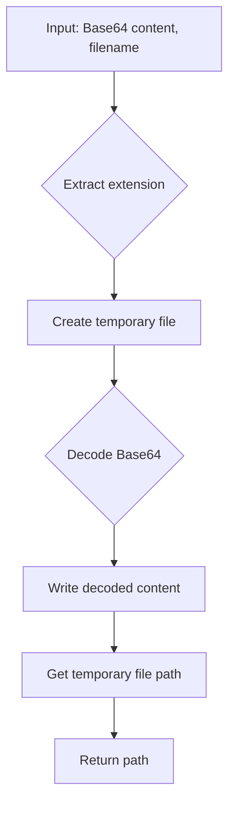

```python
## \file hypotez/src/utils/convertors/base64.py
# -*- coding: utf-8 -*-
#! venv/Scripts/python.exe
#! venv/bin/python/python3.12

"""
.. module: src.utils.convertors
	:platform: Windows, Unix
	:synopsis: Convert Base64 encoded content to a temporary file

"""
MODE = 'dev'

""" This module provides a function to decode Base64 encoded content and write it to a temporary file with the specified extension.

Functions:
    - `base64_to_tmpfile`: Convert Base64 encoded content to a temporary file.
"""

import base64
import tempfile
import os

def base64_to_tmpfile(content: str, file_name: str) -> str:
    """
    Convert Base64 encoded content to a temporary file.

    This function decodes the Base64 encoded content and writes it to a temporary file with the same extension as the provided file name. 
    The path to the temporary file is returned.

    Args:
        content (str): Base64 encoded content to be decoded and written to the file.
        file_name (str): Name of the file used to extract the file extension for the temporary file.

    Returns:
        str: Path to the temporary file.

    Example:
        >>> base64_content = "SGVsbG8gd29ybGQh"  # Base64 encoded content "Hello world!"
        >>> file_name = "example.txt"
        >>> tmp_file_path = base64_to_tmpfile(base64_content, file_name)
        >>> print(f"Temporary file created at: {tmp_file_path}")
        Temporary file created at: /tmp/tmpfile.txt
    """
    _, ext = os.path.splitext(file_name)
    path = ''
    with tempfile.NamedTemporaryFile(delete=False, suffix=ext) as tmp:
        tmp.write(base64.b64decode(content))
        path = tmp.name

    return path

def base64encode(image_path):
    # Function to encode the image
  with open(image_path, "rb") as image_file:
    return base64.b64encode(image_file.read()).decode('utf-8')
```

**<algorithm>**



* **Input:** Base64 encoded string (`content`) and the desired filename (`file_name`).
* **Extract extension:**  Determine the file extension from the input filename using `os.path.splitext()`.  For example, if the input is `"image.png"`, the extension would be ".png".
* **Create temporary file:**  `tempfile.NamedTemporaryFile` creates a temporary file with the specified extension.  `delete=False` ensures the file is not automatically deleted. The `suffix` parameter appends the extracted extension to the temporary filename.
* **Decode Base64:**  `base64.b64decode(content)` converts the Base64 encoded string into its original byte format.
* **Write decoded content:** The decoded byte data is written to the temporary file using `tmp.write()`.
* **Get temporary file path:** The temporary file's full path is obtained from `tmp.name`.
* **Return path:** The function returns the temporary file's full path.


**<explanation>**

* **Imports:**
    * `base64`: Used for encoding and decoding Base64 strings.  Crucial for handling Base64 data.
    * `tempfile`: Used to create temporary files. Essential for handling temporary storage.
    * `os`: Used for file path operations, specifically for extracting file extensions.


* **Classes:** There are no classes defined in the provided code.


* **Functions:**
    * **`base64_to_tmpfile(content: str, file_name: str) -> str`**:
        * Takes the Base64 encoded content and the desired filename as input.
        * Extracts the file extension from the input filename.
        * Creates a temporary file with the specified extension.
        * Decodes the Base64 content.
        * Writes the decoded content to the temporary file.
        * Returns the path to the temporary file.
        * **Example Usage (from docstring):**
            ```python
            base64_content = "SGVsbG8gd29ybGQh"  # Base64 encoded "Hello world!"
            file_name = "example.txt"
            tmp_file_path = base64_to_tmpfile(base64_content, file_name)
            print(f"Temporary file created at: {tmp_file_path}")
            ```

    * **`base64encode(image_path)`**: This function takes an image file path as input, reads the image in binary mode (`rb`), encodes it using `base64.b64encode()`, and returns the Base64 encoded string.

* **Variables:**
    * `MODE`: A string variable, likely for development mode.
    * `content`: String representing the Base64 encoded data.
    * `file_name`: String holding the name of the file to create.
    * `ext`: String containing the extracted file extension.
    * `path`: String holding the temporary file path.


* **Potential Errors/Improvements:**
    * **Error Handling:** The code lacks error handling.  If `content` isn't a valid Base64 string, `base64.b64decode()` will raise an exception.  Adding `try...except` blocks around the decoding step is highly recommended.
    * **File Existence Check (for `base64encode`):** The `base64encode` function should verify that the file at `image_path` exists before attempting to open it.  Otherwise, a `FileNotFoundError` will occur.
    * **Temporary File Cleanup:**  While `tempfile.NamedTemporaryFile` automatically cleans up temporary files when the object goes out of scope, it's a good practice to explicitly remove the temporary file if it's not used further in the code (especially in a long-running application).  Add a call to `os.remove(path)` after the function finishes if needed, or use a `with` statement to ensure the file gets automatically cleaned up when necessary.
    * **Security (for `base64encode`):** If this function will be used with potentially untrusted data, consider verifying or sanitizing `image_path` before use to prevent arbitrary file reading.  Also, if the image might be malicious, handling it appropriately would be critical to the overall application security.

**Relationships with Other Parts:**

This module (`base64.py`) likely facilitates data transformations needed in other parts of the `hypotez` project.  The base64 encoding and decoding capabilities are likely required by other components for temporary file storage, image handling, or other data manipulation tasks.  For example, it might be used by functions within `hypotez/src/data_processing` to store results in temporary files.