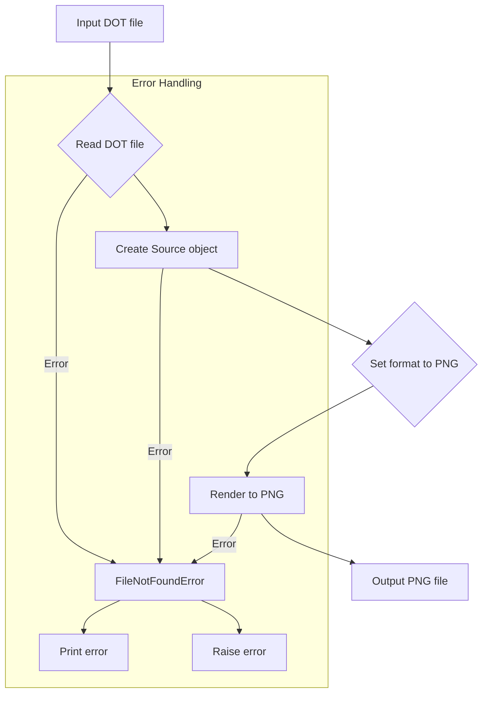

```
## File hypotez/src/utils/convertors/dot.py
# -*- coding: utf-8 -*-\
#! venv/Scripts/python.exe
#! venv/bin/python/python3.12

"""
.. module: src.utils.convertors 
	:platform: Windows, Unix
	:synopsis: converts DOT files into PNG images using the Graphviz library

"""
MODE = 'dev'

import sys
from graphviz import Source

def dot2png(dot_file: str, png_file: str) -> None:
    """ Converts a DOT file to a PNG image.

    Args:
        dot_file (str): The path to the input DOT file.
        png_file (str): The path where the output PNG file will be saved.

    Raises:
        FileNotFoundError: If the DOT file does not exist.
        Exception: For other errors during conversion.

    Example:
        >>> dot2png('example.dot', 'output.png')
        
        This converts the DOT file 'example.dot' into a PNG image named 'output.png'.
        
        Sample DOT content for 'example.dot':
        
        ```dot
        digraph G {
            A -> B;
            B -> C;
            C -> A;
        }
        ```
        
        To run the script from the command line:
        
        ```bash
        python dot2png.py example.dot output.png
        ```

        This command will create a PNG file named 'output.png' from the graph defined in 'example.dot'.
    """
    try:
        # Read the DOT file
        with open(dot_file, 'r') as f:
            dot_content = f.read()

        # Create a Source object from the DOT content
        source = Source(dot_content)

        # Render the source to a PNG file
        source.format = 'png'
        source.render(png_file, cleanup=True)
    except FileNotFoundError as e:
        print(f"Error: The file '{dot_file}' was not found.")
        raise e
    except Exception as e:
        print(f"An error occurred during the conversion: {e}")
        raise e


if __name__ == "__main__":
    if len(sys.argv) != 3:
        print("Usage: python dot2png.py <input_dot_file> <output_png_file>")
        sys.exit(1)

    input_dot_file = sys.argv[1]
    output_png_file = sys.argv[2]

    dot2png(input_dot_file, output_png_file)
```

**<algorithm>**



**Example Data Flow:**

Input: `example.dot` (containing a DOT graph) and `output.png` (output filename).

1. **Read DOT file (B):** The function reads the content of `example.dot` into the `dot_content` variable. Example: `dot_content = "digraph { ... }"`

2. **Create Source object (C):** A `Source` object is created using the `graphviz` library. It parses the `dot_content`. Example: `source = Source("digraph { ... }")`

3. **Set format to PNG (D):** The `source.format` attribute is set to 'png' to specify the output image format.

4. **Render to PNG (E):** The `source.render` method generates the PNG image from the parsed DOT data and saves it to the specified file (`output.png`).

5. **Output PNG file (F):** The converted PNG image is saved.

**Error Handling (Error Handling section of flowchart):**

If any error occurs (like the file not being found or a problem during rendering), error handling is triggered, an appropriate error message is printed to the console, and the error is raised using `raise` to stop the program.


**<explanation>**

* **Imports:**
    * `sys`: Provides access to system-specific parameters and functions, such as command-line arguments (`sys.argv`). This import is crucial for handling the command-line input and for exiting the program with an error code when necessary.
    * `graphviz`:  This import is from the `graphviz` library, which is used for graph visualization.  It handles the conversion of DOT language descriptions into image formats (like PNG). It's a third-party library that must be installed (`pip install graphviz`). It enables the project to perform the core function of the `dot2png` module.

* **Classes:**
    * `Source`: The `Source` class from `graphviz` is used, but not defined in the code.  It's crucial for handling DOT file content and rendering to different formats.  The class encapsulates the parsing and rendering logic for the DOT graph.


* **Functions:**
    * `dot2png(dot_file: str, png_file: str) -> None`:
        * Takes two string arguments: the input DOT file path (`dot_file`) and the desired output PNG file path (`png_file`).
        * Uses a `try...except` block to handle potential `FileNotFoundError` and other exceptions during file reading or rendering. This is a critical aspect for robustness.
        * Reads the contents of the DOT file into a string variable (`dot_content`).
        * Creates a `graphviz.Source` object from the DOT content.
        * Sets the output format to PNG using `source.format = 'png'`.
        * Calls `source.render` to create the output PNG file, and then cleans up temporary files (`cleanup=True`).
        * Handles potential errors using `except` blocks, printing informative error messages and re-raising the exceptions.

* **Variables:**
    * `MODE`: A string variable with the value `'dev'`.  Its purpose isn't directly evident from this snippet. It likely indicates a development mode or some configuration.  More context would be needed.
    * `dot_file`, `png_file`: Strings representing file paths.
    * `dot_content`: String containing the DOT file's content.
    * `source`: An instance of the `graphviz.Source` class.
    * `input_dot_file`, `output_png_file`: Strings representing the input and output filenames taken from command-line arguments.

* **Potential Errors/Improvements:**
    * **Error Handling:** The code handles `FileNotFoundError`, which is good. However, it could be more comprehensive by catching other exceptions that might arise during file operations or graphviz rendering.
    * **Input Validation:** The `if __name__ == "__main__":` block is a good practice. However, the validation of input arguments (e.g., checking if the filenames are valid) could be enhanced. (e.g., checking if `dot_file` actually exists or checking file extensions to ensure its indeed a DOT file).
    * **Type Hinting:**  Type hinting is used, which improves code readability and maintainability. Consider using a linter (like flake8) or a static analysis tool to enforce type hints and help catch errors early.


**Relationships with other parts of the project:**

The `dot.py` script is part of the `hypotez` project's `utils/convertors` module.  It likely exists within a larger system, presumably for visualizing graphs or data.  It's reusable; other parts of the project can call the `dot2png` function to generate images from DOT descriptions.  The specific functions in other modules that would utilize this conversion are not shown here, but it seems to exist in a project that uses graphs, visualizations, and possibly data processing.