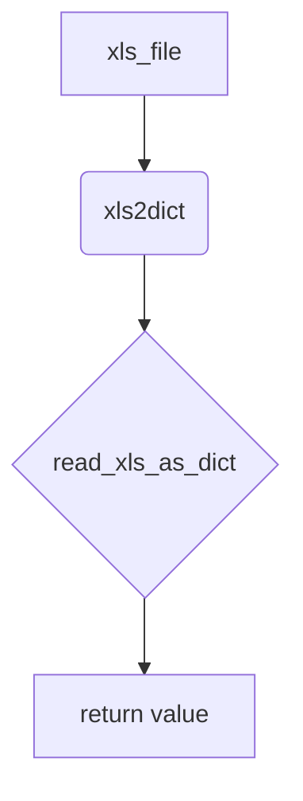

1. **<input code>**

```python
## \file hypotez/src/utils/convertors/xls.py
# -*- coding: utf-8 -*-
#! venv/Scripts/python.exe
#! venv/bin/python/python3.12

"""
.. module: src.utils.convertors 
	:platform: Windows, Unix
	:synopsis:

"""
MODE = 'dev'


from pathlib import Path

from src.utils.xls import read_xls_as_dict, save_xls_file


def xls2dict(xls_file: str | Path) -> dict | None:
    """"""
    return read_xls_as_dict(xls_file = xls_file)
```

2. **<algorithm>**



* **Input:** `xls_file` (a string or `Path` object representing the path to an XLS file).
* **Process:** The `xls2dict` function takes the `xls_file` path as input.
* **Output:** The function returns the result of calling `read_xls_as_dict` with the provided `xls_file` path.  If `read_xls_as_dict` successfully parses the file, it returns a Python dictionary. If there's an error (e.g., file not found, invalid format), it likely returns `None`.

3. **<explanation>**

* **Imports:**
    * `from pathlib import Path`: Imports the `Path` object, allowing the code to handle file paths in a more platform-independent way (Windows vs. Unix).
    * `from src.utils.xls import read_xls_as_dict, save_xls_file`: Imports functions `read_xls_as_dict` and `save_xls_file` from the `src.utils.xls` module.  This suggests a modular design where `xls.py` likely contains functions for reading and writing XLS files, and this `xls.py` file focuses on calling those functions to convert XLS files to dictionaries. The `src` prefix implies that these files and imports reside within a package structure.


* **Functions:**
    * `xls2dict(xls_file: str | Path) -> dict | None`:
        * Takes an `xls_file` path (string or `Path` object) as input.
        * Calls `read_xls_as_dict` with the provided `xls_file` as an argument.
        * Returns the result of `read_xls_as_dict`. This result is expected to be a dictionary or `None` (for errors).  The type hints (`-> dict | None`) are crucial for specifying possible return values and are a good practice.

* **Variables:**
    * `MODE = 'dev'`:  A global variable probably used for configuration (development mode in this case).


* **Potential Errors/Improvements:**
    * The code doesn't handle potential exceptions from `read_xls_as_dict`.  It should include a `try...except` block to catch errors like `FileNotFoundError` or errors related to the XLS file format.  For example:

```python
def xls2dict(xls_file: str | Path) -> dict | None:
    try:
        return read_xls_as_dict(xls_file=xls_file)
    except FileNotFoundError as e:
        print(f"Error: {e}")
        return None
    except Exception as e:
        print(f"An unexpected error occurred: {e}")
        return None
```

    * No input validation is performed on `xls_file`.  It should check if the `xls_file` is a valid path or if it exists.

* **Relationships:**
    * The `xls2dict` function relies on the `read_xls_as_dict` function from the `src.utils.xls` module. Therefore, the `src.utils.xls` module likely contains functions that handle the actual file I/O (reading and parsing the XLS file) which provides the core functionality of converting an xls file into a Python dictionary.  There's a clear dependency from this `xls.py` file on the `xls.py` file in the `src/utils` package. The `save_xls_file` function, if defined in the `src.utils.xls` module, allows saving data to XLS files.  This suggests a possible larger pipeline involving reading, processing, and potentially saving data.