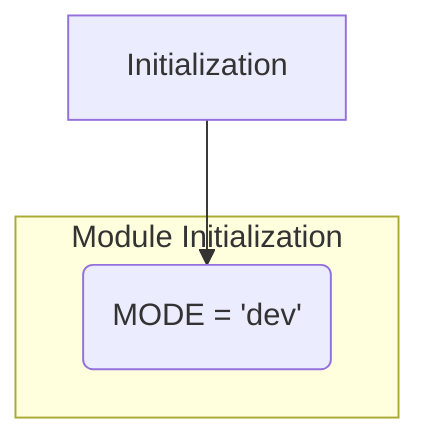

1. **<input code>**

```python
## \file hypotez/src/utils/iso/__init__.py
# -*- coding: utf-8 -*-\
#! venv/Scripts/python.exe
#! venv/bin/python/python3.12

"""
.. module: src.utils.iso 
	:platform: Windows, Unix
	:synopsis:

"""
MODE = 'dev'
```

2. **<algorithm>**



There is no complex algorithm. This file simply initializes a global variable `MODE` within the `src.utils.iso` module.  The module's structure is the core functionality.  Data flow is minimal.

3. **<explanation>**

* **Imports:** There are no imports. This file is likely a module initializer within a larger project.

* **Classes:** There are no classes defined.

* **Functions:** There are no functions defined.

* **Variables:**
    * `MODE`:  A global string variable initialized to the value 'dev'.  This variable likely controls the behavior of other parts of the project, such as which environment configuration to use (development, testing, production).

* **Potential Errors or Areas for Improvement:**

    * **No Documentation:** While the docstring provides some context, a missing `__all__` variable in the `__init__.py` file can lead to unexpected behavior if other files in the `src.utils.iso` package are imported without proper qualification.
    * **Lack of Context:** The purpose of `MODE = 'dev'` is unclear without understanding the surrounding codebase.  Is it used to choose different configuration files, switch on/off debug messages, or something else entirely?  The code needs more context from other files to properly determine the significance of this variable.
    * **Hardcoding Values:** Using the string literal `'dev'` for the mode could be improved by introducing a named constant or an environment variable.  This would improve maintainability and prevent typos.

* **Relationships with Other Parts of the Project:**

    * The `src.utils.iso` module likely interacts with other parts of the project, specifically components that use or reference the `MODE` global variable. For instance, there might be functions in another module that use the value of `MODE` to determine the path to a configuration file, or to enable or disable debugging statements.  This initialization file sets the context for behavior elsewhere.
    * The `hypotez` directory structure implies the code belongs to a project called "hypotez," and `src/utils/iso` suggests this module provides utility functions related to ISO standards (possibly file formats or similar).  More complete file structure would solidify this relationship.


**In Summary:**

This Python file is a simple module initializer for a package (`src.utils.iso`) in a larger project. The primary functionality is setting a global variable `MODE` to control the project's behavior, but the precise details are difficult to ascertain without more context.  Additional documentation and more context are required for a complete understanding of the file's role within the `hypotez` project.