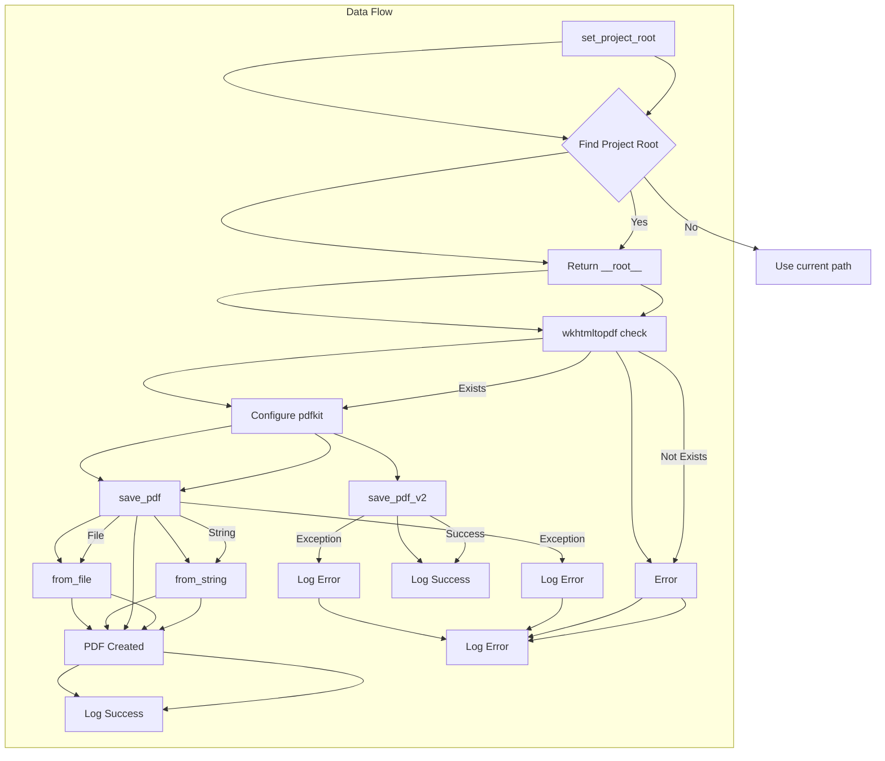

```python
## \file hypotez/src/utils/pdf.py
# -*- coding: utf-8 -*-\
#! venv/Scripts/python.exe
#! venv/bin/python/python3.12

"""
.. module: src.utils 
	:platform: Windows, Unix
	:synopsis: Модуль для преобразования HTML-контента или файлов в PDF

Модуль для преобразования HTML-контента или файлов в PDF с использованием библиотеки `pdfkit`.
Дополнительная информация:
- https://chatgpt.com/share/672266a3-0048-800d-a97b-c38f647d496b
- https://stackoverflow.com/questions/73599970/how-to-solve-wkhtmltopdf-reported-an-error-exit-with-code-1-due-to-network-err
- https://habr.com/ru/companies/bothub/articles/853490/
"""
MODE = 'dev'
import sys
import os

from pathlib import Path
import pdfkit
from reportlab.pdfgen import canvas
from fpdf import FPDF

from src.logger import logger
```

```
<algorithm>
```


```
<explanation>

**Imports:**

- `sys`: Provides access to system-specific parameters and functions, such as command-line arguments and environment variables. Used here for adding the project root to `sys.path`

- `os`: Offers functions for interacting with the operating system, such as file system operations.  Potentially used for file checks but not directly evident in this snippet.

- `pathlib`:  Provides object-oriented way of working with files and paths, improving code readability.

- `pdfkit`:  The core library for converting HTML to PDF.

- `reportlab.pdfgen.canvas`:  (Potentially used for more advanced PDF generation, if this import is necessary, but currently not in use).

- `fpdf`:  An alternative library for creating PDF documents (like generating a simple PDF from string content).

- `src.logger`: Imports a custom logging module presumably defined in a `src/logger.py` file, which is part of the project's structure, likely for recording events and errors related to PDF generation.  This is an example of modular design.


**Classes:**

- `PDFUtils`: This class encapsulates PDF-related functionalities.

    - `save_pdf`:  Takes HTML content (string) or a file path as input and saves it as a PDF using `pdfkit`.  Handles both string and file input. The use of the `try...except` block is excellent error handling practice, catching both `pdfkit.PDFKitError` and `OSError`.  It uses `configuration` and `options` for `pdfkit` and logs appropriately for success or failure.  This is a well-structured function, handling different input types.

    - `save_pdf_v2`:  A secondary method for saving simple text data to PDF format using the `fpdf` library. Useful for different use cases.  The use of `set_auto_page_break` prevents problems with long texts.


**Functions:**

- `set_project_root`:  Finds the root directory of the project relative to the current file (`__file__`). This is critical for managing dependencies (`sys.path`) correctly within a project. `marker_files` allows for customization. This function is crucial for ensuring that all packages can be imported correctly, even if the project structure changes slightly.  The function is clearly written and easy to understand, including the error handling if the root folder cannot be found.

**Variables:**

- `MODE`:  A string variable (likely a configuration setting).
- `wkhtmltopdf_exe`: The path to the `wkhtmltopdf` executable; critical for the PDF conversion process.   Crucially, it's dynamically determined from the project's root directory, making it adaptable to various project setups.
- `configuration`: Configuration for `pdfkit`, including the `wkhtmltopdf` path.
- `options`: Configuration options for `pdfkit`.

**Potential Errors/Improvements:**

- **Error Handling:** The error handling within `save_pdf` is good, but adding specific checks (e.g., if the input `data` is neither a string nor a valid file path) would make it even more robust.

- **Robustness:**  `set_project_root` could be made even more robust by checking if the marker files are directories (e.g., `.git` can be both a file or a directory in some cases)

- **Clearer Variable Naming:**  `__root__` could be more descriptive (e.g., `project_root`).

- **`wkhtmltopdf` Installation:**  The code assumes that `wkhtmltopdf` is installed and available on the system. It's crucial to include instructions to install the required libraries.


**Relationships with other parts of the project:**

- `src.logger`: This module is part of the project's logging infrastructure.


**Conclusion:** This code effectively handles HTML-to-PDF conversions, using several robust libraries and techniques. The error handling and dynamic determination of the project root directory enhance its applicability across diverse project setups. This code example is well documented and follows good practices.  It's a good example of a Python module for converting HTML data to PDF.
```