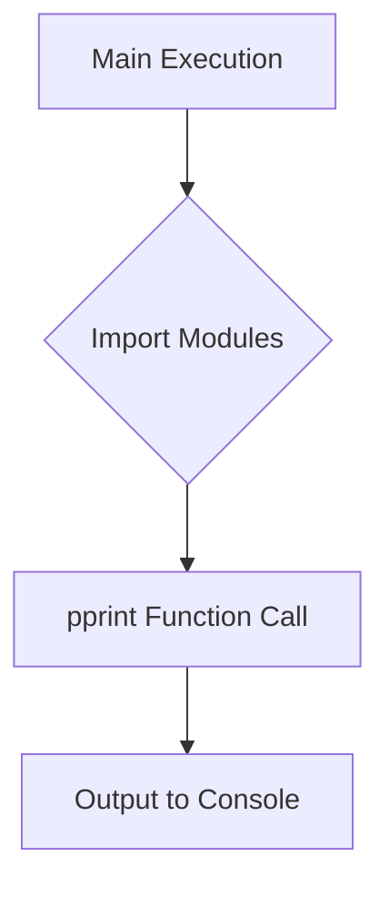

1. <input code>
```python
## \file hypotez/src/utils/powershell/examples/pprint/example_pprint.py
# -*- coding: utf-8 -*-\
#! venv/Scripts/python.exe
#! venv/bin/python/python3.12

"""
.. module: src.utils.powershell.examples.pprint 
	:platform: Windows, Unix
	:synopsis:

"""
MODE = 'dev'

"""
	:platform: Windows, Unix
	:synopsis:

"""


"""
	:platform: Windows, Unix
	:synopsis:

"""


"""
  :platform: Windows, Unix

"""
"""
  :platform: Windows, Unix
  :platform: Windows, Unix
  :synopsis:
"""MODE = 'dev'
  
""" module: src.utils.powershell.examples.pprint """


""" HERE SHOULD BE A DESCRIPTION OF THE MODULE OPERATION ! """
...
import header
from pprint import pprint as pretty_print 
from src.printer import pprint

pprint("Hello, world!")
...
```

2. <algorithm>



**Example Data Flow:**

* **A:** The Python interpreter begins execution.
* **B:** The code imports necessary modules (`header`, `pprint`, `src.printer`).  This step retrieves the functions and classes defined in those modules.  
    * Example: `header` might contain utility functions, and `src.printer` would contain custom print formatting or logging.
* **C:** The `pprint("Hello, world!")` call passes the string "Hello, world!" to the `pprint` function.
* **D:** The `pprint` function processes the string, possibly formatting it (depending on implementation in `src.printer`). It sends the result to the console for display.


3. <explanation>

* **Imports:**
    * `import header`: This imports a module named `header`.  It's unclear from the provided code what `header` contains.  It likely provides additional utility functions or constants related to the project, but without the actual code for `header`, it's hard to determine the exact nature of its contents and interactions with `example_pprint.py`.  This module is likely part of the `src` package or a package directly related to `src`.
    * `from pprint import pprint as pretty_print`: This imports the `pprint` function from the built-in `pprint` module and renames it to `pretty_print`. This is a standard Python utility for pretty-printing data structures.
    * `from src.printer import pprint`: This line imports a function named `pprint` from the `src.printer` module. This `pprint` likely contains custom formatting for output. This is a crucial import in that it defines the specific way the output is presented; it's not merely calling the standard `pprint` function from `pprint`. `src.printer` is a part of the project's internal module system.

* **Classes (None):** There are no classes defined in this code snippet.

* **Functions:**
    * `pprint("Hello, world!")`: This line calls the `pprint` function, which was imported from `src.printer`.  It passes the string "Hello, world!" as an argument. The `pprint` function's behavior, likely within `src.printer`, handles formatting and output; it would determine the specific way the string is displayed on the console.
    * The `pprint` function inside `src.printer` is not shown.  Without this function's definition, we cannot analyze its parameters or internal workings.


* **Variables:**
    * `MODE = 'dev'`: This is a global variable that likely controls the behavior of the code, potentially enabling or disabling debug features or output formatting within `src.printer`.


* **Potential Errors or Improvements:**
    * **Missing Documentation:** The code lacks comprehensive docstrings for the `pprint` function from `src.printer` and the overall purpose of this module.  This makes it harder to understand the intended behavior and how it relates to other parts of the project.
    * **Unclear `header` usage:** Without the `header` module's definition, its use in this script is unclear.

* **Chain of Relationships:**
    * `example_pprint.py` uses `src.printer`.
    * `src.printer` probably uses other `src` modules (unspecified) to perform its formatting operations.
    * `header` likely interacts with and supports one or more modules within the `src` package, possibly providing configuration settings, utility functions, or common data structures.