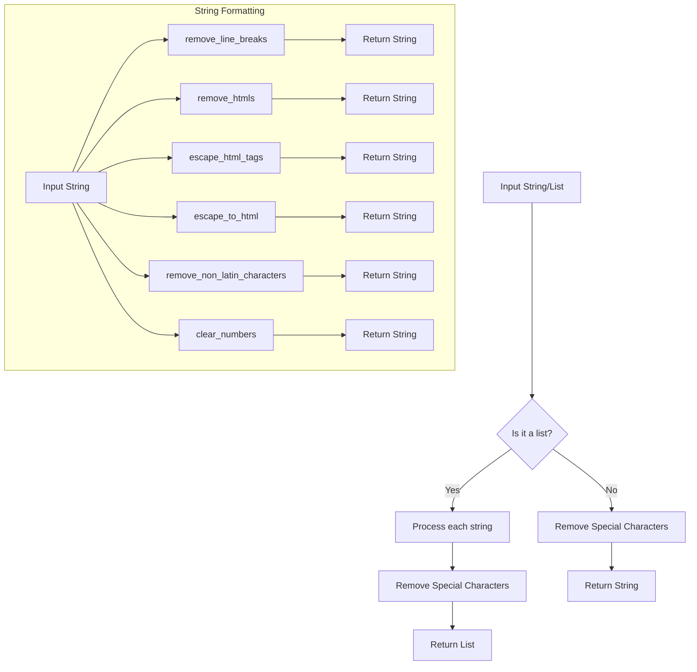

```
## File: hypotez/src/utils/string/formatter.py
# -*- coding: utf-8 -*-\
#! venv/Scripts/python.exe
#! venv/bin/python/python3.12

"""
.. module: src.utils.string 
	:platform: Windows, Unix
	:synopsis: String formatting functions.

Functions:
    - remove_line_breaks(input_str: str) -> str
    - remove_htmls(input_html: str) -> str
    - escape_html_tags(input_html: str) -> str
    - escape_to_html(text: str) -> str
    - remove_non_latin_characters(input_str: str) -> str
    - remove_special_characters(input_str: str | list) -> str
    - clear_numbers(input_str: str) -> str

Data transformation:
    - convert_to_list(input: str | list[str, dict, list[dict]], delimiter: str = ',') -> list
    - extract_value_from_parentheses_with_lead_dollar(input_str: str) -> str | list | bool
    - clean_url_from_protocols(url: str) -> str
"""
MODE = 'dev'
import re
import html
from typing import List, Dict
from urllib.parse import urlparse, parse_qs
from src.logger import logger
from .html_escapes import html_escapes

class StringFormatter:
    """
    StringFormatter (String Formatting):

    Provides utility functions for formatting strings, such as removing line breaks, HTML tags, non-Latin characters, and special characters.
    """

    @staticmethod
    def remove_line_breaks(input_str: str) -> str:
        """ Removes line breaks from the input string.

        Args:
            input_str (str): Input string.

        Returns:
            str: A string with line breaks removed.
        """
        return input_str.replace("\\n", " ").replace("\\r", " ").strip()

    @staticmethod
    def remove_htmls(input_html: str) -> str:
        """ Removes HTML tags from the input string.

        Args:
            input_html (str): Input HTML string.

        Returns:
            str: A string with HTML tags removed.
        """
        return re.sub(r'<.*?>', '', input_html).strip()

    @staticmethod
    def escape_html_tags(input_html: str) -> str:
        """ Replaces `<` and `>` with `&lt;` and `&gt;` in the input HTML string.

        Args:
            input_html (str): Input HTML string.

        Returns:
            str: An escaped HTML string.
        """
        return html.escape(input_html)

    @staticmethod
    def escape_to_html(text: str) -> str:
        """ Replaces characters with their HTML escape sequences.

        Args:
            text (str): Input text.

        Returns:
            str: Text with characters replaced by HTML escape sequences.
        """
        return ''.join(html_escapes.get(char, char) for char in text)

    @staticmethod
    def remove_non_latin_characters(input_str: str) -> str:
        """ Removes non-Latin characters from the input string.

        Args:
            input_str (str): Input string.

        Returns:
            str: A string with non-Latin characters removed.
        """
        return re.sub(r'[^a-zA-Z\s]', '', input_str).strip()

    @staticmethod
    def remove_special_characters(input_str: str | list) -> str | list:
        """ Removes special characters not allowed in specific contexts.

        Args:
            input_str (str | list): Input string or list of strings.

        Returns:
            str | list: Processed string or list with special characters removed.
        """
        if isinstance(input_str, list):
            return [re.sub(r'[^a-zA-Z0-9\s]', '', s) for s in input_str]
        return re.sub(r'[^a-zA-Z0-9\s]', '', input_str)

    @staticmethod
    def clear_numbers(input_str: str) -> str:
        """ Clears the input string, leaving only decimal numbers and points.

        Args:
            input_str (str): Input string.

        Returns:
            str: Cleared string containing only decimal numbers and points.

        Example:
            >>> input_str = 'aaa123.456 cde'
            >>> output_str = StringFormatter.clear_numbers(input_str)
            >>> print(output_str)
            123.456
        """
        return re.sub(r'[^\\d\\.]', '', input_str)
```

**<algorithm>**




**<explanation>**

* **Imports:**
    * `re`: For regular expressions, used for pattern matching and manipulation of strings (e.g., removing HTML tags, special characters).
    * `html`: For HTML escaping (e.g., converting `<` to `&lt;`).
    * `typing`: For type hints (`List`, `Dict`), enhancing code readability and maintainability.
    * `urllib.parse`: For URL parsing, used in potential future URL-related string formatting functions (clean_url_from_protocols).
    * `src.logger`: Likely for logging operations (not detailed in the provided snippet).  Implies a logger module for reporting/debugging in the `hypotez` project.
    * `.html_escapes`: Likely a local module, probably containing pre-defined HTML escape sequences for efficiency and readability, reducing repetitive logic.


* **Classes:**
    * `StringFormatter`: A utility class containing static methods for string formatting. This promotes code organization and reusability.  It centralizes string manipulation logic.

* **Functions:**
    * `remove_line_breaks`: Removes newline characters (`\n`, `\r`) from a string.  Useful for preparing strings for display or further processing.
    * `remove_htmls`: Removes HTML tags from a string.  Suitable for extracting text content from HTML sources.
    * `escape_html_tags`: Escapes `<` and `>` characters in a string to their HTML entities (&lt; and &gt;).  Crucial for preventing issues when embedding strings within HTML.
    * `escape_to_html`:  Replaces characters with their corresponding HTML escape sequences.  It's useful for rendering text safely in HTML, preventing misinterpretations and security vulnerabilities.
    * `remove_non_latin_characters`: Removes non-Latin characters (including symbols not used in most text).  Crucial when expecting specific character sets.
    * `remove_special_characters`: Removes special characters from a string or a list of strings (handling both cases). Useful in situations where special characters aren't valid input (e.g., input sanitization).
    * `clear_numbers`: Extracts only digits and decimal points from a string. This helps to isolate numerical data within a string for further processing.

* **Variables:**
    * `MODE`: A string variable, likely set to 'dev' in this module, which could control behavior (e.g., enabling/disabling logging, testing mode).

* **Potential Errors/Improvements:**
    * The regular expressions (`re.sub`) used in several functions to remove characters might be improved with more specific or comprehensive character ranges to exclude, avoiding unintended removals of relevant characters.
    * The code lacks a docstring describing the `convert_to_list` function, which is listed in the module docstring, creating redundancy. A proper docstring including the arguments `input` and `delimiter` would be helpful.

* **Relationships:**
    * `StringFormatter` interacts with other modules/functions in the `src` project, but details of these interactions are not shown in the snippet. The imports indicate reliance on the `logger` module (for logging).


In summary, this Python module provides a collection of static methods within the `StringFormatter` class to handle various string formatting tasks. The module relies on regular expressions and the `html` module for specific manipulations and offers functions for various sanitization tasks.  Further improvement could involve adding error handling to functions.