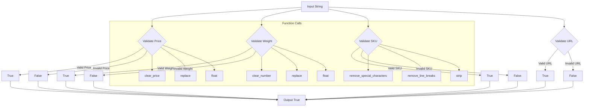

## <input code>
```python
## \file hypotez/src/utils/string/validator.py
# -*- coding: utf-8 -*-\n#! venv/Scripts/python.exe
#! venv/bin/python/python3.12

"""
.. module: src.utils.string 
	:platform: Windows, Unix
	:synopsis: Модуль валидации строк
Модуль может предоставлять функции для проверки строк на соответствие определенным критериям или форматам.
Валидация может включать в себя проверку наличия определенных символов, длины строки, формата электронной почты, URL и т. д.

"""
...
MODE = 'dev'
import re, html
from urllib.parse import urlparse, parse_qs
from typing import Union
from urllib.parse import urlparse, parse_qs

from src.logger import logger

class ProductFieldsValidator:
    """
     StringValidator (Валидатор строк):
    @details 
    - Задача: Проверка строки на соответствие определенным критериям или шаблонам.
    - Действия: Проверка наличия определенных символов, длины строки, соответствие регулярным выражениям и другие проверки.
    - Пример использования: Проверка корректности электронной почты, пароля или номера кредитной карты.
    """

    @staticmethod
    def validate_price(price: str) -> bool:
        """
         [Function's description]

        Parameters : 
            @param price : str  :  [description]
        Returns : 
            @return bool  :  [description]

        """
        """
        Валидация цены
        """
        if not price:
            return
        price = Ptrn.clear_price.sub('', price)
        price = price.replace(',', '.')
        try:
            float(price)
        except:
            return
        return True


    @staticmethod
    def validate_weight(weight: str) -> bool:
        """
         [Function's description]

        Parameters : 
            @param weight : str  : [description]
        Returns : 
            @return bool  : [description]

        """
        """
        Валидация веса
        """
        if not weight:
            return
        weight = Ptrn.clear_number.sub('', weight)
        weight = weight.replace(',', '.')
        try:
            float(weight)
        except:
            return
        return True


    @staticmethod
    def validate_sku(sku: str) -> bool:
        """
         [Function's description]

        Parameters : 
            @param sku : str  : [description]
        Returns : 
            @return bool  : [description]

        """
        """
        Валидация артикула
        """
        if not sku:
            return
        sku = StringFormatter.remove_special_characters(sku)
        sku = StringFormatter.remove_line_breaks(sku)
        sku = sku.strip()
        if len(sku) < 3:
            return
        return True


    @staticmethod
    def validate_url(url: str) -> bool:
        """
         [Function's description]

        Parameters : 
            @param url : str  : [description]
        Returns : 
            @return bool  : [description]

        """
        """
        Валидация URL
        """
        if not url:
            return

        url = url.strip()

        if not url.startswith('http'):
            url = 'http://' + url

        parsed_url = urlparse(url)

        if not parsed_url.netloc or not parsed_url.scheme:
            return

        return True


    @staticmethod
    def isint(s: str) -> bool:
        """
         [Function's description]

        Parameters : 
            @param s : str  : [description]
        Returns : 
            @return bool  : [description]

        """
        try:
            s = int(s)
            return True
        except Exception as ex:
            return

```

```
## <algorithm>
```


**Example Data Flow (validate_price):**

Input: `price = "12,50"`

1. `price` is checked for null/empty.
2. `Ptrn.clear_price.sub('', price)` removes unwanted characters from the string (e.g., '$', spaces).  Result: `price = "12,50"`
3. `price = price.replace(',', '.')` replaces commas with periods. Result: `price = "12.50"`
4. `try: float(price)` attempts to convert the string to a float. Result: Success.
5. Returns `True`.


```
## <explanation>
```

**Imports:**

- `re, html`: Likely for regular expression operations and HTML handling, though the use of `html` is not apparent in the code provided.
- `urllib.parse`:  Used for parsing URLs. `urlparse` and `parse_qs` are employed for URL validation.
- `typing.Union`: Potentially used for type hinting but is not directly used in this code.
- `src.logger`: Imports a logger object from the `src.logger` module, indicating a logging mechanism is available for recording information or errors from this string validator module.

**Classes:**

- `ProductFieldsValidator`: This class encapsulates string validation methods related to product data fields.  This is a good structure for organizing validation logic related to products.


**Functions:**

- `validate_price(price: str) -> bool`: Validates a price string.
    - **Arguments:** `price` (str): The price string.
    - **Return Value:** `bool`: `True` if the price is valid (converts to a float), `None` if invalid.
    - **Example Usage:** If `price` is "12,50" or "12.50", the function returns `True`. If `price` is "abc", it returns `None`.
- `validate_weight(weight: str) -> bool`:  Validates a weight string. Similar functionality to `validate_price`.
- `validate_sku(sku: str) -> bool`: Validates a SKU string.
    - **Arguments:** `sku` (str): The SKU string.
    - **Return Value:** `bool`: `True` if the SKU is valid (at least 3 characters after processing), `None` otherwise.
    - **Example Usage:** A string like "ABC123" would return `True`, while a string like "AB" would return `None`.  The handling of `StringFormatter` objects should be investigated.
- `validate_url(url: str) -> bool`: Validates a URL string.
    - **Arguments:** `url` (str): The URL string.
    - **Return Value:** `bool`: `True` if the URL is valid (has a scheme and netloc after processing, `None` otherwise.
    - **Example Usage:** If `url` is "https://www.example.com", returns `True`. If `url` is an empty string, it returns `None`.
- `isint(s: str) -> bool`: Checks if a string represents an integer.
    - **Arguments:** `s` (str): The string to check.
    - **Return Value:** `True` if it's an integer, `None` otherwise.


**Variables:**

- `MODE`: A string variable that likely controls the program mode (e.g., 'dev', 'prod'), used for configuration, though this is not evident.

**Potential Errors and Improvements:**

- **Missing `Ptrn` and `StringFormatter`:** The code refers to `Ptrn` and `StringFormatter` objects. These are not defined within the provided code snippet.  The code would fail if these weren't defined elsewhere in the project.  This implies a dependency on other modules or classes to process the string. Investigate the source of these objects.
- **Error Handling and Logging:** While `try-except` blocks are used, there's no use of the imported `logger` object for logging errors during validation attempts.  Consider adding `logger.error("Invalid input:", exc_info=True)` within the exceptions.
- **Unclear Functionality:** The function descriptions (`[Function's description]`) in the docstrings are quite general. More detailed information about what the functions do and what they are trying to validate would be helpful.
- **Return `None` for failure:** While `return None` or `return` is used to indicate failure in some functions, this approach isn't consistent, which may lead to unintended behavior if the caller doesn't anticipate this. Returning `False` in this case would be a more conventional approach to signal an unsuccessful validation.
- **Missing Validation Criteria:** The provided functions are basic, and more robust and specific criteria might be necessary (e.g., to verify credit card numbers, email addresses, and so on) depending on the needed validation.
- **Type Hinting:** While type hinting is used, its usage could be made more consistent and explicit.

**Chain of Relationships:**

- `ProductFieldsValidator` relies on `src.logger` for logging.
- `ProductFieldsValidator` likely interacts with other modules (e.g., data processing or display) to use validation results.
- `ProductFieldsValidator` is part of the `hypotez.src.utils.string` module.


This analysis highlights the need for further context to understand the complete functionality and relationships within the larger project.