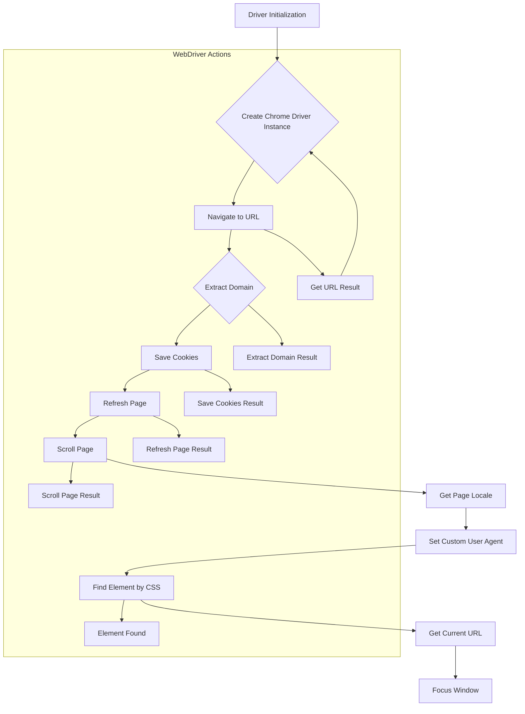

1. **<input code>**:

```python
# -*- coding: utf-8 -*-\n
""" Examples for using `Driver` and `Chrome` classes """

from src.webdriver import Driver, Chrome
from selenium.webdriver.common.by import By

def main():
    """ Main function to demonstrate usage examples for Driver and Chrome """

    # Example 1: Create a Chrome driver instance and navigate to a URL
    chrome_driver = Driver(Chrome)
    if chrome_driver.get_url("https://www.example.com"):
        print("Successfully navigated to the URL")

    # Example 2: Extract the domain from a URL
    domain = chrome_driver.extract_domain("https://www.example.com/path/to/page")
    print(f"Extracted domain: {domain}")

    # Example 3: Save cookies to a local file
    success = chrome_driver._save_cookies_localy()
    if success:
        print("Cookies were saved successfully")

    # Example 4: Refresh the current page
    if chrome_driver.page_refresh():
        print("Page was refreshed successfully")

    # Example 5: Scroll the page down
    if chrome_driver.scroll(scrolls=3, direction='forward', frame_size=1000, delay=1):
        print("Successfully scrolled the page down")

    # Example 6: Get the language of the current page
    page_language = chrome_driver.locale
    print(f"Page language: {page_language}")

    # Example 7: Set a custom user agent for the Chrome driver
    user_agent = {
        'user-agent': 'Mozilla/5.0 (Windows NT 10.0; Win64; x64) AppleWebKit/537.36 (KHTML, like Gecko) Chrome/100.0.4896.127 Safari/537.36'
    }
    custom_chrome_driver = Driver(Chrome, user_agent=user_agent)
    if custom_chrome_driver.get_url("https://www.example.com"):
        print("Successfully navigated to the URL with custom user agent")

    # Example 8: Find an element by its CSS selector
    element = chrome_driver.find_element(By.CSS_SELECTOR, 'h1')
    if element:
        print(f"Found element with text: {element.text}")

    # Example 9: Get the current URL
    current_url = chrome_driver.current_url
    print(f"Current URL: {current_url}")

    # Example 10: Focus the window to remove focus from the element
    chrome_driver.window_focus()
    print("Focused the window")

if __name__ == "__main__":
    main()
```

2. **<algorithm>**:



3. **<explanation>**:

* **Imports**:
    * `from src.webdriver import Driver, Chrome`: Imports the `Driver` and `Chrome` classes from the `src.webdriver` package.  This suggests a modular structure where `Chrome` likely implements the actual Chrome WebDriver functionality. `Driver` is a higher-level wrapper.
    * `from selenium.webdriver.common.by import By`: Imports the `By` class from Selenium for locating web elements (e.g., using CSS selectors).
    * **`src` package relationship**: The `src` package likely contains other essential packages for the project, including settings, utilities (e.g., `gs`, `pprint`, `j_loads`, `save_png`), logging (`logger`), and exception handling modules. The specific relationship and how they interact with the `webdriver` module are not directly visible but highly likely.

* **Classes**:
    * `Driver`: A class likely a wrapper providing a higher-level interface to interact with web browsers using different browser drivers (e.g., Chrome, Firefox, Edge). The included methods show a variety of tasks, indicating the class encompasses various web automation functionalities. The examples show the use of methods like `get_url`, `extract_domain`, `_save_cookies_localy`, `page_refresh`, `scroll`, `locale`, `find_element`, `current_url`, `window_focus`, and importantly, accepting arguments like a user agent.
    * `Chrome`: This class (likely in the `src.webdriver` package) represents a specific implementation of a Chrome browser driver, using the Selenium library.  It provides the low-level methods needed to control the Chrome browser via Selenium.
    * **Interaction**: The `Driver` class likely utilizes the `Chrome` class for actual browser interaction, abstracting away the specifics of WebDriver control.
    
* **Functions**:
    * `main()`: The main function demonstrates the usage of the `Driver` class. It calls several methods to perform actions, such as navigating to a URL, extracting a domain, saving cookies, refreshing a page, scrolling, getting page language, and setting a custom user agent.

* **Variables**:
    * The variables `chrome_driver`, `domain`, `success`, `page_language`, `current_url`, and `custom_chrome_driver` are used for storing the driver instances and the results of different operations, illustrating the flow of data.

* **Potential errors or areas for improvement**:

    * **Error Handling:** While the example shows `if` statements to check for success, more robust error handling using `try...except` blocks within each method (`get_url`, `extract_domain`, etc.) is recommended for production code. This would prevent script crashes and provide better debugging information.
    * **Explicit Waits:** The examples do not show explicit waits for elements to load or appear.  Using `WebDriverWait` from Selenium can enhance robustness and prevent unexpected errors.
    * **Logging:**  For debugging and monitoring purposes, integrating logging (e.g., `logging` module) would provide insights into the flow of execution and any errors encountered.
    * **Resource Management:** The code doesn't address the closing of the WebDriver instance after usage (with `driver.quit()` or `driver.close()`). This is crucial to release resources and avoid browser conflicts.
    * **Parameter Validation:** Add validation for input parameters (e.g., checking if `url` is a valid string, if `scrolls` is positive) to improve robustness and prevent unexpected behaviors.
    * **External dependencies**:  The examples don't handle potential issues that might arise from external libraries like the `selenium` or `requests` dependencies not working correctly or with the system environment (e.g., the version being used).


**Relationships with other parts of the project:**

The code heavily relies on the `src` package, indicating an internal project structure. The `gs` (global settings) likely defines configuration values, such as paths to settings files, connection strings, etc., while other `utils` could provide helper functions and data serialization/deserialization tools.  The `logger` and exception handling modules are vital for managing errors, output, and debugging within the project. The `webdriver` module communicates with these modules, utilizing their functionalities to conduct automated actions on web pages and storing results or logs to facilitate other project processes.