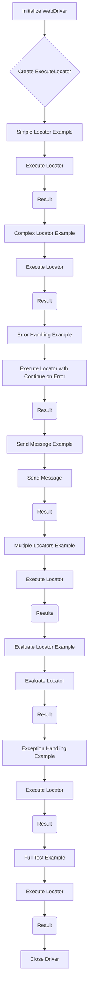

1. **<input code>**:

```python
## \file hypotez/src/webdriver/_examples/_example_executor_2.py
# -*- coding: utf-8 -*-
#! venv/Scripts/python.exe
#! venv/bin/python/python3.12

"""
.. module: src.webdriver._examples 
	:platform: Windows, Unix
	:synopsis:

"""
MODE = 'dev'

"""
	:platform: Windows, Unix
	:synopsis:

"""


"""
	:platform: Windows, Unix
	:synopsis:

"""


"""
  :platform: Windows, Unix

"""
"""
  :platform: Windows, Unix
  :platform: Windows, Unix
  :synopsis:
"""MODE = 'dev'
  
""" module: src.webdriver._examples """


""" Примеры использования класса `ExecuteLocator` для различных сценариев тестирования.
@details В этом файле приведены примеры создания экземпляра `ExecuteLocator` и выполнения различных задач с его помощью.
"""

from selenium import webdriver
from src.webdriver.executor import ExecuteLocator
from src import gs
from src.logger.exceptions import ExecuteLocatorException

# Создание экземпляра WebDriver (например, Chrome)
driver = webdriver.Chrome(executable_path=gs['chrome_driver_path'])
driver.get("https://example.com")  # Переход на сайт

# Создание экземпляра ExecuteLocator
locator = ExecuteLocator(driver)

# ... (rest of the code)
```

2. **<algorithm>**:



**Explanation of blocks:**

* **Initialize WebDriver:**  Creates a Selenium WebDriver instance (e.g., Chrome) and navigates to a website. Data: `driver` object.
* **Create ExecuteLocator:** Creates an instance of the `ExecuteLocator` class, passing the WebDriver. Data: `locator` object.
* **Execute Locator (Simple):** Executes a simple locator (`simple_locator`), returning a result (e.g., a string).
* **Execute Locator (Complex):** Executes a complex locator (`complex_locator`) with possible events.
* **Error Handling:** Handles `ExecuteLocatorException` that might be raised during execution.
* **Send Message:** Sends a message to a web element. Data: message string.
* **Multiple Locators:** Executes a locator with multiple targets and returns a list of results.
* **Evaluate Locator:** Executes a locator to evaluate a specific attribute. Data: attribute value.
* **Close Driver:**  Closes the WebDriver session.

3. **<explanation>**:

* **Imports:**
    * `selenium import webdriver`: Imports the Selenium library for interacting with web browsers. It's crucial for automating web tasks.
    * `src.webdriver.executor import ExecuteLocator`: Imports a custom class (`ExecuteLocator`) likely from a `src.webdriver.executor` module for executing locators (presumably tailored for a specific testing framework).
    * `src import gs`: Imports a module (`gs`)—likely a global settings module—that holds configurations like the ChromeDriver path. The relationship is that the ChromeDriver path is retrieved from this module.
    * `src.logger.exceptions import ExecuteLocatorException`: Imports a custom exception class for handling errors related to the `ExecuteLocator` class, possibly from a dedicated logging system.


* **Classes:**
    * `ExecuteLocator`: Likely a custom class designed to streamline locating and interacting with web elements within a testing framework. Its role is to encapsulate the logic for finding, interacting with, and retrieving data from web elements.  It contains methods like `execute_locator`, `send_message`, `evaluate_locator`, indicating these methods are tailored to handle complex locator strategies.

* **Functions:**
    * `execute_locator()`: Takes a locator dictionary, possibly handling different locator types (XPATH, CSS etc), executing events (click, send_keys), and returning the result (e.g., text content).
    * `send_message()`: Handles input operations like typing on text fields. The function needs the `typing_speed` parameter.
    * `evaluate_locator()`: Executes a locator for a specific attribute (textContent, value, etc.), returning the attribute's value.
    * These functions are likely part of the `ExecuteLocator` class.

* **Variables:**
    * `MODE`: A string variable to represent the current mode (e.g., 'dev', 'test').
    * `driver`: A Selenium WebDriver object.
    * `locator`: An instance of the `ExecuteLocator` class.
    * `simple_locator`, `complex_locator`, `message_locator`, `multi_locator`, `attribute_locator`, and `test_locator`: Dictionaries defining locators (how to identify elements on the webpage) including the method, selector, attribute, events, etc.
    * `result`, `results`, `attribute_value`: Variables storing the results of locator executions.


* **Potential Errors/Improvements:**
    * **Error Handling:**  The code includes `try...except` blocks, improving robustness by catching exceptions and providing informative messages. This is a good practice.
    * **Clearer Locator Structure:** The `locator` dictionaries could use more descriptive keys for better readability and maintainability.
    * **Typing Speed:** The `send_message` method allows for control over typing speed, but it's crucial to consider that slow typing might not mimic human interactions correctly.  Consider more dynamic approaches.
    * **Robustness**:  The use of `continue_on_error=True` in the `execute_locator` method, though useful,  needs justification and possibly error logging to understand why it's needed.
    * **Data Validation**:  Consider validating input to the locator to prevent invalid selectors (syntax errors)


* **Relationships**:
    The code demonstrates a clear relationship with the Selenium WebDriver library, `src.webdriver.executor`, `src.logger.exceptions`, and `src.gs` module for configuration.  The structure suggests a broader testing framework involving locator handling, error logging, and external configuration.