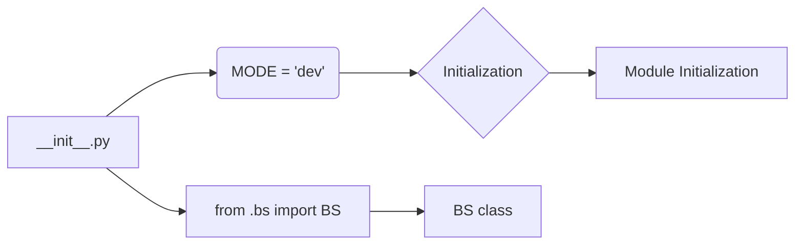

1. **<input code>**:

```python
## \file hypotez/src/webdriver/bs/__init__.py
# -*- coding: utf-8 -*-\
#! venv/Scripts/python.exe
#! venv/bin/python/python3.12

"""
.. module: src.webdriver.bs 
	:platform: Windows, Unix
	:synopsis:

"""
MODE = 'dev'

from .bs import BS
```

2. **<algorithm>**:



* **Initialization (D):** The module initializes by setting the `MODE` variable to 'dev'.  No significant data is passed or transformed here.
* **Module Initialization (F):** This step simply imports the `BS` class from the `./bs` submodule. The imported class and its attributes become part of the module's functionality, ready for use by other parts of the project.


3. **<explanation>**:

* **Imports**:
    * `from .bs import BS`: This line imports the `BS` class (presumably a class defining a browser or web automation object) from the submodule `./bs`.  The `.` indicates a relative import within the current package (`hypotez/src/webdriver/bs`).  This import is crucial for enabling access to the functionality provided by the `BS` class within the `__init__.py` file.  This implies that `hypotez/src/webdriver/bs/bs.py` or a similar file exists and contains the definition of the `BS` class.

* **Variables**:
    * `MODE = 'dev'`: This global variable likely controls the operation mode of the system, in this case, 'dev' suggests a development environment. This could influence logging, error handling, or other configuration settings.


* **Classes**:
    * `BS`: The `BS` class is imported but not directly used or instantiated within this `__init__.py` file. Its implementation details are contained in the `hypotez/src/webdriver/bs/bs.py` file (or similar).  Knowing the structure of the `BS` class would require looking at that separate file.  This `__init__.py` acts as a facade for the `BS` class, providing access to it without exposing the implementation of the class to the calling scripts.

* **Functions**: There are no functions defined in this file.

* **Potential Errors/Areas for Improvement**:
    * **Missing Documentation:** The docstring (`"""..."""`) is incomplete, lacking a detailed explanation of the module's purpose, expected input and output, and any significant functionality or interactions with other parts of the project. Expanding this docstring would enhance understanding and maintainability.
    * **Relative Imports**: The relative import (`from .bs import BS`) is correct, but it's crucial that the file `hypotez/src/webdriver/bs/bs.py` is actually present.


* **Relationships with Other Parts**:
    * The `__init__.py` file acts as an entry point for the `bs` module. It imports functionality from `bs.py` (or equivalent), enabling other parts of the project to use the `BS` class for web driver interaction.

    * The `hypotez/src` package likely contains other modules related to testing, data processing, or other tasks which might directly or indirectly use the `BS` class and its functionality to interact with web browsers. The relative import pattern implies a specific module design where related modules are organized in sub-packages, facilitating organization and maintainability.  The precise relationships with other project components can only be deduced if you analyze the rest of the source code in the `hypotez` project.