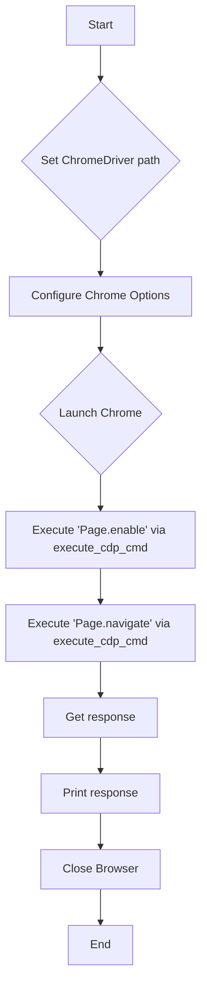

### How WebDriver and DevTools Work Together

1. **Integration with DevTools Protocol:**
   - WebDriver can utilize DevTools Protocol functions to perform tasks such as gathering performance data, managing network requests, working with mobile devices, and more.
   - You can activate DevTools mode through `ChromeOptions` settings in WebDriver and use DevTools Protocol commands to perform operations.

2. **Using `DevTools` through `Chrome DevTools Protocol`:**
   - You can use built-in DevTools Protocol commands to perform tasks not available through the standard WebDriver methods.
   - For example, you can use DevTools Protocol to analyze performance, navigate pages, or manage network requests.

### Example of Using DevTools Protocol via WebDriver

```python
from selenium import webdriver
from selenium.webdriver.chrome.service import Service
from selenium.webdriver.chrome.options import Options

# Set the path to ChromeDriver
service = Service('/path/to/chromedriver')

# Configure ChromeOptions
chrome_options = Options()
chrome_options.add_argument('--remote-debugging-port=9222')

# Launch Chrome with specified options
driver = webdriver.Chrome(service=service, options=chrome_options)

# Get DevTools session
dev_tools = driver.execute_cdp_cmd('Page.enable', {})

# Execute a command via DevTools Protocol
response = driver.execute_cdp_cmd('Page.navigate', {'url': 'https://www.example.com'})
print(response)

# Close the browser
driver.quit()
```

### Key Steps:

1. **Configure WebDriver:**
   - Ensure that ChromeDriver is set up to work with the remote debugging option (`--remote-debugging-port`).

2. **Obtain DevTools Session:**
   - Use `driver.execute_cdp_cmd` to execute DevTools Protocol commands. The `Page.enable` command activates certain DevTools features for the current session.

3. **Execute DevTools Protocol Commands:**
   - Through `execute_cdp_cmd`, you can send commands to control the page, gather information, or perform other tasks.

### Additional Capabilities

- **Performance Analysis:** Use DevTools Protocol to collect and analyze performance data of the page.
- **Network Monitoring:** Monitor network requests and responses by using commands like `Network.enable`.
- **DOM Management:** Manage DOM elements and CSS through DevTools Protocol commands such as `DOM.getDocument` and `CSS.getComputedStyleForNode`.

### Documentation and Resources

- [Selenium Documentation](https://www.selenium.dev/documentation/en/)
- [Chrome DevTools Protocol Documentation](https://chromedevtools.github.io/devtools-protocol/)

Thus, WebDriver for Chrome and DevTools Protocol can work together, providing a powerful tool for automating and testing web applications.
```

```
<algorithm>


**Example Data Flow:**

* **B (Set ChromeDriver path):**  Input: `/path/to/chromedriver`. Output: `service` object initialized with the path.
* **C (Configure Chrome Options):** Input: `'--remote-debugging-port=9222'`. Output: `chrome_options` object with the remote debugging port set.
* **D (Launch Chrome):** Input: `service`, `chrome_options`. Output: `driver` object representing the launched Chrome browser.
* **E (Execute 'Page.enable'):** Input: `driver`, 'Page.enable', {}. Output:  `dev_tools` (or potentially null/empty).
* **F (Execute 'Page.navigate'):** Input: `driver`, 'Page.navigate', `{'url': 'https://www.example.com'}`. Output: `response` (a dictionary containing the result of the command).
* **G (Get response):** Input:  The result of the `execute_cdp_cmd` output. Output: The extracted `response` data.
* **I (Close Browser):** Input: `driver` object. Output: `driver` object is closed/quit, releasing resources.


```
<explanation>

**Imports:**

* `from selenium import webdriver`: Imports the core Selenium WebDriver library, enabling interaction with web browsers.
* `from selenium.webdriver.chrome.service import Service`: Imports the service class for managing the ChromeDriver executable. Crucial for handling the driver properly.  Relationship with other `src.` packages: part of the Selenium library.
* `from selenium.webdriver.chrome.options import Options`: Imports the `Options` class for configuring Chrome browser instances. Part of the Selenium library.


**Classes:**

* `Service`: Represents the ChromeDriver service.  In this example, it's instantiated with the path to the ChromeDriver executable.  It handles the process of starting and managing the ChromeDriver.  This class interacts with other parts of the project by enabling the WebDriver to communicate with the browser.
* `Options`: Represents options for configuring the Chrome browser instance. In this example, the `add_argument` method configures the port for remote debugging.  It is used by the `webdriver.Chrome` class to configure the browser's launch settings, enabling interaction with the browser and providing necessary options like enabling remote debugging.


**Functions:**

* `webdriver.Chrome(service=service, options=chrome_options)`:  Initializes a Chrome WebDriver instance.  
    * Arguments: `service` (a `Service` object for managing the driver), `options` (a `Options` object for configuration).
    * Return value: a `webdriver.Chrome` object.  Important, this is the connection to the browser.
* `driver.execute_cdp_cmd(...)`: Executes a command through the Chrome DevTools Protocol.
    * Arguments: command name, a dictionary of parameters.
    * Return value: A dictionary containing the command's response.  The exact content of the return depends on the command executed.   Example, in `Page.navigate`, it could contain a status or error.
* `driver.quit()`: Closes the WebDriver and terminates the browser instance.  It releases all resources tied to the browser session.


**Variables:**

* `service`:  `Service` object, holds the path to the ChromeDriver executable.
* `chrome_options`: `Options` object, used to specify chrome options.
* `driver`: `webdriver.Chrome` object, represents the active browser instance.
* `dev_tools`:  Result of `execute_cdp_cmd('Page.enable', {})` call.
* `response`: Dictionary containing the response from the DevTools command `Page.navigate`.


**Potential Errors/Improvements:**

* **Error Handling:** The example lacks error handling. If ChromeDriver is not found, or there's a problem with the DevTools command, an exception will be raised without any handling.  Add `try...except` blocks to catch and handle potential errors appropriately.
* **Explicit Wait:** The code doesn't include waiting mechanisms. If the page is not fully loaded when `Page.navigate` is called, the test might fail.  Using `WebDriverWait` from Selenium would improve robustness.


**Chain of Relationships:**

The code connects to the Chrome browser through the ChromeDriver, controlled by the Selenium WebDriver API and the Chrome DevTools Protocol.  This allows interaction with the browser's internal functionalities beyond standard WebDriver methods. This chain of relationships allows for more granular control and access to browser resources.