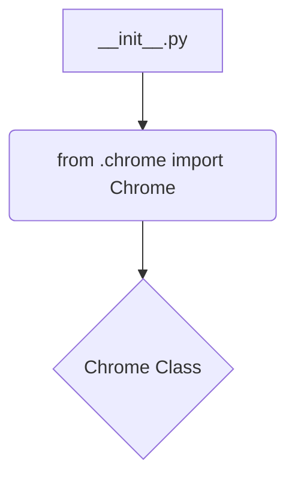

```
## <input code>
```python
## \file hypotez/src/webdriver/chrome/__init__.py
# -*- coding: utf-8 -*-
#! venv/Scripts/python.exe
#! venv/bin/python/python3.12

"""
.. module: src.webdriver.chrome 
	:platform: Windows, Unix
	:synopsis:

"""

from .chrome import Chrome
```

## <algorithm>



**Example:**

The `__init__.py` file is a module for the `chrome` webdriver package.  It simply imports the `Chrome` class from the `chrome.py` file within the same directory. This allows other modules to directly use the `Chrome` class without needing to specify the full path.


## <explanation>

**Imports:**

- `from .chrome import Chrome`: This line imports the `Chrome` class from a file named `chrome.py` located in the same directory (`./chrome`).  The `.` before `chrome` indicates a relative import, which is a good practice for better organization.  This import is crucial for making the `Chrome` functionality available in this `__init__.py` file.  This implies that the `chrome.py` file defines the `Chrome` class.  

**Classes (implied):**

- `Chrome`: This is likely a class defined in the `chrome.py` file (as suggested by the import). Without seeing `chrome.py`, we cannot detail its attributes and methods.  It's a good assumption that it represents a Chrome webdriver object, handling interactions with a Chrome browser.  It would likely provide methods for initializing the driver, navigating pages, interacting with elements, and managing the browser session.


**Functions (implied):**

- Any functions used by the `Chrome` class are defined within `chrome.py` and not directly in this `__init__.py` file.  The `__init__.py` file is primarily acting as an entry point to access the `Chrome` class.  


**Variables (implied):**

- No direct variables are defined in this `__init__.py` file.  Variables are likely defined within `chrome.py` (e.g., to store configuration or instance properties within the `Chrome` class).


**Potential Errors/Improvements:**

- **Missing `chrome.py`:**  The provided code is incomplete.  There needs to be a `chrome.py` file to define the `Chrome` class. Without that, there's no actual code to run or test.


**Relationships:**

This `__init__.py` file establishes a dependency on the `chrome.py` file (and any other module it imports).  The project structure likely reflects a modular design, with separate files handling specific tasks or functionalities, organized into packages like `webdriver` and `chrome`. This modular design promotes better code organization and reusability.  Other components in the project might use `Chrome` from this `webdriver/chrome` package (importing from `hypotez.src.webdriver.chrome`).   This relationship illustrates a basic structure, but more detail is needed to grasp the broader project architecture.