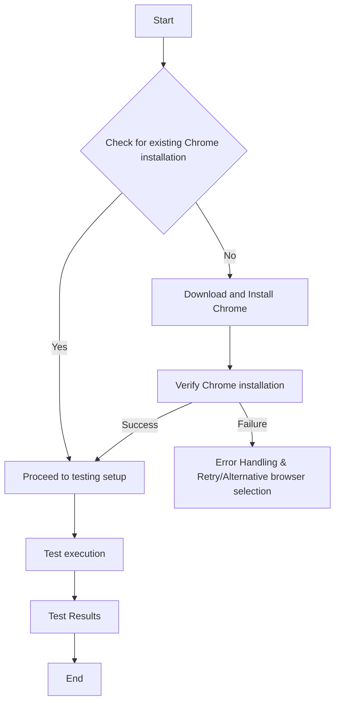

1. **<input code>**

```
{\\rtf1}
```

2. **<algorithm>**



**Explanation of Blocks:**

* **A[Start]:** Initiates the process.
* **B{Check for existing Chrome installation}:** Determines if Chrome is already present on the system. This could involve checking for a specific file, registry key, or other system-level information.
* **C[Proceed to testing setup]:** If Chrome is installed, the process continues to the setup required for the testing environment. This may include configuring paths, setting up environment variables, or initializing the webdriver.
* **D[Download and Install Chrome]:** If Chrome is not found, the process downloads the appropriate version of the browser installer and installs it.  This may involve a download from a specific URL or a package manager.
* **F[Verify Chrome installation]:** Once the installation is completed, the process verifies that Chrome is properly installed and functioning. This can involve launching a basic browser window.
* **G[Error Handling & Retry/Alternative browser selection]:** If installation fails, the process handles the error. This could involve logging the error, attempting reinstallation, or selecting an alternative browser if possible.
* **E[Test execution]:** The WebDriver scripts are initiated for running the automated tests.
* **H[Test Results]:** The process collects and stores the results of the tests.
* **I[End]:** The process finishes.


3. **<explanation>**

The provided code is empty.  There is no code to analyze.  The provided `rtf` tag likely indicates that a document describing the installation procedure for Chrome is stored in a format other than plain text, and it is not in a format suitable for direct execution.


**Relationship to other project components (hypothetical):**

In a real-world project, this `how_to_istall_chrome_for_testing.md` file would likely be part of a larger project related to automated testing using Selenium WebDriver.  It would be used as documentation or as a script/process to ensure that the necessary prerequisites for the testing framework (like a specific version of Chrome) are met.  The procedure outlined in the file might be executed in a CI/CD pipeline or by a developer/tester before running tests.  The `webdriver` directory likely contains other code, configuration files, and scripts for setting up and running the testing environment using the Selenium WebDriver.  Dependencies on the `selenium` library would also be crucial.


**Potential Errors and Improvements (Hypothetical):**

* **Error Handling:** A real-world implementation should include robust error handling (e.g., checking download status, handling network issues, handling installation failures, or fallback to other browsers).
* **Version Management:**  The installation process should be tailored to specific versions of Chrome that might be required for particular tests (or by the testing framework) to prevent unexpected compatibility issues.
* **Automated Process:** An automated script rather than manual documentation, would be preferable in a software testing process for better scalability and repeatability. The script would likely use a system/environment to download and install the browser.  Python, Java, or Node.js are commonly used for such a task.
* **Browser Compatibility:**  If multiple browsers are supported, the process should be adaptable to different browsers rather than being hardcoded for only Chrome.


Without the actual code, the analysis is limited to a conceptual walkthrough of the likely process.  More context is needed to perform a deeper analysis.