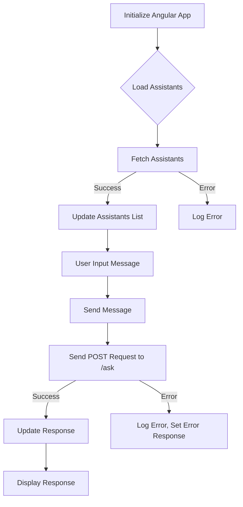

```
// Инициализируем Angular приложение
const app = angular.module('openaiApp', []);

// Контроллер для обработки логики
app.controller('MainController', function ($scope, $http) {
    $scope.message = '';
    $scope.response = '';
    $scope.assistants = [];
    $scope.selectedAssistant = null;

    // Функция для получения списка ассистентов
    function loadAssistants() {
        const url = 'http://localhost:8000/assistants';  // Создай новый endpoint для получения списка ассистентов
        alert("ASST")
        $http.get(url)
            .then(function (response) {
                $scope.assistants = response.data;  // Список ассистентов
            })
            .catch(function (error) {
                console.error('Ошибка загрузки ассистентов:', error);
            });
    }

    // Загружаем список ассистентов при инициализации
    loadAssistants();

    // Функция для отправки сообщения модели
    $scope.sendMessage = function () {
        const url = 'http://localhost:8000/ask';  // Адрес FastAPI сервера

        const data = {
            message: $scope.message,
            system_instruction: "You are a helpful assistant.",
            assistant_id: $scope.selectedAssistant.id  // Добавляем ID ассистента
        };

        // Отправка POST-запроса через $http (AJAX)
        $http.post(url, data)
            .then(function (response) {
                $scope.response = response.data.response;  // Ответ от сервера
            })
            .catch(function (error) {
                console.error('Ошибка:', error);
                $scope.response = 'Произошла ошибка. Попробуйте позже.';
            });
    };
});
```

**<algorithm>**



**Example Data Flow:**

* **A:** `angular.module('openaiApp', [])` creates an AngularJS module.
* **B:**  A decision point, triggered by initialization.
* **C:** Sends a GET request to `http://localhost:8000/assistants` to get assistant data.  Example data: `[ {id: 1, name: 'Assistant1'}, {id: 2, name: 'Assistant2'} ]`.
* **D:** Updates `$scope.assistants` with fetched assistant data.
* **F:** User enters a message in the UI, updating `$scope.message`. Example: `$scope.message = "Hello, how are you?"`.
* **G:** The `sendMessage` function is called.
* **H:** Sends a POST request to `http://localhost:8000/ask` with the message and selected assistant ID. Example data sent: `{ message: "Hello, how are you?", system_instruction: "You are a helpful assistant.", assistant_id: 1 }`.
* **I:** Updates `$scope.response` with the response from the API. Example: `$scope.response = "Hi! I'm doing well."`.
* **K:** Updates the UI to display `$scope.response`.


**<explanation>**

* **Imports:**  There are no explicit imports. This code relies on AngularJS ($http, $scope, etc.) which are likely part of the project's dependencies.
* **Classes:**  There are no classes defined. This is a typical AngularJS controller structure.
* **Functions:**
    * `loadAssistants()`: Fetches a list of assistants from the backend API at `http://localhost:8000/assistants`.  It handles potential errors during the request.
    * `$scope.sendMessage()`: Takes user input (`$scope.message`), the selected assistant's ID (`$scope.selectedAssistant.id`), and sends a POST request to `http://localhost:8000/ask` to get a response from the OpenAI model.  It uses error handling for cases where the API call fails.
* **Variables:**
    * `$scope.message`: Stores the user's input message (string).
    * `$scope.response`: Stores the server's response (string).
    * `$scope.assistants`: Stores an array of assistant objects, populated by the `loadAssistants` function.
    * `$scope.selectedAssistant`: Stores the currently selected assistant object.
    * `url`: Stores the API endpoints for assistant loading and message sending.  It's crucial to replace 'http://localhost:8000' with your actual server address.
    * `data`:  Contains the data sent to the backend API.  It's a JSON object crucial for the interaction with the server.

* **Potential Errors/Improvements:**
    * **Hardcoded URLs:** The URLs (`http://localhost:8000/assistants`, `http://localhost:8000/ask`) are hardcoded.  This is a significant problem for maintainability and deployment. They should be configurable, e.g., via a configuration file or environment variables.
    * **Missing `$scope.selectedAssistant` Initialization:** The code assumes `$scope.selectedAssistant` will be populated in the UI;  it's possible for `$scope.selectedAssistant` to be undefined, leading to errors (undefined.id). This function needs a mechanism to ensure `$scope.selectedAssistant` is a valid object before calling sendMessage().
    * **No Error Handling in UI:** If the user tries to send a message without selecting an assistant, the application will likely crash. A mechanism needs to be added to validate the selection and display user-friendly error messages.
    * **Alert:** Using `alert("ASST")` is a poor way to display information. It can confuse the user.  A more appropriate user interface component, like a progress indicator, should be used instead.
    * **Missing Error Handling in UI:** The error handling in `$scope.sendMessage()` is not communicated effectively to the user; adding UI elements to show errors would greatly improve the user experience.

**Relationship to Other Parts of the Project:**

This code interacts with a backend server (FastAPI in this case, judging from the URLs).  The server handles the logic for fetching assistants and processing the user's messages.  A front-end (not shown) likely interacts with this code via AngularJS directives and updates the UI to display the response. The `assistant_id` variable is a critical link to a likely `assistants` model in the server-side project to identify a particular assistant and to provide context for the OpenAI request.  Missing parts like the HTML, the structure of the `assistants` model on the backend, and the OpenAI integration in the server code are needed for a complete picture.