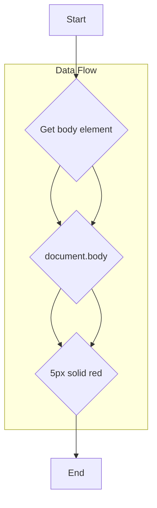

```
1. <input code>

```javascript
document.body.style.border = "5px solid red";
alert()
```
2. <algorithm>



* **Start:** The execution begins.
* **Get body element:** The code retrieves the `<body>` element of the HTML document using `document.body`.  *Example:* `document.body` represents the `<body>` element of `index.html` or the currently active HTML page.
* **Set border style:** The code sets the border style of the `body` element to "5px solid red". *Example:*  If the body had no border, it will now have a red border with a thickness of 5 pixels.
* **Display Alert:** The `alert()` function displays a pop-up dialog box containing a message to the user. *Example:* A box will appear containing default alert text.
* **End:** Execution finishes.


3. <explanation>

* **Imports:** There are no imports. The code directly interacts with the DOM (Document Object Model).  This script likely runs directly within an HTML page, or a page with a loaded script tag.

* **Classes:** No classes are defined.

* **Functions:**
    * `document.body.style.border = "5px solid red";`: This line sets the `border` style property of the `body` element in the current document to "5px solid red".
        * **Arguments:**  The literal string `"5px solid red"`.  No variables or dynamic values are involved in setting the border style.
        * **Return Value:**  None.  The action is side-effect based, modifying the DOM directly.
        * **Purpose:** It changes the visual presentation of the page by adding a red border around the entire page content.
    * `alert()`: This is a built-in JavaScript function that displays a pop-up message dialog box.
        * **Arguments:**  None (by default).  The content of the message is determined by how the script is being used, this may depend on previous calls.
        * **Return Value:** None. This is a blocking function, the program waits for the user to acknowledge the alert box (often through a 'OK' button).
        * **Purpose:**  To show an alert message box to the user.

* **Variables:** There are no declared variables.  This code modifies objects (e.g., `document.body`) directly.

* **Potential Errors/Areas for Improvement:**

    * **Missing error handling:**  If the `document.body` element doesn't exist, which would happen if the script is called before the `<body>` is loaded, the script will likely throw an error, or have an unpredictable effect.
    * **No user feedback:** The addition of the border is immediate but gives no indication of success.  Adding a confirmation message (e.g., a more sophisticated alert message) or other feedback would enhance usability.
    * **Potential for conflict:** This script, if in a browser extension, could potentially overwrite styles applied by other resources or extension code.


* **Relationships with Other Parts of the Project (Hypothetical):**

  This script, placed in a browser extension context, could be part of a larger suite of functionality.  It might be designed to affect a specific page or set of pages within the extension's target websites.  Its purpose and the surrounding code would help define its relationship.  For instance, it might be part of a testing suite or a visual enhancement script for a website. Without further context (the rest of the extension's code), we cannot make more specific assumptions.  The location of this file (`hypotez/src/webdriver/chrome/extentions/test_extention/`) suggests that it's part of an extension related to browser automation (webdriver) in a testing/development environment.