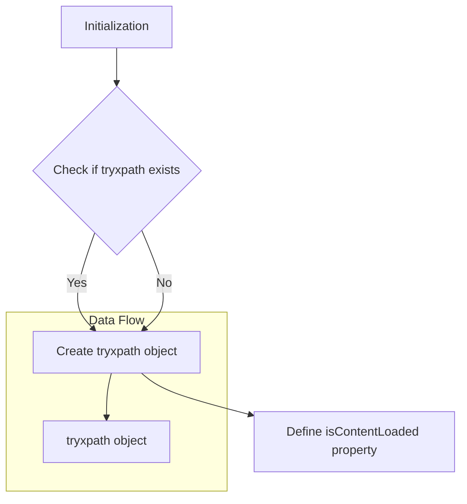

1. **<input code>**

```javascript
/* This Source Code Form is subject to the terms of the Mozilla Public
 * License, v. 2.0. If a copy of the MPL was not distributed with this
 * file, You can obtain one at http://mozilla.org/MPL/2.0/. */

// namespace
if (!tryxpath) {
    var tryxpath = {};
}

tryxpath.isContentLoaded;
```

2. **<algorithm>**



**Example:**

* **Initialization (A):**  The code starts by running.
* **Check if `tryxpath` exists (B):** It checks if a variable named `tryxpath` has already been defined.
* **Create `tryxpath` object (C):** If it doesn't exist, a new object is created with the name `tryxpath`.
* **Define `isContentLoaded` property (D):** A property named `isContentLoaded` is defined within the `tryxpath` object.  Its current value is `undefined`.


3. **<explanation>**

* **Imports:** There are no imports. The code operates entirely within the current JavaScript file.

* **Classes:** There are no classes defined. The code creates a simple object literal.

* **Functions:** There are no functions defined.

* **Variables:**
    * `tryxpath`: This variable (or object) is a namespace.  Namespaces are used to avoid naming conflicts in large projects.  Within the `tryxpath` namespace, `isContentLoaded` is likely to be used later in the code to hold some boolean value, signaling whether the content of a page has loaded completely.

* **Potential Errors/Improvements:**
    * The code currently only defines a namespace and a property.  It doesn't do anything useful.  This means there is no actual *functionality*.  This property (`isContentLoaded`) is likely to be used later in the code (not shown) to check if a webpage's content is fully loaded before performing actions, but there is no indication of how it will be set to a meaningful value (e.g., `true` or `false`).
    * The absence of any logic within the `tryxpath` object implies the need for methods or functions to be added to the object later.  For example, there might need to be a function like `tryxpath.checkIfContentLoaded()`.
    * A crucial missing piece is how `tryxpath.isContentLoaded` is *set* to a meaningful value.  This is essential to make the object and property useful.


* **Relationships with other parts of the project:**
   The `tryxpath` namespace strongly suggests that this JavaScript file is part of a larger project related to web automation or testing, most likely using a browser automation framework (e.g., WebDriver).  The `tryxpath` prefix (presumably short for "try XPath") indicates that this code is likely to involve navigating web pages and querying their content using XPath expressions. The missing implementation of how `isContentLoaded` is set implies an interaction with other components or functions in the codebase which are not shown in the provided snippet. The functions that would set the `isContentLoaded` variable are likely to use the browser's API or internal mechanisms to determine if the page is fully loaded. This implies a relationship with the browser's event handling or DOM loading events.

**In Summary:**

The code provides a basic namespace but is incomplete.  It lays the groundwork for a larger web automation task, potentially involving XPath queries, but the crucial implementation details (functionality to set `isContentLoaded`) are missing.  Understanding the broader context of the project, such as how to use WebDriver and whether this is part of a larger testing framework, is critical to fully comprehending the intended functionality.